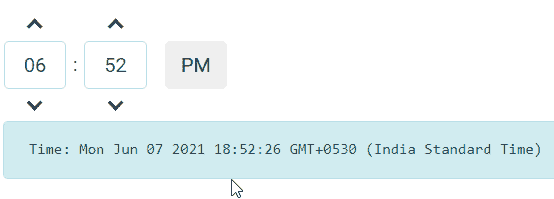

# 角度 ngx 自举计时器组件

> 原文:[https://www . geeksforgeeks . org/angular-ngx-bootstrap-time picker-component/](https://www.geeksforgeeks.org/angular-ngx-bootstrap-timepicker-component/)

Angular ngx bootstrap 是一个 bootstrap 框架，与 Angular 一起使用，创建具有很好风格的组件，这个框架非常容易使用，用于制作响应性网站。
在本文中，我们将了解如何在 angular ngx bootstrap 中使用 Timepicker。

**安装语法:**

```
npm install ngx-bootstrap --save
```

**进场:**

*   首先，使用上述命令安装 angular ngx 引导程序。
*   在 index.html

    > <link href="”https://maxcdn.bootstrapcdn.com/bootstrap/4.0.0/css/bootstrap.min.css”" rel="”stylesheet”">

    添加以下脚本
*   在模块中导入 timepicker 组件
*   在 app.component.html，制作一个更精致的组件。
*   使用 ng serve 为应用提供服务。

**示例:**

## index.html

```
<!DOCTYPE html>
<html lang="en">

<head>
    <meta charset="utf-8" />
    <title>Demo</title>
    <base href="/" />
    <meta name="viewport" content=
        "width=device-width, initial-scale=1" />
    <link href=
"https://maxcdn.bootstrapcdn.com/bootstrap/4.0.0/css/bootstrap.min.css"
        rel="stylesheet" />

    <link rel="icon" type="image/x-icon" href="favicon.ico" />
    <link rel="preconnect" href="https://fonts.gstatic.com" />
    <link href=
"https://fonts.googleapis.com/css2?family=Roboto:wght@300;400;500&display=swap"
        rel="stylesheet" />
    <link href=
"https://fonts.googleapis.com/icon?family=Material+Icons"
        rel="stylesheet" />
</head>

<body class="mat-typography">
    <app-root></app-root>
</body>

</html>
```

## app.component.html

```
<div id="gfg1">
    <timepicker [(ngModel)]="gfg"></timepicker>

    <pre class="alert alert-info">
        Time: {{gfg}}
    </pre>
</div>
```

## app.module.ts

```
import { NgModule } from '@angular/core';

// Importing forms module
import { FormsModule, ReactiveFormsModule  } 
from '@angular/forms';
import { BrowserModule } 
from '@angular/platform-browser';
import { BrowserAnimationsModule }
from '@angular/platform-browser/animations';
import { TimepickerModule} 
from 'ngx-bootstrap/timepicker';

import { AppComponent }  
from './app.component';

@NgModule({
  bootstrap: [
    AppComponent
  ],
  declarations: [
    AppComponent
  ],
  imports: [
    FormsModule,
    BrowserModule,
    BrowserAnimationsModule,
    ReactiveFormsModule,
    TimepickerModule.forRoot()
  ]
})
export class AppModule { }
```

## app.component.css

```
#gfg1 {
    margin: 10px;
}
```

## app.component.ts

```
import { Component, OnInit,LOCALE_ID }
from '@angular/core';

@Component({
    selector: 'app-root',
    templateUrl: './app.component.html',
    styleUrls: ['./app.component.css']
})
export class AppComponent {
    gfg: Date = new Date();
}
```

**输出:**

