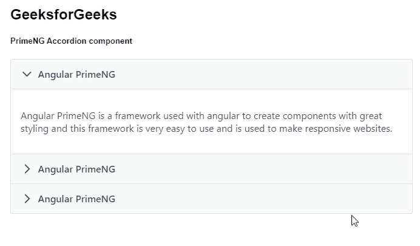
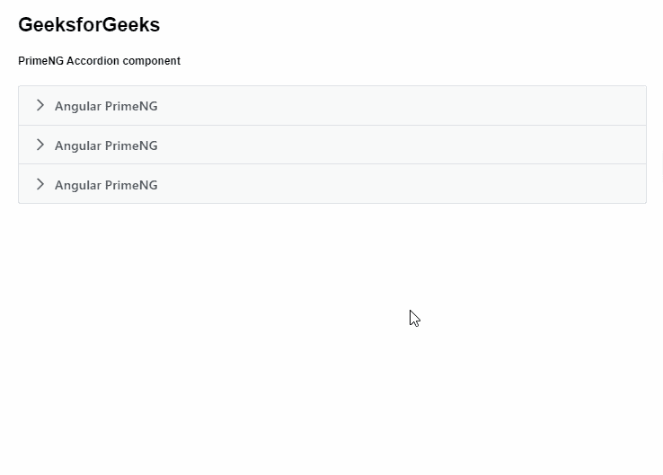

# 棱角分明的 PrimeNG 手风琴组件

> 原文:[https://www . geesforgeks . org/angular-priming-accordion-component/](https://www.geeksforgeeks.org/angular-primeng-accordion-component/)

Angular PrimeNG 是一个开源框架，具有一组丰富的本机 Angular UI 组件，用于实现出色的风格，该框架用于非常轻松地制作响应性网站。在本文中，我们将了解如何在 Angular PrimeNG 中使用手风琴组件。我们还将了解将在代码中使用的属性、样式及其语法。

**手风琴组件:**它用于在选项卡中显示一段自定义内容。

**手风琴的属性:**

*   **多个:**指定是否可以同时激活多个标签页。它是布尔数据类型&默认值为假。
*   **样式:**是组件的内嵌样式。它是字符串数据类型&默认值为空。
*   **styleClass:** 是组件的样式类。它是字符串数据类型&默认值为假。
*   **活动索引:**是活动选项卡的索引。它接受任何数据类型&默认值为空。
*   **expandIcon:** 是折叠标签的图标。它是字符串数据类型&默认值是 pi pi-fw pi-chevron-right。
*   **折叠图标:**是展开标签的图标。它是字符串数据类型&默认值是 pi pi-fw pi-chevron-down。

**一致性标签的属性:**

*   **表头** : 指定标签页的标题。它是字符串数据类型&默认值为空。
*   **选中**:定义标签是否激活。它属于布尔数据类型&默认值为假。
*   **禁用**:定义是否可以选择标签页。它属于布尔数据类型&默认值为假。
*   **过渡选项:**动画的过渡选项。它是字符串数据类型&默认值是 400 毫秒三次贝塞尔曲线(0.86，0，0.07，1)。
*   **缓存**:指定延迟加载的面板是否应该避免在重选时再次加载。它属于布尔数据类型&默认值为真。

**事件:**

*   **onClose:** 是点击表头触发的回调。
*   **onOpen:** 这是一个在选项卡展开时触发的回调。

**造型:**

*   **p 手风琴:**是容器元素。
*   **p-手风琴-表头:**是一个标签页的表头。
*   **p-手风琴-内容:**是一个标签页的内容。

**创建角度应用&模块安装:**

*   **步骤 1:** 使用以下命令创建角度应用程序。

```ts
ng new appname
```

*   **步骤 2:** 创建项目文件夹即 appname 后，使用以下命令移动到该文件夹。

```ts
cd appname
```

*   **步骤 3:** 在给定的目录中安装 PrimeNG。

```ts
npm install primeng --save
npm install primeicons --save
```

**项目结构**:如下图:


**示例 1:** 这是说明如何使用手风琴组件的基本示例。

## app.component.html

```ts
<h2>GeeksforGeeks</h2>
<h5>PrimeNG Accordion component</h5>
<p-accordion>
    <p-accordionTab header="Angular PrimeNG" [selected]="true">
        <p>
            Angular PrimeNG is a framework used with angular 
            to create components with great styling and this 
            framework is very easy to use and is used to make
            responsive websites.
        </p>
    </p-accordionTab>
    <p-accordionTab header="Angular PrimeNG">
        <p>
            Angular PrimeNG is a framework used with angular 
            to create components with great styling and this 
            framework is very easy to use and is used to make
            responsive websites.
        </p>
    </p-accordionTab>
    <p-accordionTab header="Angular PrimeNG">
        <p>
            Angular PrimeNG is a framework used with angular 
            to create components with great styling and this 
            framework is very easy to use and is used to make
            responsive websites.
        </p>
    </p-accordionTab>
</p-accordion>
```

## app.component.ts

```ts
import { Component } from "@angular/core";

@Component({
  selector: "my-app",
  templateUrl: "./app.component.html",
  styleUrls: ["./app.component.scss"],
})
export class AppComponent {}
```

## app.module.ts

```ts
import { NgModule } from "@angular/core";
import { BrowserModule } from "@angular/platform-browser";
import { BrowserAnimationsModule } 
    from "@angular/platform-browser/animations";

import { AppComponent } from "./app.component";
import { AccordionModule } from "primeng/accordion";

@NgModule({
  imports: [BrowserModule, 
              BrowserAnimationsModule, 
            AccordionModule],
  declarations: [AppComponent],
  bootstrap: [AppComponent],
})
export class AppModule {}
```

**输出:**



**示例 2:** 在本例中，我们将了解如何在手风琴组件中使用*多个*属性。

## app.component.html

```ts
<h2>GeeksforGeeks</h2>
<h5>PrimeNG Accordion component</h5>
<p-accordion multiple="true">
  <p-accordionTab header="Angular PrimeNG" [selected]="true">
    <p>
      Angular PrimeNG is a framework used with angular 
      to create components with great styling and this 
      framework is very easy to use and is used to make
      responsive websites.
    </p>
  </p-accordionTab>

  <p-accordionTab header="Angular PrimeNG">
    <p>
      Angular PrimeNG is a framework used with angular 
      to create components with great styling and this 
      framework is very easy to use and is used to make
      responsive websites.
    </p>
  </p-accordionTab>

  <p-accordionTab header="Angular PrimeNG">
    <p>
      Angular PrimeNG is a framework used with angular 
      to create components with great styling and this 
      framework is very easy to use and is used to make
      responsive websites.
    </p>
  </p-accordionTab>
</p-accordion>
```

## app.component.ts

```ts
import { Component } from "@angular/core";

@Component({
  selector: "my-app",
  templateUrl: "./app.component.html",
  styleUrls: ["./app.component.scss"],
})
export class AppComponent {}
```

## app.module.ts

```ts
import { NgModule } from "@angular/core";
import { BrowserModule } from "@angular/platform-browser";
import { BrowserAnimationsModule } 
    from "@angular/platform-browser/animations";

import { AppComponent } from "./app.component";
import { AccordionModule } from "primeng/accordion";

@NgModule({
  imports: [BrowserModule, 
              BrowserAnimationsModule, 
            AccordionModule],
  declarations: [AppComponent],
  bootstrap: [AppComponent],
})
export class AppModule {}
```

**输出:**



**参考:**[](https://primefaces.org/primeng/showcase/#/button)**[https://primefaces.org/primeng/showcase/#/accordion](https://primefaces.org/primeng/showcase/#/accordion)**