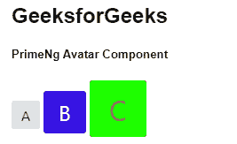

# 棱角分明的 PrimeNG 头像组件

> 原文:[https://www . geesforgeks . org/angular-priming-avatar-component/](https://www.geeksforgeeks.org/angular-primeng-avatar-component/)

Angular PrimeNG 是一个开源框架，具有一组丰富的本机 Angular UI 组件，用于实现出色的风格，该框架用于非常轻松地制作响应性网站。在本文中，我们将了解如何在 Angular PrimeNG 中使用 Avatar 组件。让我们了解一下将在代码中使用的属性、样式及其语法。

**头像组件:**用于将人表示为图标、图像或标签。

**头像属性:**

*   **标签**:用于定义要显示的文本。它是字符串数据类型，默认值为 null。
*   **图标**:用于定义要显示的图标。它是字符串数据类型，默认值为 null。
*   **图像**:用于定义要显示的图像。它是字符串数据类型，默认值为 null。
*   **大小**:用于设置元素的大小，有效选项有“大”和“xlarge”。它是字符串数据类型，默认值为 null。
*   **形状**:用于设置元素的形状，有效选项有“方形”和“圆形”。它是字符串数据类型，默认值为方形。
*   **样式**:用于设置组件的内嵌样式。它属于对象数据类型，默认值为空。
*   **样式类**:用于定义组件的样式类。它是字符串数据类型，默认值为 null。

【AvatarGroup 的属性:

*   **样式**:这里，在本例中也是，用于设置组件的内嵌样式。它属于对象数据类型，默认值为空。
*   **styleClass** :这里，在这种情况下也是，用来定义组件的样式类。它是字符串数据类型，默认值为 null。

**头像造型:**

*   **p-avatar** :是容器元素。
*   **p-头像-图像**:是图像模式下的容器元素。
*   **p-avatar-circle:** 是圆形的容器元素。
*   **p-头像-文字**:是头像的文字元素。
*   **p-头像图标**:是头像的风格图标。
*   **p-avatar-lg** :是大尺寸的容器元素。
*   **p-avatar-xl:** 是一个 xlarge 大小的容器元素。

**avatar group 的造型:**

*   **p-头像组:**用于元素的容器。

**创建角度应用&模块安装:**

*   **步骤 1:** 使用以下命令创建角度应用程序。

    ```
    ng new appname
    ```

*   **步骤 2:** 创建项目文件夹即 appname 后，使用以下命令移动到该文件夹。

    ```
    cd appname
    ```

*   **步骤 3:** 在给定的目录中安装 PrimeNG。

    ```
    npm install primeng --save
    npm install primeicons --save
    ```

**项目结构**:如下图:


**示例 1:** 这是展示如何使用头像组件的基本示例。

## app.component.html

```
<h2>GeeksforGeeks</h2>
<h5>PrimeNg Avatar Component</h5>
<p-avatar label="A" styleClass="p-mr-1"></p-avatar>
<p-avatar
  label="B"
  styleClass="p-mr-1"
  size="large"
  [style]="{'background-color':'#3714e3', 'color': '#ffffff'}">
</p-avatar>

<p-avatar
  label="C"
  styleClass="p-mr-1"
  size="xlarge"
  [style]="{'background-color':'#1eff00', 'color': '#ff8400'}">
</p-avatar>
```

## app.module.ts

```
import { NgModule } from "@angular/core";
import { BrowserModule } from "@angular/platform-browser";
import { BrowserAnimationsModule } 
    from "@angular/platform-browser/animations";
import { AppComponent } from "./app.component";
import { AvatarModule } from "primeng/avatar";

@NgModule({
  imports: [BrowserModule, 
              BrowserAnimationsModule, 
            AvatarModule],
  declarations: [AppComponent],
  bootstrap: [AppComponent],
})
export class AppModule {}
```

**输出:**



**示例 2:** 在本例中，我们将制作带有图标的圆形头像。

## app.component.html

```
<div class="card">
  <h5>Circle shaped avatar with icon</h5>
  <div>
    <p-avatar
      icon="pi pi-user"
      size="small"
      [style]="{'background-color': 'red', 'color': '#ffffff'}"
      shape="circle">
    </p-avatar>
  </div>
  <div>
    <p-avatar
      icon="pi pi-user"
      [style]="{'background-color': 'black', 'color': '#ffffff'}"
      shape="circle">
    </p-avatar>
  </div>
  <div>
    <p-avatar
      icon="pi pi-user"
      size="large"
      [style]="{'background-color':'green', 'color': '#ffffff'}"
      shape="circle">
    </p-avatar>
  </div>
  <div>
    <p-avatar icon="pi pi-user" size="xlarge" shape="circle"></p-avatar>
  </div>
</div>
```

## app.module.ts

```
import { NgModule } from "@angular/core";
import { BrowserModule } from "@angular/platform-browser";
import { BrowserAnimationsModule } 
    from "@angular/platform-browser/animations";
import { AppComponent } from "./app.component";
import { AvatarModule } from "primeng/avatar";

@NgModule({
  imports: [BrowserModule, 
              BrowserAnimationsModule, 
            AvatarModule],
  declarations: [AppComponent],
  bootstrap: [AppComponent],
})
export class AppModule {}
```

**输出:**


**参考:**T2】https://primefaces.org/primeng/showcase/#/avatar