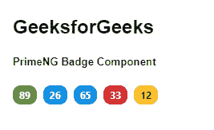
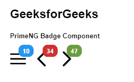

# 棱角分明的底漆徽章组件

> 原文:[https://www . geesforgeks . org/angular-priming-badge-component/](https://www.geeksforgeeks.org/angular-primeng-badge-component/)

Angular PrimeNG 是一个开源框架，具有一组丰富的本机 Angular UI 组件，用于实现出色的风格，该框架用于非常轻松地制作响应性网站。在本文中，我们将了解如何在 Angular PrimeNG 中使用 Badge 组件。

**徽章组件:**用于将文本表示为状态指示器，或将数字表示为徽章。

**属性:**

*   **值**:用于定义徽章内部显示的值。它是字符串数据类型，默认值为 null。
*   **严重性**:用于设置徽章的严重性类型。它是字符串数据类型，默认值为 null。
*   **尺寸**:用于定义徽章的尺寸，有效选项有“大”和“xlarge”。它是字符串数据类型，默认值为 null。
*   **样式**:用于设置组件的内嵌样式。它属于对象数据类型，默认值为空。
*   **样式类**:用于定义组件的样式类。它是字符串数据类型，默认值为 null。

**造型:**

*   **p-徽章**:是徽章元素。
*   **p-叠加徽章**:是一个包装徽章及其目标。
*   **p-徽章点**:是没有价值的徽章元素。
*   **p-徽章-成功:**是一个带有成功严重性的徽章元素。
*   **p-徽章-信息:**是一个带有信息严重性的徽章元素。
*   **p-徽章-警告:**是具有警告严重性的徽章元素。
*   **p-徽章-危险:**是具有危险严重性的徽章元素。
*   **p-徽章-lg:** 是大徽章元素。
*   **p-徽章-xl:** 是超大徽章元素。

**创建角度应用&模块安装:**

*   **步骤 1:** 使用以下命令创建角度应用程序。

    ```ts
    ng new appname
    ```

*   **步骤 2:** 创建项目文件夹即 appname 后，使用以下命令移动到该文件夹。

    ```ts
    cd appname
    ```

*   **步骤 3:** 在给定的目录中安装 PrimeNG。

    ```ts
    npm install primeng --save
    npm install primeicons --save
    ```

**项目结构:**如下图。


**示例 1:** 这是展示如何使用徽章组件的基本示例。

## app.component.html

```ts
<h2>GeeksforGeeks</h2>
<h5>PrimeNG Badge Component</h5>
<div class="badges">
  <p-badge [value]="89" styleClass="p-mr-2" severity="success"></p-badge>
  <p-badge [value]="26" styleClass="p-mr-2" severity="info"></p-badge>
  <p-badge [value]="65" styleClass="p-mr-2"></p-badge>
  <p-badge [value]="33" styleClass="p-mr-2" severity="danger"></p-badge>
  <p-badge [value]="12" styleClass="p-mr-2" severity="warning"></p-badge>
</div>
```

## app.module.ts

```ts
import { NgModule } from "@angular/core";
import { BrowserModule } from "@angular/platform-browser";
import { BrowserAnimationsModule } 
    from "@angular/platform-browser/animations";
import { AppComponent } from "./app.component";
import { BadgeModule } from "primeng/badge";

@NgModule({
  imports: [BrowserModule, 
              BrowserAnimationsModule, 
            BadgeModule],
  declarations: [AppComponent],
  bootstrap: [AppComponent],
})
export class AppModule {}
```

## app.component.ts

```ts
import { Component } from "@angular/core";

@Component({
  selector: "my-app",
  templateUrl: "./app.component.html",
})
export class AppComponent {}
```

**输出:**



**示例 2:** 在本例中，我们将了解如何在消息组件中插入图标。

## app.component.html

```ts
<h2>GeeksforGeeks</h2>
<h5>PrimeNG Badge Component</h5>
<i
  class="pi pi-bars p-mr-3"
  pBadge
  style="font-size: 2rem"
  value="10"
  styleClass="p-mr-5">
</i>
<i
  class="pi pi-chevron-left p-mr-3"
  pBadge
  severity="danger"
  style="font-size: 2rem"
  value="34">
</i>
<i
  class="pi pi-chevron-right"
  pBadge
  severity="success"
  style="font-size: 2rem"
  value="47">
</i>
```

## app.module.ts

```ts
import { NgModule } from "@angular/core";
import { BrowserModule } from "@angular/platform-browser";
import { BrowserAnimationsModule } 
    from "@angular/platform-browser/animations";
import { AppComponent } from "./app.component";
import { ButtonModule } from "primeng/button";
import { BadgeModule } from "primeng/badge";

@NgModule({
  imports: [
    BrowserModule,
    BrowserAnimationsModule,
    BadgeModule,
    ButtonModule,
    BadgeModule,
  ],
  declarations: [AppComponent],
  bootstrap: [AppComponent],
})
export class AppModule {}
```

## app 包含. ts

```ts
import { Component } from '@angular/core';

@Component({
  selector: 'my-app',
  templateUrl: './app.component.html'
})
export class AppComponent {}
```

**输出:**



**参考:**T2】https://primefaces.org/primeng/showcase/#/badge