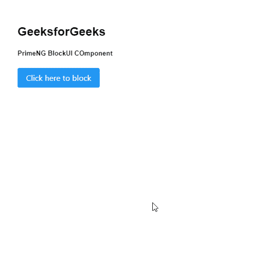
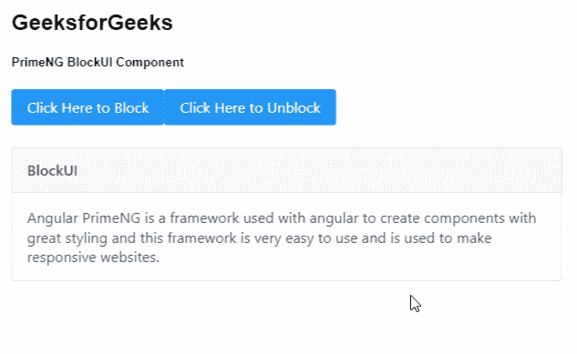

# 棱角分明的底漆块料组件

> 原文:[https://www . geesforgeks . org/angular-priming-blockui-component/](https://www.geeksforgeeks.org/angular-primeng-blockui-component/)

Angular PrimeNG 是一个开源框架，具有一组丰富的本机 Angular UI 组件，用于实现出色的风格，该框架用于非常轻松地制作响应性网站。在本文中，我们将了解如何在 Angular PrimeNG 中使用 BlockUI 组件。

**BlockUI 组件:**用于阻塞组件或整个页面。

**属性:**

*   **阻塞**:用于控制阻塞状态。它属于布尔数据类型，默认值为 false。
*   **目标**:用于定义引用另一个组件的本地 ng-template 变量的名称。它是字符串数据类型，默认值文档。
*   **baseZIndex** :用于定义分层时使用的基 z-Index 值。它是数字数据类型，默认值为 0。
*   **autoZIndex** :用于决定是否自动管理分层。它是布尔数据类型，默认值为真。
*   **样式类**:用于定义组件的样式类。它是字符串数据类型，默认值为 false。

**造型:**

*   **p-blockui:** 是掩蔽元素。
*   **p-blockui-document:** 是全屏模式下的屏蔽元素。

**创建角度应用&模块安装:**

*   **步骤 1:** 使用以下命令创建角度应用程序。

    ```
    ng new appname
    ```

*   **步骤 2:** 创建项目文件夹即 appname 后，使用以下命令移动到该文件夹。

    ```
    cd appname
    ```

*   **步骤 3:** 在给定的目录中安装 PrimeNG。

    ```
    npm install primeng --save
    npm install primeicons --save
    ```

**项目结构:**如下图:


**示例 1:** 这是展示如何使用 blockUI 组件的基本示例。

## app.component.html

```
<h2>GeeksforGeeks</h2>
<h5>PrimeNG BlockUI Component</h5>
<p-blockUI [blocked]="gfg"></p-blockUI>

<button
  type="button"
  pButton
  pRipple
  label="Click here to block"
  (click)="geeks()">
</button>
```

## app.component.ts

```
import { Component } from "@angular/core";

@Component({
  selector: "app-root",
  templateUrl: "./app.component.html",
})
export class AppComponent {
  gfg: boolean = false;

  geeks() {
    this.gfg = true;
    setTimeout(() => {
      this.gfg = false;
    }, 3000);
  }
}
```

## app.module.ts

```
import { NgModule } from "@angular/core";
import { BrowserModule } from "@angular/platform-browser";
import { FormsModule } from "@angular/forms";
import { BrowserAnimationsModule } 
    from "@angular/platform-browser/animations";

import { AppComponent } from "./app.component";
import { ButtonModule } from "primeng/button";
import { BlockUIModule } from "primeng/blockui";
import { PanelModule } from "primeng/panel";

@NgModule({
  imports: [
    BrowserModule,
    BrowserAnimationsModule,
    BlockUIModule,
    ButtonModule,
    PanelModule,
    FormsModule,
  ],
  declarations: [AppComponent],
  bootstrap: [AppComponent],
})
export class AppModule {}
```

**输出:**



**示例 2:** 在本例中，我们将了解如何在消息组件中阻止面板。

## app.component.html

```
<h2>GeeksforGeeks</h2>
<h5>PrimeNG BlockUI Component</h5>

<button
  type="button"
  pButton
  pRipple
  label="Click Here to Block"
  (click)="gfg=true">
</button>
<button
  type="button"
  pButton
  pRipple
  label="Click Here to Unblock"
  (click)="gfg=false">
</button>

<p-blockUI [target]="geeks" [blocked]="gfg">
  <i class="pi pi-lock" style="font-size: 3rem"></i>
</p-blockUI>
<p-panel #geeks header="BlockUI" styleClass="p-mt-4">
  <p class="p-m-0">
    Angular PrimeNG is a framework used with 
    angular to create components with
    great styling and this framework is very 
    easy to use and is used to make
    responsive websites.
  </p>

</p-panel>
```

## app.component.ts

```
import { Component } from "@angular/core";

@Component({
  selector: "app-root",
  templateUrl: "./app.component.html",
})
export class AppComponent {
  gfg: boolean = false;
}
```

## app.module.ts

```
import { NgModule } from "@angular/core";
import { BrowserModule } from "@angular/platform-browser";
import { FormsModule } from "@angular/forms";
import { BrowserAnimationsModule } 
    from "@angular/platform-browser/animations";

import { AppComponent } from "./app.component";
import { ButtonModule } from "primeng/button";
import { BlockUIModule } from "primeng/blockui";
import { PanelModule } from "primeng/panel";

@NgModule({
  imports: [
    BrowserModule,
    BrowserAnimationsModule,
    BlockUIModule,
    ButtonModule,
    PanelModule,
    FormsModule,
  ],
  declarations: [AppComponent],
  bootstrap: [AppComponent],
})
export class AppModule {}
```

**输出:**



**参考:**[**https://primefaces.org/primeng/showcase/#/blockui**](https://primefaces.org/primeng/showcase/#/blockui)