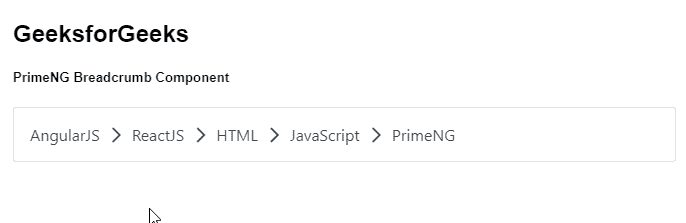
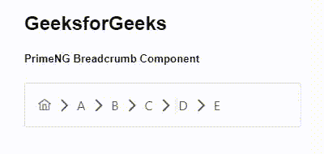

# 棱角分明的面包屑组件

> 原文:[https://www . geeksforgeeks . org/angular-priming-bread-component/](https://www.geeksforgeeks.org/angular-primeng-breadcrumb-component/)

Angular PrimeNG 是一个开源框架，具有一组丰富的本机 Angular UI 组件，用于实现出色的风格，该框架用于非常轻松地制作响应性网站。在本文中，我们将了解如何在 Angular PrimeNG 中使用面包屑组件。我们还将了解将在代码中使用的属性、事件和样式以及它们的语法。

**面包屑组件:**它提供了导航链接，用于链接用户导航通过的先前页面&并将其显示在层次结构中。

**属性:**

*   **模型:**这是一组要显示的菜单。它属于数组数据类型，默认值为 null。
*   **主页:**是主页图标的 menuItem 配置。它属于 MenuItem 类型，默认值为空。
*   **样式:**是组件的内嵌样式。它是字符串数据类型，默认值为 null。
*   **styleClass:** 是组件的样式类。它是字符串数据类型，默认值为 null。

**事件**T2:

*   **ontinemclick:**是选择一个项目时触发的回调。

**造型:**

*   **p-breadcrumb:** 是容器元素。
*   **p-menuitem:** 是 menuitem 元素。
*   **p-menuitem-text:** 是 menuitem 的标签。
*   **p-面包屑-人字形:**是人字形元素。

**创建角度应用&模块安装:**

*   **步骤 1:** 使用以下命令创建角度应用程序。

```ts
ng new appname
```

*   **步骤 2:** 创建项目文件夹即 appname 后，使用以下命令移动到该文件夹。

```ts
cd appname
```

*   **步骤 3:** 在给定的目录中安装 PrimeNG。

```ts
npm install primeng --save
npm install primeicons --save
```

**项目结构**:如下图:


**示例 1:** 这是说明如何使用面包屑组件的基本示例。**T3】**

## app.component.html

```ts
<h2>GeeksforGeeks</h2>
<h5>PrimeNG Breadcrumb Component</h5>
<p-breadcrumb [model]="gfg"></p-breadcrumb>
```

## app.module.ts

```ts
import { NgModule } from "@angular/core";
import { BrowserModule } from "@angular/platform-browser";
import { BrowserAnimationsModule } 
    from "@angular/platform-browser/animations";

import { AppComponent } from "./app.component";
import { BreadcrumbModule } from "primeng/breadcrumb";

@NgModule({
  imports: [BrowserModule, 
              BrowserAnimationsModule, 
            BreadcrumbModule],
  declarations: [AppComponent],
  bootstrap: [AppComponent],
})
export class AppModule {}
```

## app.component.ts

```ts
import { Component } from "@angular/core";
import { MenuItem } from "primeng/api";

@Component({
  selector: "my-app",
  templateUrl: "./app.component.html",
})
export class AppComponent {
  gfg: MenuItem[];

  ngOnInit() {
    this.gfg = [
      { label: "AngularJS" },
      { label: "ReactJS" },
      { label: "HTML" },
      { label: "JavaScript" },
      { label: "PrimeNG" },
    ];
  }
}
```

**输出:**



**示例 2:** 在这个示例中，我们将知道如何在面包屑组件中使用 home 属性，并且还使用 HTML 模板制作了 elements itemlist。

## app.component.html

```ts
<p-breadcrumb
  [model]="[{label: 'A'},{label: 'B'},
       {label: 'C'},{label: 'D'},{label: 'E'}]"
  [home]="home">
</p-breadcrumb>
```

## app.module.ts

```ts
import { NgModule } from "@angular/core";
import { BrowserModule } from "@angular/platform-browser";
import { BrowserAnimationsModule } 
    from "@angular/platform-browser/animations";

import { AppComponent } from "./app.component";
import { BreadcrumbModule } from "primeng/breadcrumb";

@NgModule({
  imports: [BrowserModule, 
              BrowserAnimationsModule, 
            BreadcrumbModule],
  declarations: [AppComponent],
  bootstrap: [AppComponent],
})
export class AppModule {}
```

## app.component.ts

```ts
import { Component } from "@angular/core";
import { MenuItem } from "primeng/api";

@Component({
  selector: "my-app",
  templateUrl: "./app.component.html",
})
export class AppComponent {
  gfg: MenuItem[];

  ngOnInit() {
    this.home = { icon: "pi pi-home" };
  }
}
```

**输出:**



**参考:**T2】https://primefaces.org/primeng/showcase/#/breadcrumb