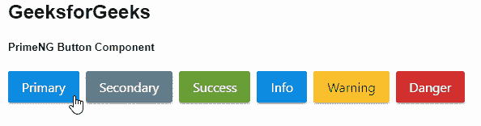
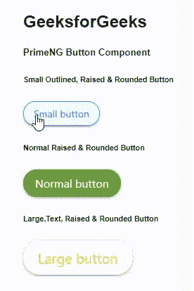

# 角度启动按钮组件

> 原文:[https://www . geesforgeks . org/angular-priming-button-component/](https://www.geeksforgeeks.org/angular-primeng-button-component/)

Angular PrimeNG 是一个开源框架，具有一组丰富的本机 Angular UI 组件，用于实现出色的风格，该框架用于非常轻松地制作响应性网站。在这篇文章中，我们将了解如何在角度灌注中使用按钮组件。我们还将了解将在代码中使用的属性、样式及其语法。

**按钮组件:**它用于制作一个标准按钮，该按钮将指示可能的用户动作。

**按钮的属性:**

*   **标签:**是按钮的文字。它是字符串数据类型&默认值为空。
*   **图标:**是图标的名称。它是字符串数据类型&默认值为空。
*   **图标位置:**指定图标的位置，有效值为“左”和“右”。它是字符串类型&默认值为左。
*   **加载:**指定按钮是否处于加载状态。它是布尔数据类型&默认值为假
*   **加载图标:**是加载状态下显示的图标。它是字符串类型&默认值是 pi pi-spinner pi-spin。

**按钮的属性:**

*   **类型**:指定按钮的类型。它是字符串类型&默认值为空。
*   **标签**:指定按钮的文字。它是字符串类型&默认值为空。
*   **图标**:指定图标的名称。它是字符串类型&默认值为空。
*   **图标**:指定图标的位置，有效值为“左”和“右”。它是字符串类型&默认值为左。
*   **徽章**:指定徽章值。它是字符串类型&默认值为空。
*   **徽章类**:指定徽章样式类。它是字符串类型&默认值为空。
*   **加载**:指定按钮是否处于加载状态。它是布尔类型的&默认值为假。
*   **加载图标**:指定加载状态下显示的图标。它是字符串类型&默认值是 pi pi-spinner pi-spin。
*   **禁用**:指定组件应禁用。它是布尔类型的&默认值为假。
*   **样式**:指定元素的内嵌样式。它是字符串类型&默认值为空。
*   **样式类**:指定元素的样式类。它是字符串类型&默认值为空。
*   **onClick** :用于按钮被点击时回调执行。它属于事件类型&，默认值为空。
*   **onFocus** :用于按钮对焦时回调执行。它属于事件类型&，默认值为空。
*   **onbull**:用于按钮失焦时回调执行。它属于事件类型&，默认值为空。

**造型:**

*   **p-button:** 是按钮元素。
*   **p-button-icon:** 是图标元素。
*   **p-button-label:** 是按钮的标签元素。

**创建角度应用&模块安装:**

*   **步骤 1:** 使用以下命令创建角度应用程序。

```
ng new appname
```

*   **步骤 2:** 创建项目文件夹即 appname 后，使用以下命令移动到该文件夹。

```
cd appname
```

*   **步骤 3:** 在给定的目录中安装 PrimeNG。

```
npm install primeng --save
npm install primeicons --save
```

**项目结构**:如下图:


**示例 1:** 这是说明如何使用按钮组件的基本示例。**T3】**

## app.component.html

```
<h2>GeeksforGeeks</h2>
<h5>PrimeNG Button Component</h5>
<button pButton pRipple label="Primary" 
  class="p-button-raised">
</button>
<button
  pButton
  pRipple
  label="Secondary"
  class="p-button-raised p-button-secondary">
</button>
<button
  pButton
  pRipple
  label="Success"
  class="p-button-raised p-button-success">
</button>
<button
  pButton
  pRipple
  label="Info"
  class="p-button-raised p-button-info">
</button>
<button
  pButton
  pRipple
  label="Warning"
  class="p-button-raised p-button-warning">
</button>
<button
  pButton
  pRipple
  label="Danger"
  class="p-button-raised p-button-danger">
</button>
```

## app.component.ts

```
import { Component } from '@angular/core';

@Component({
  selector: 'my-app',
  templateUrl: './app.component.html',
  styleUrls: ['./app.component.scss']
})
export class AppComponent {}
```

## app.module.ts

```
import { NgModule } from "@angular/core";
import { BrowserModule } from "@angular/platform-browser";
import { BrowserAnimationsModule } 
    from "@angular/platform-browser/animations";

import { AppComponent } from "./app.component";
import { ButtonModule } from "primeng/button";
import { RippleModule } from "primeng/ripple";

@NgModule({
  imports: [BrowserModule, 
              BrowserAnimationsModule, 
            ButtonModule, RippleModule],
  declarations: [AppComponent],
  bootstrap: [AppComponent],
})
export class AppModule {}
```

**输出:**



**示例 2:** 在本例中，我们将了解如何使用按钮组件中各种可用的类属性。

## app.component.html

```
<h2>GeeksforGeeks</h2>
<h5>PrimeNG Button Component</h5>
<h6>Small Outlined, Raised & Rounded Button</h6>
<button
  pButton
  pRipple
  label="Small button"
  class="p-button-raised p-button-sm p-button-rounded p-button-outlined">
</button>
<h6>Normal Raised & Rounded Button</h6>
<button
  pButton
  pRipple
  label="Normal button"
  class="p-button-raised p-button-success p-button-rounded">
</button>
<h6>Large,Text, Raised & Rounded Button</h6>
<button
  pButton
  pRipple
  label="Large button"
  class="
p-button-text p-button-raised p-button-warning p-button-lg p-button-rounded">
</button>
```

## app.component.ts

```
import { Component } from "@angular/core";

@Component({
  selector: "my-app",
  templateUrl: "./app.component.html",
  styleUrls: ["./app.component.scss"],
})
export class AppComponent {}
```

## app.module.ts

```
import { NgModule } from "@angular/core";
import { BrowserModule } from "@angular/platform-browser";
import { BrowserAnimationsModule } 
        from "@angular/platform-browser/animations";

import { AppComponent } from "./app.component";
import { ButtonModule } from "primeng/button";
import { RippleModule } from "primeng/ripple";

@NgModule({
  imports: [BrowserModule, 
              BrowserAnimationsModule, 
            ButtonModule, RippleModule],
  declarations: [AppComponent],
  bootstrap: [AppComponent],
})
export class AppModule {}
```

**输出:**



**参考:**[**https://primefaces.org/primeng/showcase/#/button**](https://primefaces.org/primeng/showcase/#/button)