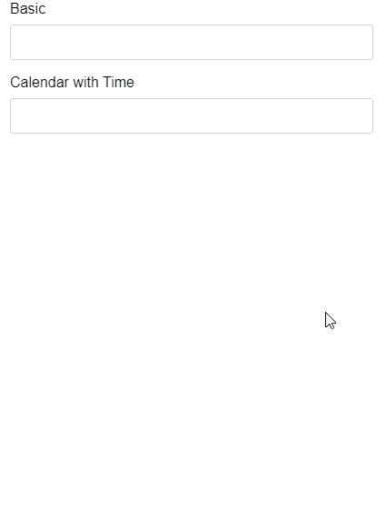

# 角质料日历组件

> 原文:[https://www . geesforgeks . org/angular-priming-calendar-component/](https://www.geeksforgeeks.org/angular-primeng-calendar-component/)

Angular PrimeNG 是一个开源框架，具有一组丰富的本机 Angular UI 组件，用于实现出色的风格，该框架用于非常轻松地制作响应性网站。在本文中，我们将了解如何在 angular ngx bootstrap 中使用日历组件。

**日历组件:** It 用于显示月度日历，允许用户选择日期并移动到下一个或上一个月。

**属性:**

*   **默认日期:**如果字段为空，则设置默认日期在第一次开盘时高亮显示。
*   **选择模式:**用于定义选择的数量，有效值为“单”、“多”和“范围”。
*   **样式:**用于给出组件的 Inline 样式。
*   **styleClass:** 是组件的 Style 类。
*   **输入样式:**用于设置输入字段的内联样式。
*   **输入样式类:**用于设置输入字段的样式类。
*   **inputId:** 是底层输入元素的 Id 标识。
*   **名称:**用于设置输入元素的名称。
*   **占位符:**用于设置输入的占位符文本。
*   **禁用:**用于禁用复选框。
*   **日期格式:**用于设置日期的格式，也可以在区域设置中定义。
*   **内联:**用于将日历显示为内联。对于弹出模式，默认值为 false。
*   **显示其他月份:**用于显示当月开始或结束时其他月份的日期(不可选择)。
*   **显示图标:**用于显示输入旁边有图标的按钮。
*   **showOnFocus:** 用于对组件设置焦点。
*   **显示周:**用于显示周数。
*   **图标:**用于日历按钮的图标。
*   **追加到:**该属性获取叠加到其上的元素的标识。
*   **readonlyInput:** 用于防止用键盘手动输入日期。
*   **短截止年:**用于显示截止年，以确定日期的世纪。
*   **minDate:** 用于显示最小可选日期。
*   **最大日期:**用于显示最大可选日期。
*   **禁用日期:**用于显示带有应禁用日期的数组(不可选择)。
*   **disabledDays:** 用于显示带有应禁用的工作日数字的数组(不可选择)。
*   **monthNavigator:** 用于显示月份是否应该呈现为下拉列表，而不是文本。
*   **verenavigator:**用于显示年份是否应该呈现为下拉列表，而不是文本。
*   **yearRange:** 用于以(nnnn:nnnn)格式如(2000:2020)显示年份下拉显示的年份范围。
*   **显示时间:**用于显示时间选择器。
*   **小时格式:**用于指定 12 或 24 小时格式。
*   **地区:**用于显示具有日历区域配置属性的对象。
*   **timeOnly:** 仅用于显示时间选择器。
*   **时间分隔符:**用于显示时间选择器的分隔符。
*   **数据类型:**它是要写回 ngModel 的值的类型，默认为日期，可选为字符串。
*   **必选:**用于指定提交表单前必须填写输入字段。
*   **Tabindex:** 用于按 tab 键顺序设置元素的 index。
*   **arilabelledby:**这是 ariaLabelBy 属性，用于建立组件和标签之间的关系，其中其值应为一个或多个元素 id。
*   **显示秒:**用于指定是否在时间选择器中显示秒。
*   **stepHour:** 用于指定每步要更改的小时数。
*   **步长分钟:**用于指定每步要改变的分钟数。
*   **stepSecond:** 用于指定每步要更改的秒数。
*   **maxDateCount:** 用于在多种模式下指定最大可选日期数。
*   **showButtonBar:** 用于指定是否显示今日和清除页脚按钮。
*   **today 按钮样式类:**用于指定 today 按钮的样式类。
*   **clearButtonStyleClass:** 用于指定清除按钮的样式类。
*   **baseZIndex:** 用于指定分层时使用的 baseZIndex 值。
*   **autoZIndex:** 用于指定是否自动管理分层。
*   **panelStyleClass:** 用于指定 datetimepicker 容器元素的 Style 类。
*   **panelStyle:** 用于设置 datetimepicker 容器元素的 Inline 样式。
*   **保持无效:**用于输入模糊时保持无效值。
*   **隐藏日期时间选择:**用于指定日期选择时是否隐藏覆盖。
*   **月数:**用于指定显示的月数。
*   **视图:**用于指定要显示的视图类型。
*   **多重分隔符:**用于指定多重选择模式的分隔符。
*   **范围分隔符:**用于在范围选择模式下指定连接开始和结束日期的分隔符。
*   **触摸界面:**用于指定日历覆盖，显示为针对触摸设备进行了优化。
*   **focusTrap:** 用于指定只关注日历内部的元素。
*   **显示过渡选项:**用于设置显示动画的过渡选项。
*   **隐藏过渡选项:**用于设置隐藏动画的过渡选项。
*   **firstDayOfWeek:** 用于定义各种日期计算的一周的第一天。

**事件:**

*   **onSelect:** 指定选择日期时调用的回调。请注意，当手动输入值时，不会调用此事件。
*   **OnBull:**它指定在输入字段模糊时调用的回调。
*   **onFocus:** 指定在输入字段的焦点上调用回调。
*   **onClose:** 它指定了关闭日期选择器面板时要调用的回调。
*   **onShow:** 它指定了在日期选择器面板可见时调用的回调。
*   **onclickouter:**它指定了在日期选择器面板外部单击时要调用的回调。
*   **onInput:** 它指定在输入字段被键入时调用的回调。
*   **to day click:**它指定当点击 today 按钮时要调用的回调。
*   **onClearClick:** 指定单击清除按钮时要调用的回调。
*   **OnMounthChange:**它指定当使用导航器更改月份时要调用的回调。
*   **onYearChange:** 它指定了当使用导航器更改年份时要调用的回调。

**造型:**

*   **p-calendar:** 指定主容器元素。
*   **p-calendar-w-btn:** 指定按钮启用时的主容器元素。
*   **p-calendar-timeonly:** 它指定了仅时间选择器模式下的主容器元素。
*   **p-inputtext:** 指定一个输入元素。
*   **p-datepicker:** 它指定了 datepicker 元素。
*   **p-datepicker-inline:** 它指定了 inline 模式下的 datepicker 元素。
*   **p-datepicker-monthppicker:**它指定月视图中的 date picker 元素。
*   **p-datepicker-touch-p:** 它指定了 touch p 模式下的 datepicker 元素。
*   **p-datepicker-calendar:** 它指定了一个包含一个月的日期的表。
*   **p-date picker-当前日期:**指定所选日期的单元格。
*   **p-datepicker-today:** 指定今天日期的单元格。

**模板:**

*   **date $implicit:** 它是组件的一个值。

**方法:**

*   **切换:**这有助于切换日历的可见性。

**日期格式:**

*   **d:** 月日(无前导零)
*   **日:**月日(两位数)
*   **o:** 一年中的某一天(无前导零)
*   **oo:** 一年中的某一天(三位数)
*   **D:** 日的简称
*   **DD:** 长格式的日名
*   **m:** 一年中的月份(无前导零)
*   **毫米:**一年中的月份(两位数)
*   **M:** 月名简写
*   **MM:** 长格式月名
*   **y:** 年(两位数)
*   **yy:** 年(四位数)
*   **@:** Unix 时间戳(自 1970 年 1 月 1 日起的毫秒)
*   **！:**窗口滴答(自 01/01/0001 以来 100 纳秒)
*   **'……':**字面意思
*   **:单引号**
*   ****其他内容:**文字**

****创建角度应用&模块安装:****

*   ****步骤 1:** 使用以下命令创建角度应用程序。

    ```ts
    ng new appname
    ```** 
*   ****步骤 2:** 创建项目文件夹(即 appname)后，使用以下命令移动到该文件夹。

    ```ts
    cd appname
    ```** 
*   ****步骤 3:** 在给定的目录中安装 PrimeNG。

    ```ts
    npm install primeng --save
    npm install primeicons --save
    ```** 

****项目结构**:如下图。**

****

****示例 1:** 这是展示如何使用日历组件的基本示例**

## **app.component.html**

```ts
<h2>GeeksforGeeks</h2>
<h4>PrimeNg Calendar Component</h4>
<p-calendar [inline]="true" [showWeek]="true"></p-calendar>
```

*   ****app.module.ts****

## **java 描述语言**

```ts
import { NgModule } from "@angular/core";
import { BrowserModule } from "@angular/platform-browser";
import { FormsModule } from "@angular/forms";
import { HttpClientModule } from "@angular/common/http";
import { BrowserAnimationsModule } from 
    "@angular/platform-browser/animations";

import { AppComponent } from "./app.component";

import { CalendarModule } from "primeng/calendar";

@NgModule({
  imports: [
    BrowserModule,
    BrowserAnimationsModule,
    CalendarModule,
    FormsModule,
  ],
  declarations: [AppComponent],
  bootstrap: [AppComponent],
})
export class AppModule {}
```

## **app.component.ts**

```ts
import { Component } from "@angular/core";

@Component({
  selector: "my-app",
  templateUrl: "./app.component.html",
  styleUrls: ["./app.component.css"],
})
export class AppComponent {}
```

****输出:****

****

****示例 2:** 我们将使用弹出式日历。**T3】****

## **app.component.html**

```ts
<div class="p-fluid p-grid p-formgrid">
  <div class="p-field p-col-12 p-md-4">
    <label>Basic</label>
    <p-calendar></p-calendar>
  </div>
  <div class="p-field p-col-12 p-md-4">
    <label>Calendar with Time</label>
    <p-calendar [showTime]="true"></p-calendar>
  </div>
</div>
```

## **app.module.ts**

```ts
import { NgModule } from "@angular/core";
import { BrowserModule } from "@angular/platform-browser";
import { FormsModule } from "@angular/forms";
import { HttpClientModule } from "@angular/common/http";
import { BrowserAnimationsModule } from "@angular/platform-browser/animations";

import { AppComponent } from "./app.component";

import { CalendarModule } from "primeng/calendar";

@NgModule({
  imports: [
    BrowserModule,
    BrowserAnimationsModule,
    CalendarModule,
    FormsModule,
  ],
  declarations: [AppComponent],
  bootstrap: [AppComponent],
})
export class AppModule {}
```

*   ****app.component.ts****

## **java 描述语言**

```ts
import { Component } from "@angular/core";

@Component({
  selector: "app-root",
  templateUrl: "./app.component.html",
  styleUrls: ["./app.component.css"],
})
export class AppComponent {}
```

****输出:****

****

****参考:**T2】https://primefaces.org/primeng/showcase/#/calendar**