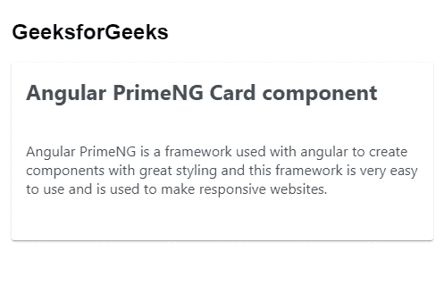
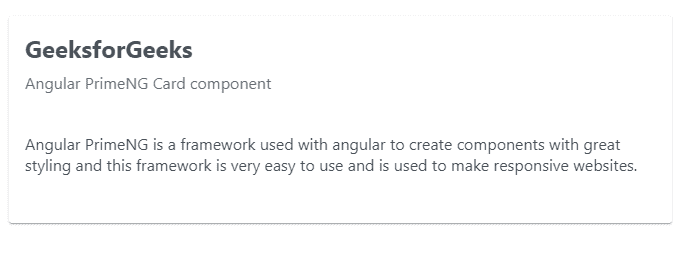

# 角部灌注卡组件

> 原文:[https://www . geesforgeks . org/angular-priming-card-component/](https://www.geeksforgeeks.org/angular-primeng-card-component/)

Angular PrimeNG 是一个开源框架，具有一组丰富的本机 Angular UI 组件，用于实现出色的风格，该框架用于非常轻松地制作响应性网站。在这篇文章中，我们将知道如何在角度灌注中使用卡片组件。我们还将了解将在代码中使用的属性、样式及其语法。

**卡片组件:**卡片用于展示灵活可扩展的内容容器。

**属性:**

*   **表头:**指定卡片标题。它是字符串数据类型&默认值为空。
*   **副标题:**指定卡片的二级标题。它是字符串数据类型&默认值为空。
*   **样式:**用于设置组件的内联样式。它是字符串数据类型&默认值为空。
*   **styleClass:** 用于设置组件的样式类。它是字符串数据类型&默认值为空。

**造型:**

*   **p-card:** 是容器元素。
*   **p-card-** 阅读器:是标题元素。
*   **p-card-副标题**:是副标题元素。
*   **p 卡-内容:**是卡的内容。
*   **p-卡片页脚:**是卡片的页脚。

**创建角度应用&模块安装:**

*   **步骤 1:** 使用以下命令创建角度应用程序。

```
ng new appname
```

*   **步骤 2:** 创建项目文件夹即 appname 后，使用以下命令移动到该文件夹。

```
cd appname
```

*   **步骤 3:** 在给定的目录中安装 PrimeNG。

```
npm install primeng --save
npm install primeicons --save
```

**项目结构**:如下图:


**示例 1:** 这是说明如何使用 Card 组件的基本示例。**T3】**

## app.component.html

```
<h2>GeeksforGeeks</h2>
<p-card header="Angular PrimeNG Card component">

<p>
    Angular PrimeNG is a framework used with
    angular to create components with great styling
    and this framework is very easy to use and
    is used to make responsive websites.
</p>

</p-card>
```

## app.component.ts

```
import { Component } from '@angular/core';

@Component({
  selector: 'my-app',
  templateUrl: './app.component.html',
  styleUrls: ['./app.component.scss']
})
export class AppComponent {}
```

## app.module.ts

```
import { NgModule } from "@angular/core";
import { BrowserModule } from "@angular/platform-browser";
import { BrowserAnimationsModule } 
    from "@angular/platform-browser/animations";

import { AppComponent } from "./app.component";
import { CardModule } from "primeng/card";

@NgModule({
  imports: [BrowserModule, 
              BrowserAnimationsModule, 
            CardModule],
  declarations: [AppComponent],
  bootstrap: [AppComponent],
})
export class AppModule {}
```

**输出:**



**示例 2:** 在本例中，我们将了解如何在 Card 组件中使用*子标题*属性。

## app.component.html

```
<p-card header='GeeksforGeeks' subheader="Angular PrimeNG Card component">

<p>
    Angular PrimeNG is a framework used with 
    angular to create components with great 
    styling and this framework is very easy 
    to use and is used to make responsive 
    websites.
</p>

</p-card>
```

## app.component.ts

```
import { Component } from '@angular/core';

@Component({
  selector: 'my-app',
  templateUrl: './app.component.html',
  styleUrls: ['./app.component.scss']
})
export class AppComponent {}
```

## app.module.ts

```
import { NgModule } from '@angular/core';
import { BrowserModule } from '@angular/platform-browser';
import { BrowserAnimationsModule } 
    from '@angular/platform-browser/animations';

import { AppComponent } from './app.component';
import { CardModule } from 'primeng/card';

@NgModule({
  imports: [BrowserModule, 
              BrowserAnimationsModule, 
            CardModule],
  declarations: [AppComponent],
  bootstrap: [AppComponent]
})
export class AppModule {}
```

**输出:**



**参考:**[](https://primefaces.org/primeng/showcase/#/button)**[https://primefaces.org/primeng/showcase/#/card](https://primefaces.org/primeng/showcase/#/card)**