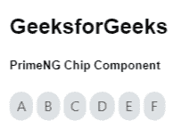

# 角焊芯片组件

> 原文:[https://www . geesforgeks . org/angular-priming-chip-component/](https://www.geeksforgeeks.org/angular-primeng-chip-component/)

Angular PrimeNG 是一个开源框架，具有一组丰富的本机 Angular UI 组件，用于实现出色的风格，该框架用于非常轻松地制作响应性网站。在本文中，我们将了解如何在 Angular PrimeNG 中使用 Chip 组件。

**芯片组件:**用于表示图标、标签和图像。

**属性:**

*   **标签**:用于定义要显示的文本。它是字符串数据类型，默认值为 null。
*   **图标**:用于定义要显示的图标。它是字符串数据类型，默认值为 null。
*   **图像**:用于定义要显示的图像。它是字符串数据类型，默认值为 null。
*   **可移除**:用于定义是否显示移除图标。它是布尔数据类型，默认值为 false。
*   **样式**:用于设置组件的内嵌样式。它属于对象数据类型，默认值为空。
*   **样式类**:用于定义组件的样式类。它是字符串数据类型，默认值为 null。
*   **移除图标**:是移除元素的图标。它是字符串数据类型，默认值是ππ-倍-圆。

**造型:**

*   **p-chip:** 是容器造型元素。
*   **p-chip-image:** 是图像模式下的容器元素。
*   **p-chip-text:** 它样式化芯片的文本。
*   **pi-chip-remove-icon:** 样式为 remove 图标。

**事件:**

*   **onRemove:** 它是一个回调函数，在移除芯片时调用。

**创建角度应用&模块安装:**

*   **步骤 1:** 使用以下命令创建角度应用程序。

    ```ts
    ng new appname
    ```

*   **步骤 2:** 创建项目文件夹即 appname 后，使用以下命令移动到该文件夹。

    ```ts
    cd appname
    ```

*   **步骤 3:** 在给定的目录中安装 PrimeNG。

    ```ts
    npm install primeng --save
    npm install primeicons --save
    ```

**项目结构:**如下图:


**示例 1:** 这是展示如何使用 Chip 组件的基本示例。

## app.component.html

```ts
<h2>GeeksforGeeks</h2>
<h5>PrimeNG Chip Component</h5>
<div class="p-d-flex p-ai-center">
  <p-chip label="A" styleClass="p-mr-1"></p-chip>
  <p-chip label="B" styleClass="p-mr-1"></p-chip>
  <p-chip label="C" styleClass="p-mr-1"></p-chip>
  <p-chip label="D" styleClass="p-mr-1"></p-chip>
  <p-chip label="E" styleClass="p-mr-1"></p-chip>
  <p-chip label="F"></p-chip>
</div>
```

## app.module.ts

```ts
import { NgModule } from "@angular/core";
import { BrowserModule } 
    from "@angular/platform-browser";
import { BrowserAnimationsModule } 
    from "@angular/platform-browser/animations";
import { AppComponent } from "./app.component";
import { ChipModule } from "primeng/chip";

@NgModule({
  imports: [BrowserModule, 
              BrowserAnimationsModule, 
            ChipModule],
  declarations: [AppComponent],
  bootstrap: [AppComponent],
})
export class AppModule {}
```

**输出:**



**示例 2:** 在本例中，我们将了解如何在 Chip 组件中使用可移动和图标属性。

## app.component.html

```ts
<h2>GeeksforGeeks</h2>
<h5>PrimeNG Chip Component</h5>
<div class="p-d-flex p-ai-center">

  <p-chip
    label="A"
    removable="true"
    styleClass="p-mr-1"
    icon="pi pi-angle-double-left">
  </p-chip>

  <p-chip
    label="B"
    icon="pi pi-angle-left  "
    removable="true"
    styleClass="p-mr-1">
  </p-chip>

  <p-chip
    label="C"
    icon="pi pi-bars"
    removable="true"
    styleClass="p-mr-1">
  </p-chip>

  <p-chip
    label="D"
    icon="pi pi-angle-right"
    removable="true"
    styleClass="p-mr-1">
  </p-chip>

  <p-chip
    label="E"
    icon="pi pi-angle-double-right"
    removable="true"
    styleClass="p-mr-1">
  </p-chip>
</div>
```

## app.module.ts

```ts
import { NgModule } from "@angular/core";
import { BrowserModule } from "@angular/platform-browser";
import { BrowserAnimationsModule } 
    from "@angular/platform-browser/animations";
import { AppComponent } from "./app.component";
import { ChipModule } from "primeng/chip";

@NgModule({
  imports: [BrowserModule, 
              BrowserAnimationsModule, 
            ChipModule],
  declarations: [AppComponent],
  bootstrap: [AppComponent],
})
export class AppModule {}
```

**输出:**


**参考:**T2】https://primefaces.org/primeng/showcase/#/chip