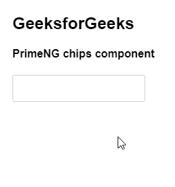
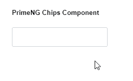

# 角焊芯片组件

> 原文:[https://www . geesforgeks . org/angular-priming-chips-component/](https://www.geeksforgeeks.org/angular-primeng-chips-component/)

Angular PrimeNG 是一个开源框架，具有一组丰富的本机 Angular UI 组件，用于实现出色的风格，该框架用于非常轻松地制作响应性网站。在本文中，我们将了解如何在 Angular PrimeNG 中使用 Chips 组件。

**Chips 组件:**它用于为一个输入字段设置多个输入值。

**属性:**

*   **字段:**用于设置要在芯片上显示的属性的名称。它是字符串数据类型，默认值为 null。
*   **max:** 用于设置允许的最大条目数。它是数字数据类型，默认值为空。
*   **禁用:**用于禁用复选框。它属于布尔数据类型，默认值为 false。
*   **样式:**用于给出组件的内嵌样式。它是字符串数据类型，默认值为 null。
*   **styleClass:** 是组件的样式类。它是字符串数据类型，默认值为 null。
*   **占位符:**用于设置输入的占位符文本。它是字符串数据类型，默认值为 null。
*   **tabindex:** 用于按 tab 键顺序设置元素的索引。它是数字数据类型，默认值为空。
*   **inputId:** 是底层输入元素的 Id 标识。它是字符串数据类型，默认值为 null。
*   **ariaLabelledBy:** 此属性建立组件和标签之间的关系，其中它的值应该是一个或多个元素标识。它是字符串数据类型，默认值为 null。
*   **允许重复:**用于设置是否允许重复值。它属于布尔数据类型，默认值为真。
*   **输入样式:**用于设置输入字段的内联样式。它是字符串数据类型，默认值为 null。
*   **输入样式类:**用于设置输入字段的样式类。它是字符串数据类型，默认值为 null。
*   **添加标签:**用于设置是否在 Tab 键上添加项目。它属于布尔数据类型，默认值为 false。
*   **addonbulr:**用于设置输入失焦时是否添加项目。它属于布尔数据类型，默认值为 false。
*   **分隔符:**用于设置除了回车键之外，按下时添加项目的分隔符。它是字符串数据类型，默认值为 null。

**事件:**

*   **onAdd:** 是一个回调，当一个值被添加时被触发。
*   **onRemove:** 它是一个回调，当一个值被移除时会被触发。
*   **onChipClick:** 是点击芯片时触发的回调。
*   **onFocus:** 它是一个回调，当一个输入被聚焦时被触发。
*   **onbulr:**是输入失去焦点时触发的回调。

**造型:**

*   **p-chips:** 是容器元素。
*   **p-chips-token:** 是一个 chip 元素容器。
*   **p-chips-token-icon:** 是一个芯片的图标。
*   **p-chips-token-label:** 是一个芯片的标签。
*   **p-chips-input-token:** 是输入元素的容器。

**创建角度应用&模块安装:**

*   **步骤 1:** 使用以下命令创建角度应用程序。

    ```ts
    ng new appname
    ```

*   **步骤 2:** 创建项目文件夹即 appname 后，使用以下命令移动到该文件夹。

    ```ts
    cd appname
    ```

*   **步骤 3:** 在给定的目录中安装 PrimeNG。

    ```ts
    npm install primeng --save
    npm install primeicons --save
    ```

**项目结构**:如下图:


**示例 1:** 这是展示如何使用 Chips 组件的基本示例。

## app.component.html

```ts
<div>
  <h2>GeeksforGeeks</h2>
  <h4>PrimeNG chips component</h4>
  <p-chips></p-chips>
</div>
```

## app.component.ts

```ts
import { Component } from '@angular/core';

@Component({
  selector: 'my-app',
  templateUrl: './app.component.html'
})
export class AppComponent {}
```

## app.module.ts

```ts
import { NgModule } from "@angular/core";
import { BrowserModule } from "@angular/platform-browser";
import { FormsModule } from "@angular/forms";
import { HttpClientModule } from "@angular/common/http";
import { BrowserAnimationsModule } 
    from "@angular/platform-browser/animations";

import { AppComponent } from "./app.component";
import { ChipsModule } from "primeng/chips";
import { ButtonModule } from "primeng/button";

@NgModule({
  imports: [
    BrowserModule,
    BrowserAnimationsModule,
    ChipsModule,
    ButtonModule,
    FormsModule,
  ],
  declarations: [AppComponent],
  bootstrap: [AppComponent],
})
export class AppModule {}
```

**输出:**



**示例 2:** 在本例中，我们有一个 Chips 组件的模板。**T3】**

## app.component.html

```ts
<h5>PrimeNG Chips Component</h5>
<p-chips [(ngModel)]="geeks">
  <ng-template let-gfg pTemplate="gfg">
    {{gfg}}<i class="pi pi-user p-ml-2"></i>
  </ng-template>
</p-chips>
```

## app.component.ts

```ts
import { Component } from "@angular/core";
import { MenuItem } from "primeng/api";

@Component({
  selector: "my-app",
  templateUrl: "./app.component.html",
})
export class AppComponent {
  geeks: string[];
}
```

## app.module.ts

```ts
import { NgModule } from "@angular/core";
import { BrowserModule } from "@angular/platform-browser";
import { FormsModule } from "@angular/forms";
import { HttpClientModule } from "@angular/common/http";
import { BrowserAnimationsModule } 
    from "@angular/platform-browser/animations";

import { AppComponent } from "./app.component";
import { ChipsModule } from "primeng/chips";
import { ButtonModule } from "primeng/button";

@NgModule({
  imports: [
    BrowserModule,
    BrowserAnimationsModule,
    ChipsModule,
    ButtonModule,
    FormsModule,
  ],
  declarations: [AppComponent],
  bootstrap: [AppComponent],
})
export class AppModule {}
```

**输出:**



**参考:**T2】https://primefaces.org/primeng/showcase/#/chips