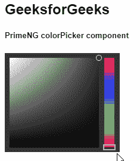
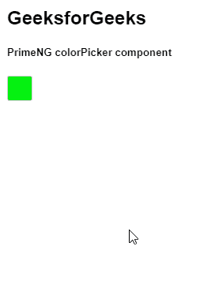

# 角度预着色拾色器组件

> 原文:[https://www . geesforgeks . org/angular-priming-color picker-component/](https://www.geeksforgeeks.org/angular-primeng-colorpicker-component/)

Angular PrimeNG 是一个开源框架，具有一组丰富的本机 Angular UI 组件，用于实现出色的风格，该框架用于非常轻松地制作响应性网站。在本文中，我们将了解如何在 Angular PrimeNG 中使用颜色选择器组件。

**拾色器组件:**它用来制作一个用户可以选择颜色的组件。

**属性:**

*   **样式:**用于设置元素的内联样式。它是字符串数据类型&默认值为空。
*   **styleClass:** 用于设置元素的样式类。它是字符串数据类型&默认值为空。
*   **内联:**用于指定是否显示为叠加。它是布尔数据类型&默认值为假。
*   **格式:**用于设置值绑定中使用的格式，支持的格式有十六进制、RGB & HSB。为字符串数据类型&，默认值为十六进制。
*   **appendTo:** 用于设置附着叠加的目标元素。它是字符串数据类型&默认值为空。
*   **tabindex:** 用于按 tab binding 顺序设置元素的索引。它是数字数据类型&默认值为空。
*   **禁用:**用于指定组件应禁用。它属于布尔数据类型&默认值为假。
*   **inputId:** 是底层输入元素的 Id 标识。它是字符串数据类型&默认值为空。
*   **baseZIndex:** 用于设置分层时使用的 baseZIndex 值。它是数字数据类型，默认值为 0。
*   **autoZIndex:** 用于指定是否自动管理分层。它属于布尔数据类型，默认值为真。
*   **显示过渡选项:**用于设置显示动画的过渡选项。它是字符串数据类型，默认值是. 12s 三次贝塞尔曲线(0，0，0.2，1)。
*   **隐藏过渡选项:**用于设置隐藏动画的过渡选项。它是字符串数据类型，默认值为. 1s 线性。

**事件:**

*   **onChange:** 是选择颜色时触发的回调。
*   **onShow:** 这是一个回调，在弹出窗口显示时触发。
*   **onHide:** 这是一个回调，当弹出窗口隐藏时触发。

**造型:**

*   **p-colorpicker:** 它是一个造型容器元素。
*   **p-colorpicker-overlay:** 它是一个覆盖模式下的造型容器元素。
*   **p-colorpicker-preview:** 是叠加模式下的 preview 输入。
*   **p-拾色器面板:**它是拾色器的造型面板元素。
*   **p-colorpicker-content:** 它是一个包含颜色和色调部分的包装器。
*   **p-拾色器-颜色选择器:**它是一个颜色选择器。
*   **p-拾色器-颜色:**它是一个造型颜色元素。
*   **p-color picker-color-handle:**是颜色元素的句柄。
*   **p-拾色器-色相:**是色相滑块。
*   **p-拾色器-色相-手柄:**是色相滑块的手柄。

**创建角度应用&模块安装:**

*   **步骤 1:** 使用以下命令创建角度应用程序。

    ```
    ng new appname
    ```

*   **步骤 2:** 创建项目文件夹(即 appname)后，使用以下命令移动到该文件夹。

    ```
    cd appname
    ```

*   **步骤 3:** 在给定的目录中安装 PrimeNG。

    ```
    npm install primeng --save
    npm install primeicons --save
    ```

**项目结构**:完成以上流程后，如下图。


有两个属性可以使用颜色选择器，第一个属性使用内联&第二个属性使用覆盖。

**示例 1:** 在这个示例中，我们将使用一个内联属性来选择颜色&这是展示如何使用 colorPicker 组件的基本示例。

## app.component.html

```
<h2>GeeksforGeeks</h2>
<h5>PrimeNG colorPicker component</h5>
<p-colorPicker [(ngModel)]="selectColor" [inline]="true"> </p-colorPicker>
```

## app.module.ts

```
import { NgModule } from "@angular/core";
import { BrowserModule } from "@angular/platform-browser";
import { FormsModule } from "@angular/forms";
import { HttpClientModule } from "@angular/common/http";
import { BrowserAnimationsModule } 
    from "@angular/platform-browser/animations";

import { AppComponent } from "./app.component";

import { ColorPickerModule } from "primeng/colorpicker";

@NgModule({
  imports: [
    BrowserModule,
    BrowserAnimationsModule,
    FormsModule,
    ColorPickerModule,
  ],
  declarations: [AppComponent],
  bootstrap: [AppComponent],
})
export class AppModule {}
```

## app.component.ts

```
import { Component } from "@angular/core";

@Component({
  selector: "my-app",
  templateUrl: "./app.component.html",
})
export class AppComponent {
  selectColor: string;
}
```

**输出:**



**示例 2:** 在本例中，我们将了解如何使用 overlay 属性在 colorPicker 组件中选择颜色。**T3】**

*   **app.component.html:**

## app.component.html

```
<h2>GeeksforGeeks</h2>
<h5>PrimeNG colorPicker component</h5>
<p-colorPicker [inline]="false" [(ngModel)]="gfg"></p-colorPicker>
```

## app.module.ts

```
import { NgModule } from '@angular/core';
import { BrowserModule } from '@angular/platform-browser';
import { FormsModule } from '@angular/forms';
import { HttpClientModule } from '@angular/common/http';
import { BrowserAnimationsModule } 
    from '@angular/platform-browser/animations';

import { AppComponent } from './app.component';

import { ColorPickerModule } from 'primeng/colorpicker';

@NgModule({
  imports: [
    BrowserModule,
    BrowserAnimationsModule,
    FormsModule,
    ColorPickerModule
  ],
  declarations: [AppComponent],
  bootstrap: [AppComponent]
})
export class AppModule {}
```

## app.component.ts

```
import { Component } from "@angular/core";

@Component({
  selector: "my-app",
  templateUrl: "./app.component.html",
})
export class AppComponent {
  gfg: string = "#05f211";
}
```

**输出:**



**参考:**T2】https://primefaces.org/primeng/showcase/#/colorpicker