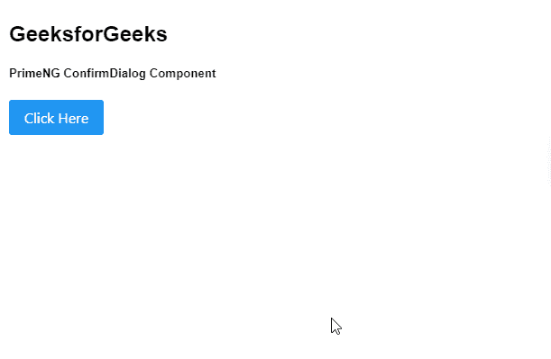

# 角度灌注确认对话框组件

> 原文:[https://www . geeksforgeeks . org/angular-priming-confirm dialog-component/](https://www.geeksforgeeks.org/angular-primeng-confirmdialog-component/)

Angular PrimeNG 是一个与 Angular 一起使用的框架，用来创建具有很好样式的组件，这个框架非常易于使用，用于制作响应性网站。

在本文中，我们将了解如何在角度预处理中使用确认对话框组件。**确认对话框组件**用于制作包含确认按钮的对话框来确认元素。

**属性:**

*   **消息:**是确认的消息。为字符串数据类型，默认值为空。
*   **键:** 是可选键，匹配确认对话框的键。为字符串数据类型，默认值为空。
*   **图标:** 是显示在消息旁边的图标。为字符串数据类型，默认值为空。
*   **表头:** 是对话框的表头文本。为字符串数据类型，默认值为空。
*   **接受:** 确认动作时执行的是回调。
*   **拒绝:** 动作被拒绝时执行的是回调
*   **acceptLabel:** 是接受按钮的标签。为字符串数据类型，默认值为空。
*   **拒绝标签:** 是拒绝按钮的标签。为字符串数据类型，默认值为空。
*   **acceptIcon:** 是接受按钮的图标。为字符串数据类型，默认值为空。
*   **拒绝图标:** 是拒绝按钮的图标。为字符串数据类型，默认值为空。
*   **accept button Style class:**用于设置接受按钮的 Style class。为字符串数据类型，默认值为空。
*   **拒绝按钮样式类:** 用于设置拒绝按钮的样式类。为字符串数据类型，默认值为空。
*   **接受可见:** 用于设置接受按钮的可见性。为布尔数据类型&默认值为假。
*   **拒绝可见:** 用于设置拒绝按钮的可见性。为布尔数据类型&默认值为假。
*   **风格:** 是组件的直列风格。为对象数据类型，默认值为空。
*   **styleClass:** 它是组件的 Style class。为字符串数据类型，默认值为空。
*   **面具风格类:** 是面具的风格类。为字符串数据类型，默认值为空。
*   **阻止滚动:** 用于在对话框可见时指定是否要阻止背景滚动。为布尔数据类型&默认值为假。
*   **关闭视图:** 它指定按下退出键是否应该隐藏对话框。为布尔数据类型&默认值为假。
*   **取消问题询问:** 它指定单击模态背景是否应该隐藏对话框。为布尔数据类型&默认值为假。
*   **默认焦点:** 当对话框可见时，是元素接收焦点。

**事件:**

*   **onHide:** 是对话框隐藏时触发的回调。

**创建角度应用和安装模块:**

*   **步骤 1:** 使用以下命令创建角度应用程序。

```ts
ng new appname
```

*   **步骤 2:** 创建项目文件夹即 appname 后，使用以下命令移动到该文件夹。

```ts
cd appname
```

*   **步骤 3:** 在给定的目录中安装 PrimeNG。

```ts
npm install primeng --save
npm install primeicons --save
```

**项目结构**:如下图。


**示例:**这是展示如何使用**确认对话框组件**的基本示例

## app.component.html

```ts
<h2>GeeksforGeeks</h2>
<h5>PrimeNG ConfirmDialog Component</h5>
<p-confirmDialog [style]="{width: '60vw'}"></p-confirmDialog>
<p-button (click)="GetConfirm()" label="Click Here"></p-button>
```

## app.module.ts

```ts
import { NgModule } from '@angular/core';
import { BrowserModule } from '@angular/platform-browser';
import {BrowserAnimationsModule} 
      from '@angular/platform-browser/animations';

import { AppComponent }   from './app.component';

import { ButtonModule } from 'primeng/button';
import { ConfirmDialogModule } from 'primeng/confirmdialog';

@NgModule({
  imports: [
    BrowserModule,
    BrowserAnimationsModule,
    ConfirmDialogModule,
    ButtonModule,
  ],
  declarations: [ AppComponent ],
  bootstrap:    [ AppComponent ]
})

export class AppModule { }
```

## app.component.ts

```ts
import { Component } from '@angular/core';
import {ConfirmationService} from 'primeng/api';
import { PrimeNGConfig } from 'primeng/api';

@Component({
  selector: 'app-root',
  templateUrl: './app.component.html',
  styles: [],
  providers: [ConfirmationService]
})
export class AppComponent { 

    constructor(private confirmationService: ConfirmationService,
    private primengConfig: PrimeNGConfig) {}

    GetConfirm() {
        this.confirmationService.confirm({
            message: 'Angular PrimeNG ConfirmDialog Component',
            header: 'GeeksforGeeks',
        });
    }
}
```

**输出:**



**参考:**T2】https://primefaces.org/primeng/showcase/#/confirmdialog