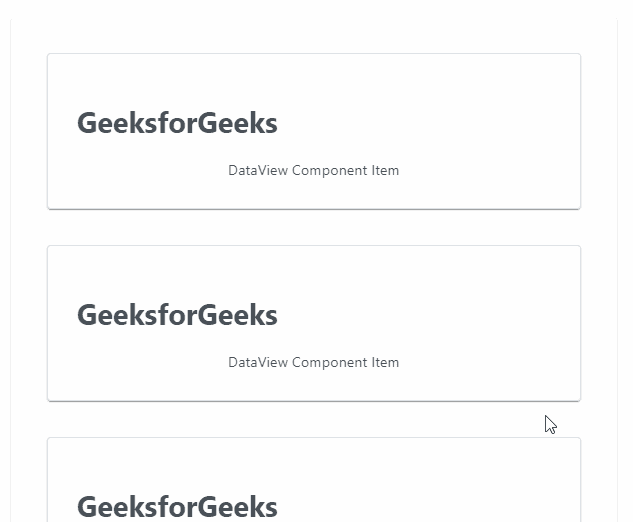
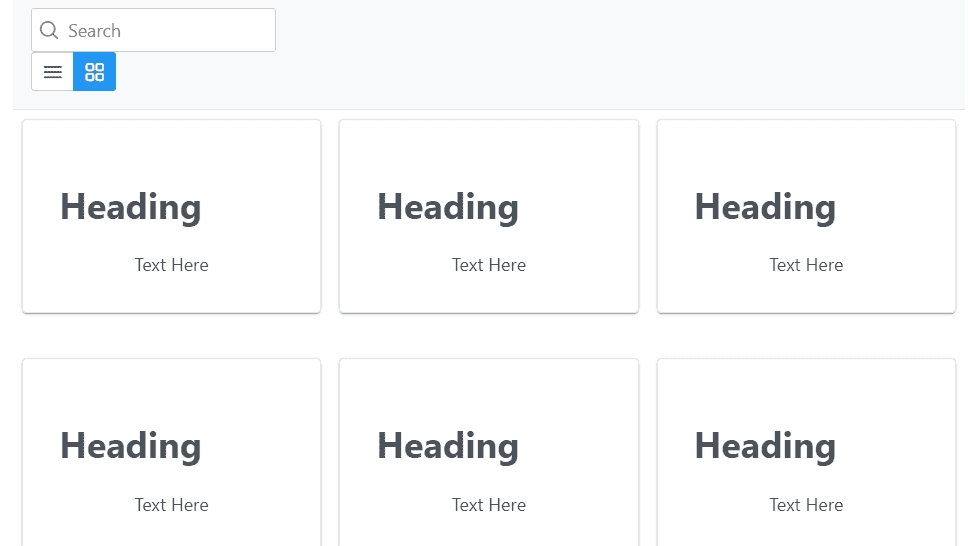

# 角度预处理数据视图组件

> 原文:[https://www . geesforgeks . org/angular-priming-data view-component/](https://www.geeksforgeeks.org/angular-primeng-dataview-component/)

Angular PrimeNG 是一个开源框架，具有一组丰富的本机 Angular UI 组件，用于实现出色的风格，该框架用于非常轻松地制作响应性网站。在本文中，我们将了解如何在 Angular PrimeNG 中使用 dataView 组件。我们还将了解将在代码中使用的属性、事件和样式以及它们的语法。

**dataView 组件**:用于显示网格和列表布局中的数据，具有分页和排序功能。

**属性:**

*   **值**:是要显示的对象数组。它属于数组数据类型，默认值为 null。
*   **布局**:是项目的布局，有效值为“列表”和“网格”。它是字符串数据类型，默认值是列表。
*   **分页器**:如果指定为真，则显示分页。它属于布尔数据类型，默认值为 false。
*   **行**:表示每页显示的行数。它是数字数据类型，默认值为空。
*   **总记录数**:表示总记录数，未定义时默认为值的长度。它是数字数据类型，默认值为空。
*   **页面链接**:表示分页器中要显示的页面链接数。它是数字数据类型，默认值为 5。
*   **行页面选项**:表示在分页器的每页行下拉列表中显示的整数/对象值数组。它属于数组数据类型，默认值为 null。
*   **分页位置**:是分页器的位置，选项有“顶”、“底”或者“两者都有”。它是字符串数据类型。它是字符串数据类型，默认值是底部。
*   **alwaysShowPaginator** :指定即使只有一页是否显示。它属于布尔数据类型，默认值为真。
*   **showfirst plastion**:指定分页器上显示的图标为第一页和最后一页。它是布尔数据类型，默认值为真。
*   **paginatordropdownlappendto**:是附着分页器下拉覆盖的目标元素。它接受任何数据类型，默认值为 null。
*   **分页器下拉高度**:是视口的分页器下拉高度，以像素为单位。它是字符串数据类型，默认值为 200px。
*   **显示当前页面报告**:指定是否显示当前页面报告。它属于布尔数据类型，默认值为 false。
*   **showJumpToPageDropdown** :指定是否显示下拉菜单导航到任意页面。它属于布尔数据类型，默认值为 false。
*   **显示页面链接**:指定是否显示页面链接。它是布尔数据类型，默认值为真。
*   **惰性**:指定数据是否以惰性方式加载和交互。它属于布尔数据类型，默认值为 false。
*   **emptyMessage** :无数据时显示的文本，为字符串数据类型。
*   **样式**:是组件的内嵌样式。它是字符串数据类型，默认值为 null。
*   **styleClass** :是组件的 Style 类。它是字符串数据类型，默认值为 null。
*   **trackBy** :是通过委托给 ngForTrackBy 优化 dom 操作的功能，默认算法检查对象身份。属于函数数据类型，默认值为空。
*   **筛选依据**:是对象图中以逗号分隔的要搜索的字段列表。它是字符串数据类型，默认值为 null。
*   **过滤区域**:过滤时使用的区域。它是字符串数据类型，默认值未定义。
*   **加载**:显示加载器，表示数据加载正在进行。它属于布尔数据类型，默认值为 false。
*   **加载图标**:表示数据加载正在进行时显示的图标。它是字符串数据类型，默认值是 pi pi-spinner。
*   **第一个**:显示第一行的索引，数据类型为数字，默认值为 0。

**事件:**

*   **onlaziload**:是在惰性模式下发生分页、排序或过滤时触发的回调。
*   **onPage** :是分页发生时触发的回调。
*   **on start**:是排序发生时触发的回调。
*   **onChangeLayout** :是改变布局时触发的回调。

**造型:**

*   **p-dataview:** 它是一个造型容器元素。
*   **p-dataview-list:** 是列表布局中的样式容器元素。
*   **p-dataview-grid:** 它是网格布局中的样式容器元素。
*   **p-dataview-header:** 这是一个样式化的 header 部分。
*   **p-data view-页脚:**这是一个样式页脚部分。
*   **p-dataview-content:** 是一个物品的造型容器。
*   **p-dataview-emptymessage:** 它是一个样式化的空消息元素。

**创建角度应用&模块安装:**

**步骤 1** :使用以下命令创建角度应用程序。

```ts
ng new appname
```

**步骤 2:** 创建项目文件夹即 appname 后，使用以下命令移动到该文件夹。

```ts
cd appname
```

**第三步**:在给定的目录下安装 PrimeNG。

```ts
npm install primeng --save
npm install primeicons --save
```

**项目结构:**如下图:


**示例 1:** 这是展示如何使用 dataView 组件的基本示例。

## app.component.html

```ts
<div class="card">
  <p-dataView
    #dv
    [value]="productNames"
    [paginator]="true"
    [rows]="3"
    filterBy="name"
    layout="grid">
    <ng-template let-product pTemplate="gridItem">
      <div class="p-col-12 p-md-4">
        <div class="product-grid-item card">
          <div class="product-grid-item-top">
            <h1>GeeksforGeeks</h1>
          </div>
          <div class="product-grid-item-content">
            DataView Component Item
          </div>
        </div>
      </div>
    </ng-template>
  </p-dataView>
</div>
```

## app.component.ts

```ts
import { Component } from "@angular/core";
import { ProductService } from "./productservice";
import { Product } from "./product";
import { SelectItem } from "primeng/api";
import { PrimeNGConfig } from "primeng/api";

@Component({
  selector: "app-root",
  templateUrl: "./app.component.html",
  styleUrls: ["./app.component.css"],
})
export class AppComponent {
  productNames: string[] = [
    "GeeksforGeeks",
    "GeeksforGeeks",
    "GeeksforGeeks",
    "GeeksforGeeks",
    "GeeksforGeeks",
    "GeeksforGeeks",
    "GeeksforGeeks",
    "GeeksforGeeks",
    "GeeksforGeeks",
    "GeeksforGeeks",
    "GeeksforGeeks",
    "GeeksforGeeks",
    "GeeksforGeeks",
  ];

  ngOnInit() {}
}
```

## app.module.ts

```ts
import { NgModule } from "@angular/core";
import { BrowserModule } from "@angular/platform-browser";
import { FormsModule } from "@angular/forms";
import { HttpClientModule } from "@angular/common/http";
import { BrowserAnimationsModule } 
    from "@angular/platform-browser/animations";

import { AppComponent } from "./app.component";
import { DataViewModule } from "primeng/dataview";

@NgModule({
  imports: [
    BrowserModule,
    BrowserAnimationsModule,
    DataViewModule,
    HttpClientModule,
    FormsModule,
  ],
  declarations: [AppComponent],
  bootstrap: [AppComponent],
})
export class AppModule {}
```

**输出:**



**示例 2:** 在本例中，我们将对数据视图组件和数据视图的不同布局使用搜索选项。

## app.component.html

```ts
<div class="card">
  <p-dataView
    #dv
    [value]="productNames"
    [paginator]="true"
    [rows]="9"
    filterBy="name"
    [sortField]="sortField"
    [sortOrder]="sortOrder"
    layout="grid">
    <ng-template pTemplate="header">
      <div>
        <span class="p-input-icon-left p-mb-2 p-mb-md-0">
          <i class="pi pi-search"></i>
          <input
            type="search"
            pInputText
            placeholder="Search"
            (input)="dv.filter($event.target.value)"/>
        </span>
        <p-dataViewLayoutOptions>
          Options
        </p-dataViewLayoutOptions>
      </div>
    </ng-template>
    <ng-template let-product pTemplate="gridItem">
      <div class="p-col-12 p-md-4">
        <div class="product-grid-item card">
          <div class="product-grid-item-top">
            <h1>{{product}}</h1>
          </div>
          <div class="product-grid-item-content">
            Text Here
          </div>
        </div>
      </div>
    </ng-template>
  </p-dataView>
</div>
```

## app.component.ts

```ts
import { Component } from "@angular/core";
import { ProductService } from "./productservice";
import { Product } from "./product";
import { SelectItem } from "primeng/api";
import { PrimeNGConfig } from "primeng/api";

@Component({
  selector: "app-root",
  templateUrl: "./app.component.html",
  styleUrls: ["./app.component.css"],
})
export class AppComponent {
  productNames: string[] = [
    "Heading",
    "Heading",
    "Heading",
    "Heading",
    "Heading",
    "Heading",
    "Heading",
    "Heading",
    "Heading",
    "Heading",
    "Heading",
    "Heading",
    "Heading",
    "Heading",
    "Heading",
  ];

  ngOnInit() {}
}
```

## app.module.ts

```ts
import { NgModule } from "@angular/core";
import { BrowserModule } from "@angular/platform-browser";
import { FormsModule } from "@angular/forms";
import { HttpClientModule } from "@angular/common/http";
import { BrowserAnimationsModule } 
    from "@angular/platform-browser/animations";

import { AppComponent } from "./app.component";
import { DataViewModule } from "primeng/dataview";

@NgModule({
  imports: [
    BrowserModule,
    BrowserAnimationsModule,
    DataViewModule,
    HttpClientModule,
    FormsModule,
  ],
  declarations: [AppComponent],
  bootstrap: [AppComponent],
})
export class AppModule {}
```

**输出:**



**参考:**T2】https://primefaces.org/primeng/showcase/#/dataview