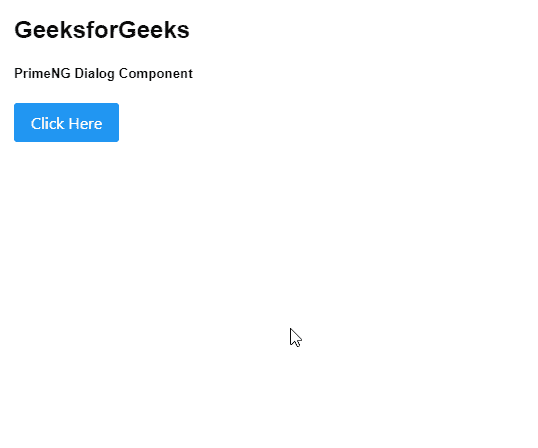
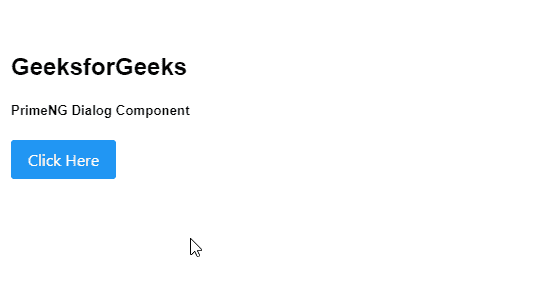
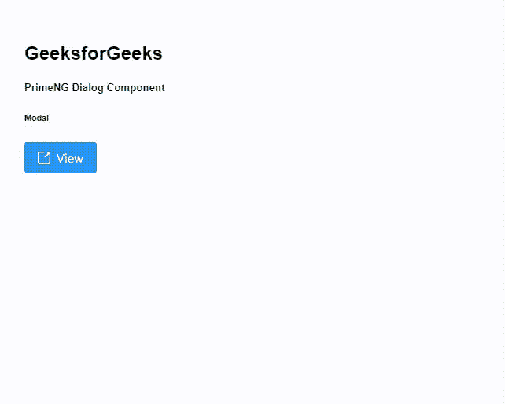

# 角度预调对话框组件

> 原文:[https://www . geesforgeks . org/angular-priming-dialog-component/](https://www.geeksforgeeks.org/angular-primeng-dialog-component/)

Angular PrimeNG 是一个开源框架，具有一组丰富的本机 Angular UI 组件，用于实现出色的风格，该框架用于非常轻松地制作响应性网站。在本文中，我们将了解如何在 Angular PrimeNG 中使用 Dialog 组件。我们还将了解将在代码中使用的属性、事件和样式以及它们的语法。

**对话框组件:**它是用来让包含一些内容的组件显示在叠加窗口中。

**属性:**

*   **表头** **:** 是对话框的标题文本。它是字符串数据类型，默认值为 null。
*   **可拖动:**允许拖动使用标题改变位置。它属于布尔数据类型，默认值为真。
*   **keepInViewport:** 用于在视口中保持对话框。它是布尔数据类型，默认值为真。
*   **可调整大小:**可调整内容大小。它是布尔数据类型，默认值为真。
*   **contentStyle:** 用于设置内容节的样式。它属于对象数据类型，默认值为空。
*   **可见:**指定对话框的可见性。它属于布尔数据类型，默认值为 false。
*   **模态:**用于定义对话框显示时是否要遮挡背景。它属于布尔数据类型，默认值为 false。
*   **位置:**用于设置对话框的位置。它是字符串数据类型，默认值是中心。
*   **阻止滚动:**用于指定对话框可见时是否要阻止背景滚动。它属于布尔数据类型，默认值为 false。
*   **closenescape:**用于指定按退出键是否应该隐藏对话框。它是布尔数据类型，默认值为真。
*   **dismissionAsk:**用于指定点击模态背景是否应该隐藏对话框。它是布尔数据类型，默认值为 false。
*   **rtl:** 当启用的对话框显示在 rtl 方向时。它是布尔数据类型，默认值为 false。
*   **可关闭:**用于在表头设置关闭图标，隐藏对话框。它是布尔数据类型，默认值为真。
*   **appendTo:** 用于设置附加对话框的 Target 元素，有效值为“body”或另一个元素的局部 ng-template 变量。它接受任何数据类型，默认值为 null。
*   **样式:**用于设置组件的内嵌样式。它属于对象数据类型，默认值为空。
*   **styleClass:** 用于设置组件的样式类。它是字符串数据类型，默认值为 null。
*   **遮罩样式类:**用于设置遮罩的样式类。它是字符串数据类型，默认值为 null。
*   **内容样式:**用于设置内容的内联样式。它属于对象数据类型，默认值为空。
*   **contentStyleClass:** 用于设置内容的样式类。它是字符串数据类型，默认值为 null。
*   **显示表头:**用于指定是否显示表头。它是布尔数据类型，默认值为真。
*   **baseZIndex:** 用于设置分层时使用的 baseZIndex 值。它是数字数据类型，默认值为 0。
*   **autoZIndex:** 用于指定是否自动管理分层。它是布尔数据类型，默认值为真。
*   **minX:** 用于设置拖动时对话框左侧坐标的最小值。它是数字数据类型，默认值为 0。
*   **minY:** 用于设置拖动时对话框顶部坐标的最小值。它是数字数据类型，默认值为 0。
*   **焦点显示:**用于指定第一个按钮在显示时接收焦点。它属于布尔数据类型，默认值为真。
*   **focusTrap:** 用于指定元素是否只能关注对话框内部的元素。它是布尔数据类型，默认值为真。
*   **最大化:**用于指定对话框是否可以全屏显示。它属于布尔数据类型，默认值为 false。
*   **断点:**是定义每个屏幕尺寸宽度的对象文字。它属于对象数据类型，默认值为空。
*   **过渡选项:**用于设置动画的过渡选项。它是字符串数据类型，默认值是 150 毫秒三次贝塞尔曲线(0，0，0.2，1)。
*   **关闭图标:**用于设置关闭图标的名称。它是字符串数据类型，默认值为 null。
*   **最小化图标:**用于设置最小化图标的名称。它是字符串数据类型，默认值是 pi pi-window-minimum。
*   **最大化图标:**用于设置最大化图标的名称。它是字符串数据类型，默认值是 pi pi-window-maximum。

**事件:**

*   **onShow** :显示对话框时会触发一个回调。
*   **on side**:是对话框隐藏时触发的回调。
*   **OnResizenit**:是一个回调，在对话框大小调整启动时触发。
*   **onResizeEnd** :是对话框大小调整完成时触发的回调。
*   **onDragEnd** :是对话框拖动完成时触发的回调。
*   **onMaximize** :是对话框最大化或未最大化时触发的回调。

**造型:**

*   **p-dialog** :是容器元素。
*   **p-dialog-标题栏:**是表头的容器。
*   **p-dialog-title:** 是表头元素。
*   **p-对话框-标题栏-图标:**是表头内部的图标容器。
*   **p-对话框-标题栏-关闭:**是关闭图标元素。
*   **p-dialog-content** :是内容元素。
*   **p-dialog-页脚:**是页脚元素。

**创建角度应用&模块安装:**

*   **步骤 1:** 使用以下命令创建角度应用程序。

```
ng new appname
```

*   **步骤 2:** 创建项目文件夹即 appname 后，使用以下命令移动到该文件夹。

```
cd appname
```

*   **步骤 3:** 在给定的目录中安装 PrimeNG。

```
npm install primeng --save
npm install primeicons --save
```

**项目结构**:如下图:


**示例 1:** 这是展示如何使用 Dialog 组件的基本示例。**T3】**

## app.component.html

```
<h2>GeeksforGeeks</h2>
<h5>PrimeNG Dialog Component</h5>
<p-button (click)="gfg()" label="Click Here"></p-button>
<p-dialog header="GeeksforGeeks" [(visible)]="geeks">

<p>Angular PrimeNG Dialog Component</p>

</p-dialog>
```

## app.module.ts

```
import { NgModule } from "@angular/core";
import { BrowserModule } from "@angular/platform-browser";
import { BrowserAnimationsModule } 
    from "@angular/platform-browser/animations";

import { AppComponent } from "./app.component";
import { DialogModule } from "primeng/dialog";
import { ButtonModule } from "primeng/button";

@NgModule({
  imports: [BrowserModule, 
              BrowserAnimationsModule, 
            DialogModule, 
            ButtonModule],
  declarations: [AppComponent],
  bootstrap: [AppComponent],
})
export class AppModule {}
```

## app.component.ts

```
import { Component } from "@angular/core";
import { PrimeNGConfig } from "primeng/api";

@Component({
  selector: "my-app",
  templateUrl: "./app.component.html",
})
export class AppComponent {
  constructor(private primengConfig: PrimeNGConfig) {}

  ngOnInit() {
    this.primengConfig.ripple = true;
  }

  geeks: boolean;

  gfg() {
    this.geeks = true;
  }
}
```

**输出:**



**示例 2:** 在本例中，我们将了解如何在对话框组件中使用*位置*属性。

## app.component.html

```
<h2>GeeksforGeeks</h2>
<h5>PrimeNG Dialog Component</h5>
<p-button (click)="gfg()" label="Click Here"></p-button>
<p-dialog position="top" header="GeeksforGeeks" [(visible)]="geeks">

<p>Angular PrimeNG Dialog Component</p>

</p-dialog>
```

## app.module.ts

```
import { NgModule } from "@angular/core";
import { BrowserModule } from "@angular/platform-browser";
import { BrowserAnimationsModule } 
    from "@angular/platform-browser/animations";

import { AppComponent } from "./app.component";
import { DialogModule } from "primeng/dialog";
import { ButtonModule } from "primeng/button";

@NgModule({
  imports: [BrowserModule, 
              BrowserAnimationsModule, 
            DialogModule, ButtonModule],
  declarations: [AppComponent],
  bootstrap: [AppComponent],
})
export class AppModule {}
```

## app.component.ts

```
import { Component } from "@angular/core";
import { PrimeNGConfig } from "primeng/api";

@Component({
  selector: "my-app",
  templateUrl: "./app.component.html",
})
export class AppComponent {
  constructor(private primengConfig: PrimeNGConfig) {}

  ngOnInit() {
    this.primengConfig.ripple = true;
  }
  geeks: boolean;

  gfg() {
    this.geeks = true;
  }
}
```

**输出:**



**示例 3:** 在本例中，我们将了解如何使用对话框组件中的*可见、模态、可调整大小的* & *可拖动的*属性，这将有助于使模态拖动&调整大小。

## app.component.html

```
<h2>GeeksforGeeks</h2>
<h5>PrimeNG Dialog Component</h5>
<h6>Modal</h6>
<p-button (click)="gfg()" 
    icon="pi pi-external-link" label="View"> 
</p-button>

<p-dialog header="About GeeksforGeeks" 
    [(visible)]="geeks" [modal]="true" 
    [draggable]="true" [resizable]="true">

    <p class="p-m-0">
        A Computer Science portal for geeks. 
        It contains well written, well thought
        and well-explained computer science 
        and programming articles. With the idea
        of imparting programming knowledge, 
        Mr. Sandeep Jain, an IIT Roorkee alumnus
        started a dream, GeeksforGeeks. Whether 
        programming excites you or you feel
        stifled, wondering how to prepare for 
        interview questions or how to ace data
        structures and algorithms, GeeksforGeeks 
        is a one-stop solution.
    </p>

    <ng-template pTemplate="footer">
        <p-button icon="pi pi-check" 
            (click)="geeks=false" label="OK" 
            class="p-button-text">
        </p-button>
    </ng-template>
</p-dialog>
```

## app.component.ts

```
import { Component } from "@angular/core";
import { PrimeNGConfig } from "primeng/api";

@Component({
  selector: "my-app",
  templateUrl: "./app.component.html",
})
export class AppComponent {
  constructor(private primengConfig: PrimeNGConfig) {}

  ngOnInit() {
    this.primengConfig.ripple = true;
  }
  displayModal: boolean;

  displayModalDialog() {
    this.displayModal = true;
  }
}
```

## app.module.ts

```
import { NgModule } from "@angular/core";
import { BrowserModule } from "@angular/platform-browser";
import { BrowserAnimationsModule } 
    from "@angular/platform-browser/animations";

import { AppComponent } from "./app.component";
import { DialogModule } from "primeng/dialog";
import { ButtonModule } from "primeng/button";

@NgModule({
  imports: [BrowserModule, 
              BrowserAnimationsModule, 
            DialogModule, ButtonModule],
  declarations: [AppComponent],
  bootstrap: [AppComponent],
})
export class AppModule {}
```

**输出:**



**参考:**T2】https://primefaces.org/primeng/showcase/#/dialog