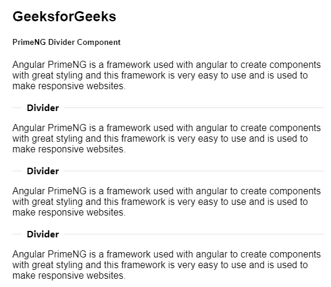
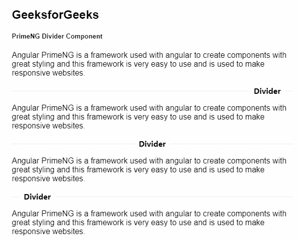

# 角度灌注分隔器组件

> 原文:[https://www . geesforgeks . org/angular-priming-divider-component/](https://www.geeksforgeeks.org/angular-primeng-divider-component/)

Angular PrimeNG 是一个开源框架，具有一组丰富的本机 Angular UI 组件，用于实现出色的风格，该框架用于非常轻松地制作响应性网站。在本文中，我们将了解如何在 Angular PrimeNG 中使用分频器组件。我们还将了解将在代码中使用的属性、样式及其语法。

**分割器组件:**它用于制作使用分割器分割内容的组件。

**属性:**

*   **对齐:**用于设置内容的对齐方式。它是字符串数据类型&默认值为空。
*   **布局:**用于指定方向。它是字符串数据类型&默认值是水平。
*   **类型:**为边框样式类型。它是字符串数据类型&默认值是固体。
*   **样式:**是组件的内嵌样式。它属于对象数据类型&，默认值为空。
*   **styleClass:** 是组件的样式类。它是字符串数据类型&默认值为空。

**造型:**

*   **p 分割器**:是容器元素。
*   **p 分隔线-水平**:是水平布局中的容器元素。
*   **p 分隔线-垂直**:是垂直布局中的容器元素。
*   **p-divider-solid** :是带有实心边框的容器元素。
*   **p 分隔线虚线**:是带虚线边框的容器元素。
*   **点状分隔线**:是带点状边框的容器元素。
*   **p 分隔线-左侧**:是内容向左对齐的容器元素。
*   **右分隔线**:内容右对齐的容器元素。
*   **p-分隔线-中心**:内容居中对齐的容器元素。
*   **p 分隔线-底部**:是内容与底部对齐的容器元素。
*   **p 分隔线顶部**:是内容与顶部对齐的容器元素。

**创建角度应用&模块安装:**

*   **步骤 1:** 使用以下命令创建角度应用程序。

```
ng new appname
```

*   **步骤 2:** 创建项目文件夹即 appname 后，使用以下命令移动到该文件夹。

```
cd appname
```

*   **步骤 3:** 在给定的目录中安装 PrimeNG。

```
npm install primeng --save
npm install primeicons --save
```

**项目结构**:如下图:


**示例 1:** 这是说明如何使用 Divider 组件的基本示例。

## app.component.html

```
<h2>GeeksforGeeks</h2>
<h5>PrimeNG Divider Component</h5>
<div>
  <p>
    Angular PrimeNG is a framework used with 
    angular to create components with great 
    styling and this framework is very easy 
    to use and is used to make responsive 
    websites.
  </p>

  <p-divider>
    <b>Divider</b>
  </p-divider>

  <p>
    Angular PrimeNG is a framework used with 
    angular to create components with great 
    styling and this framework is very easy 
    to use and is used to make responsive 
    websites.
  </p>

  <p-divider>
    <b>Divider</b>
  </p-divider>
  <p>
    Angular PrimeNG is a framework used with 
    angular to create components with great 
    styling and this framework is very easy 
    to use and is used to make responsive 
    websites.
  </p>

  <p-divider>
    <b>Divider</b>
  </p-divider>
  <p>
    Angular PrimeNG is a framework used with 
    angular to create components with great 
    styling and this framework is very easy 
    to use and is used to make responsive 
    websites.
  </p>
</div>
```

## app.component.ts

```
import { Component } from '@angular/core';

@Component({
  selector: 'my-app',
  templateUrl: './app.component.html',
  styleUrls: ['./app.component.scss']
})
export class AppComponent {}
```

## app.module.ts

```
import { NgModule } from "@angular/core";
import { BrowserModule } from "@angular/platform-browser";
import { BrowserAnimationsModule } 
    from "@angular/platform-browser/animations";
import { AppComponent } from "./app.component";
import { DividerModule } from "primeng/divider";

@NgModule({
  imports: [BrowserModule, 
              BrowserAnimationsModule, 
            DividerModule],
  declarations: [AppComponent],
  bootstrap: [AppComponent],
})
export class AppModule {}
```

**输出:**



**示例 2:** 在本例中，我们将了解如何在分割器组件中使用 align 属性。

## app.component.html

```
<h2>GeeksforGeeks</h2>
<h5>PrimeNG Divider Component</h5>
<div>
  <p>
    Angular PrimeNG is a framework used with 
    angular to create components with great 
    styling and this framework is very easy 
    to use and is used to make responsive 
    websites.
  </p>

  <p-divider align="right" type="dashed">
    <b>Divider</b>
  </p-divider>

  <p>
    Angular PrimeNG is a framework used with 
    angular to create components with great 
    styling and this framework is very easy 
    to use and is used to make responsive 
    websites.
  </p>

  <p-divider align="center" type="dashed">
    <b>Divider</b>
  </p-divider>
  <p>
    Angular PrimeNG is a framework used with 
    angular to create components with great 
    styling and this framework is very easy 
    to use and is used to make responsive 
    websites.
  </p>

  <p-divider align="left" type="dashed">
    <b>Divider</b>
  </p-divider>
  <p>
    Angular PrimeNG is a framework used with 
    angular to create components with great 
    styling and this framework is very easy 
    to use and is used to make responsive 
    websites.
  </p>
</div>
```

## app.component.ts

```
import { Component } from '@angular/core';

@Component({
  selector: 'my-app',
  templateUrl: './app.component.html',
  styleUrls: ['./app.component.scss']
})
export class AppComponent {}
```

## app.module.ts

```
import { NgModule } from "@angular/core";
import { BrowserModule } from "@angular/platform-browser";
import { BrowserAnimationsModule } 
    from "@angular/platform-browser/animations";
import { AppComponent } from "./app.component";
import { DividerModule } from "primeng/divider";

@NgModule({
  imports: [BrowserModule, 
              BrowserAnimationsModule, 
            DividerModule],
  declarations: [AppComponent],
  bootstrap: [AppComponent],
})
export class AppModule {}
```

**输出:**



**参考:**[](https://primefaces.org/primeng/showcase/#/button)**[https://primefaces.org/primeng/showcase/#/divider](https://primefaces.org/primeng/showcase/#/divider)**