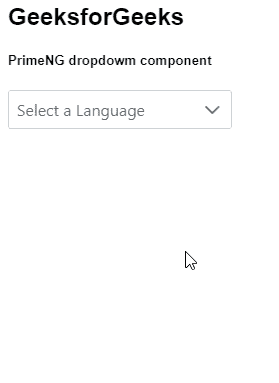
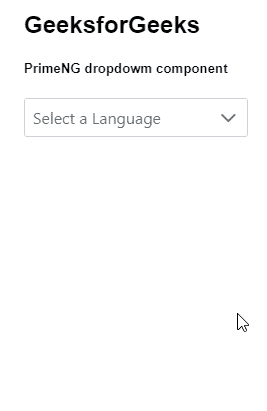

# 角度灌注下拉组件

> 原文:[https://www . geesforgeks . org/angular-priming-drop down-component/](https://www.geeksforgeeks.org/angular-primeng-dropdown-component/)

Angular PrimeNG 是一个开源框架，具有一组丰富的本机 Angular UI 组件，用于实现出色的风格，该框架用于非常轻松地制作响应性网站。在本文中，我们将了解如何在 Angular ngx Bootstrap 中使用下拉组件。我们还将了解代码示例中使用的各种属性、事件、方法和样式以及它们的语法。

**下拉组件:****用于从给定的项目列表中选择对象。**

****属性:****

*   ****选项**:是表示选择项目的数组对象，显示为可用选项。它属于数组数据类型，默认值为 null。**
*   ****选项标签**:用于给一个选项的标签命名。它是字符串数据类型，默认值是标签。**
*   ****选项值**:用于给一个选项的值命名，未定义时默认为选项本身。它是字符串数据类型，默认值是 value。**
*   ****选项组标签**:用于给选项组中的标签命名。它是字符串数据类型，默认值是标签。**
*   ****optionGroupChildren** :用于给选项组中的选项字段命名。它是字符串数据类型，默认值为 item。**
*   ****名称**:用于设置输入元素的名称。它是字符串数据类型，默认值为 null。**
*   ****滚动条高度**:用于设置视口的高度，以像素为单位，如果列表的高度超过该值，则定义一个滚动条。它是字符串数据类型，默认值为 200px。**
*   ****样式**:用于设置元素的内嵌样式。它是字符串数据类型，默认值为 null。**
*   ****样式类**:用于设置元素的样式类。它是字符串数据类型，默认值为 null。**
*   ****过滤**:用于显示一个输入字段，对按键上的项目进行过滤。它是布尔数据类型，默认值为 false。**
*   ****过滤值**:显示该值的过滤器。它是字符串数据类型，默认值为 null。**
*   ****筛选依据**:决定搜索哪个或哪些字段(逗号分隔)。它是字符串数据类型，默认值为 null。**
*   ****过滤匹配模式**:用于定义项目的过滤方式。它是字符串数据类型，默认值为包含。**
*   ****过滤器占位符**:用于设置过滤器输入为空时显示的占位符文本。它是字符串数据类型，默认值为 null。**
*   ****过滤区域**:用于设置过滤时使用的区域。默认区域设置是主机环境的当前区域设置。它是字符串数据类型，默认值未定义。**
*   ****必选**:规定提交表单前必须填写一个输入字段。它属于布尔数据类型，默认值为 false。**
*   ****禁用**:指定组件应禁用。它属于布尔数据类型，默认值为 false。**
*   ****只读**:指定组件不可编辑。它属于布尔数据类型，默认值为 false。**
*   ****空消息**:用于设置没有数据时显示的文本。它是字符串数据类型。**
*   ****emptyFilterMessage** :用于设置过滤不返回任何结果时显示的文本。它是字符串数据类型。**
*   ****Arialabelledby**:Arialabelledby 属性建立组件和标签之间的关系，其值应该是一个或多个元素标识。它是字符串数据类型，默认值为 null。**
*   ****可编辑**:用于指定自定义值，而不是使用可编辑输入字段输入的预定义选项。它属于布尔数据类型，默认值为 false。**
*   ****最大长度**:用于指定可编辑输入字段允许的最大字符数，为数字数据类型，默认值为空。**
*   ****追加到**:该属性获取叠加到其上的元素的标识。它接受任何数据类型，默认值为 null。**
*   ****tabindex** :用于按跳转顺序设置元素的索引。它是数字数据类型，默认值为空。**
*   ****输入项**:是底层输入元素的 Id 标识。它是字符串数据类型，默认值为 null。**
*   ****数据键**:是唯一标识选项中某个值的属性。它是字符串数据类型，默认值为 null。**
*   ****自动对焦**:指定组件自动对焦加载。它属于布尔数据类型，默认值为 false。**
*   ****自动对焦滤镜**:用于叠加显示时对滤镜元素进行对焦。它属于布尔数据类型，默认值为 false。**
*   ****重置过滤隐藏**:用于隐藏下拉菜单时清除过滤值。它属于布尔数据类型，默认值为 false。**
*   ****下拉图标**:用于设置下拉图标的图标类别。它是字符串数据类型，默认值是 pi pi-chevron-down。**
*   ****emptyFilterMessage** :用于设置过滤不返回任何结果时显示的文本。它是字符串数据类型。**
*   ****自动显示第一个**:用于指定如果没有定义占位符且值为空，是否将第一个项目显示为标签。它属于布尔数据类型，默认值为真。**
*   ****分组**:用于指定在提供嵌套选项时，是否将选项显示为分组。它属于布尔数据类型，默认值为 false。**
*   ****显示清除**:用于显示清除图标，显示该图标是为了清除数值。它是布尔数据类型，默认值为 false。**
*   ****baseZIndex** :用于设置分层中使用的 baseZIndex 值。它是数字数据类型，默认值为 0。**
*   ****autoZIndex** :用于指定是否自动管理分层。它属于布尔数据类型，默认值为真。**
*   ****显示过渡选项**:用于设置显示动画的过渡选项。它是字符串数据类型，默认值是. 12s 三次贝塞尔曲线(0，0，0.2，1)。**
*   ****隐藏过渡选项**:用于设置隐藏动画的过渡选项。它是字符串数据类型，默认值为. 1s 线性。**
*   ****ariaFilterLabel** :用于定义标注过滤器输入的字符串。它是字符串数据类型，默认值为 null。**
*   ****工具提示**:用于显示悬停时显示在工具提示中的咨询信息。它接受任何数据类型，默认值为 null。**
*   ****工具提示样式类**:用于设置工具提示的样式类。它是字符串数据类型，默认值为 null。**
*   ****工具提示位置**:用于设置工具提示的位置，有效值为右、左、上、下。它是字符串数据类型，默认值为 top。**
*   ****tooltipPositionStyle** :用于设置 CSS 位置的类型。它是字符串数据类型，默认值是绝对的。**

****事件:****

*   ****onClick:** 是组件被点击时触发的回调。**
*   ****onChange:** 这是一个回调，当下拉列表的值改变时触发。**
*   ****onFilter:** 是数据过滤时触发的回调。**
*   ****onFocus:** 是当 dropdown 获得焦点时触发的回调。**
*   ****onbulr:**是下拉失去焦点时触发的回调。**
*   ****onShow:** 这是一个回调，当下拉覆盖变得可见时触发。**
*   ****onHide:** 这是一个回调，当下拉覆盖被隐藏时触发。**

****方法:****

*   ****重置过滤器:**用于重置过滤器。**
*   ****焦点:**用于应用焦点。**
*   ****显示:**用于显示面板。**
*   ****隐藏:**用于隐藏面板。**

****造型:****

*   ****p-dropdown:** 是一个造型容器元素。**
*   ****p-drop-clearable:**当 showClear 打开时，它是一个样式容器元素。**
*   ****p-drop-label:**显示所选选项标签的样式元素。**
*   ****p-drop-trigger:**是一个造型图标元素。**
*   ****p-下拉面板:**这是一个造型面板元素。**
*   ****p-drop-items-wrapper:**它是项目列表的样式包装元素。**
*   ****p****-下拉-物品:**是物品的造型列表元素。**
*   ****p-下拉项:**是列表项。**
*   ****p-drop down-filter-container:**是过滤器输入的样式容器。**
*   ****p-drop-filter:**是造型滤芯。**
*   ****p-drop-open:**当覆盖可见时，它是一个样式容器元素。**

****创建角度应用&模块安装:****

*   ****步骤 1:** 使用以下命令创建角度应用程序。**

```
ng new appname
```

*   ****步骤 2:** 创建项目文件夹即 appname 后，使用以下命令移动到该文件夹。**

```
cd appname
```

*   ****步骤 3:** 在给定的目录中安装 PrimeNG。**

```
npm install primeng --save
npm install primeicons --save
```

****项目结构**:如下图:**

****

****示例 1:** 这是展示如何使用下拉组件的基本示例。**

## **app.component.html**

```
<h2>GeeksforGeeks</h2>
<h5>PrimeNG dropdowm component</h5>
<p-dropdown
  [options]="lang"
  placeholder="Select a Language"
  optionLabel="name"
  [showClear]="true">
</p-dropdown>
```

## **app.component.ts**

```
import { Component } from "@angular/core";

@Component({
  selector: "my-app",
  templateUrl: "./app.component.html"
})
export class AppComponent {
  lang = [
    { name: "HTML" },
    { name: "ReactJS" },
    { name: "Angular" },
    { name: "Bootstrap" },
    { name: "PrimeNG" },
  ];
}
```

## **app.module.ts**

```
import { NgModule } from "@angular/core";
import { BrowserModule } from "@angular/platform-browser";
import { FormsModule } from "@angular/forms";
import { BrowserAnimationsModule } 
    from "@angular/platform-browser/animations";

import { AppComponent } from "./app.component";
import { DropdownModule } from "primeng/dropdown";

@NgModule({
  imports: [
    BrowserModule,
    BrowserAnimationsModule,
    DropdownModule,
    FormsModule,
  ],
  declarations: [AppComponent],
  bootstrap: [AppComponent],
})
export class AppModule {}
```

****输出:****

****

****示例 2:** 在本例中，我们将了解如何在下拉组件中使用*可编辑*属性。**

## **app.component.html**

```
<h2>GeeksforGeeks</h2>
<h5>PrimeNG dropdowm component</h5>
<p-dropdown
  [options]='[{name: "Editable1"}, {name: "Editable2"}, 
             {name: "Editable3"}, {name: "Editable4"}, 
             {name: "Editable5"}]'
  editable="true"
  placeholder="Select a Language"
  optionLabel="name"
  [showClear]="true">
</p-dropdown>
```

## **app.component.ts**

```
import { Component } from "@angular/core";

@Component({
  selector: "my-app",
  templateUrl: "./app.component.html",
  styleUrls: ["./app.component.scss"],
})
export class AppComponent {

}
```

## **app.module.ts**

```
import { NgModule } from "@angular/core";
import { BrowserModule } from "@angular/platform-browser";
import { FormsModule } from "@angular/forms";
import { BrowserAnimationsModule } 
    from "@angular/platform-browser/animations";

import { AppComponent } from "./app.component";
import { DropdownModule } from "primeng/dropdown";

@NgModule({
  imports: [
    BrowserModule,
    BrowserAnimationsModule,
    DropdownModule,
    FormsModule,
  ],
  declarations: [AppComponent],
  bootstrap: [AppComponent],
})
export class AppModule {}
```

****输出:****

****

****参考:**T2】https://primefaces.org/primeng/showcase/#/dropdown**