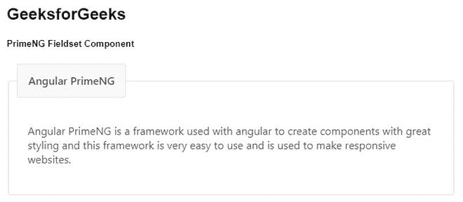
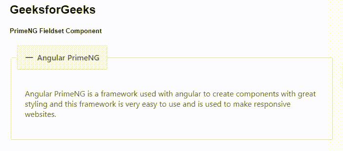

# 角度预置场组组件

> 原文:[https://www . geesforgeks . org/angular-priming-field set-component/](https://www.geeksforgeeks.org/angular-primeng-fieldset-component/)

Angular PrimeNG 是一个开源框架，具有一组丰富的本机 Angular UI 组件，用于实现出色的风格，该框架用于非常轻松地制作响应性网站。在这篇文章中，我们将知道如何在角度预处理中使用场集组件。我们还将了解将在代码中使用的属性、事件和样式以及它们的语法。

**字段集组件:**它是一个分组组件，它获取一个标题以及与该标题相关联的具有切换功能的一些内容。

**属性:**

*   **图例:**是字段集的表头文本。它是字符串数据类型，默认值为 null。
*   **可切换:**指定点击图例是否可以切换内容。它是布尔数据类型，默认值为 false。
*   **折叠:**定义内容的默认可见性状态。它是布尔数据类型，默认值为 false。
*   **样式:**是 fieldset 的内联样式。它是字符串数据类型，默认值为 null。
*   **styleClass:** 是字段集的样式类。它是字符串数据类型，默认值为 null。
*   **过渡选项:**是动画的过渡选项。它是字符串数据类型，默认值是 400 毫秒三次贝塞尔曲线(0.86，0，0.07，1)。

**事件:**

*   **onBeforeToggle:** 是在内容切换之前触发的回调。
*   **onaftertogle:**是内容切换后触发的回调。

**造型:**

*   **p-fieldset:** 是 fieldset 元素。
*   **p-fieldset-toggleable:** 是 toggleable fieldset 元素。
*   **p-fieldset-legend:** 是图例元素。
*   **p-fieldset-content:** 是内容元素。

**创建角度应用&模块安装:**

*   **步骤 1:** 使用以下命令创建角度应用程序。

```
ng new appname
```

*   **步骤 2:** 创建项目文件夹即 appname 后，使用以下命令移动到该文件夹。

```
cd appname
```

*   **步骤 3:** 在给定的目录中安装 PrimeNG。

```
npm install primeng --save
npm install primeicons --save
```

**项目结构**:如下图:


**示例 1:** 这是说明如何使用 Fieldset 组件的基本示例。

## app.component.html

```
<h2>GeeksforGeeks</h2>
<h5>PrimeNG Fieldset Component</h5>
<p-fieldset legend="Angular PrimeNG">

<p>
    Angular PrimeNG is a framework used 
    with angular to create components with
    great styling and this framework is 
    very easy to use and is used to make
    responsive websites.
  </p>

</p-fieldset>
```

## app.component.ts

```
import { Component } from '@angular/core';

@Component({
  selector: 'my-app',
  templateUrl: './app.component.html',
  styleUrls: ['./app.component.scss']
})
export class AppComponent {}
```

## app.module.ts

```
import { NgModule } from "@angular/core";
import { BrowserModule } from "@angular/platform-browser";
import { BrowserAnimationsModule } 
    from "@angular/platform-browser/animations";

import { AppComponent } from "./app.component";
import { FieldsetModule } from "primeng/fieldset";

@NgModule({
  imports: [BrowserModule, 
              BrowserAnimationsModule, 
            FieldsetModule],
  declarations: [AppComponent],
  bootstrap: [AppComponent],
})
export class AppModule {}
```

**输出:**



**示例 2:** 在本例中，我们将了解如何在 Fieldset 组件中使用*可切换*属性。

## app.component.html

```
<h2>GeeksforGeeks</h2>
<h5>PrimeNG Fieldset Component</h5>
<p-fieldset legend="Angular PrimeNG" toggleable="true">
  <p>
    Angular PrimeNG is a framework used 
    with angular to create components with
    great styling and this framework is 
    very easy to use and is used to make
    responsive websites.
  </p>
</p-fieldset>
```

## app.component.ts

```
import { Component } from '@angular/core';

@Component({
  selector: 'my-app',
  templateUrl: './app.component.html',
  styleUrls: ['./app.component.scss']
})
export class AppComponent {}
```

## app.module.ts

```
import { NgModule } from "@angular/core";
import { BrowserModule } from "@angular/platform-browser";
import { BrowserAnimationsModule } 
    from "@angular/platform-browser/animations";

import { AppComponent } from "./app.component";
import { FieldsetModule } from "primeng/fieldset";

@NgModule({
  imports: [BrowserModule, 
              BrowserAnimationsModule, 
            FieldsetModule],
  declarations: [AppComponent],
  bootstrap: [AppComponent],
})
export class AppModule {}
```

**输出:**



**参考:**T2】https://primefaces.org/primeng/showcase/#/fieldset