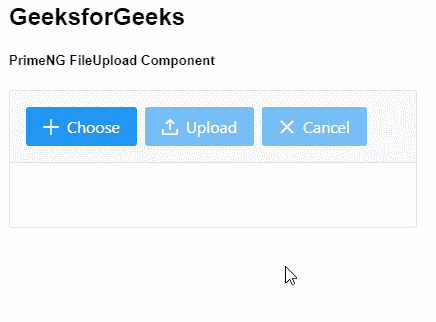
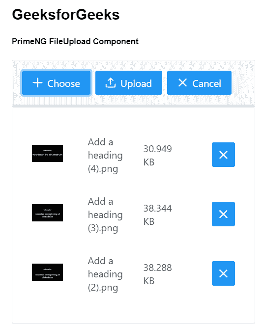

# 角度灌注文件上传组件

> 原文:[https://www . geesforgeks . org/angular-priming-file upload-component/](https://www.geeksforgeeks.org/angular-primeng-fileupload-component/)

Angular PrimeNG 是一个开源框架，具有一组丰富的本机 Angular UI 组件，用于实现出色的风格，该框架用于非常轻松地制作响应性网站。在本文中，我们将了解如何在 Angular PrimeNG 中使用 FileUpload 组件。我们还将了解将在代码中使用的属性、事件、方法和样式以及它们的语法。

**文件上传组件:**它是用来制作一个提供用户上传文件内容的元素。

**属性:**

*   **名称:**是请求参数的名称。它是字符串数据类型，默认值为 null。
*   **网址:**是上传文件的网址。它是字符串数据类型，默认值为 null。
*   **方法:**指定用于发送的 HTTP 方法。它是字符串数据类型，默认值是 post。
*   **多个:**用于一次选择多个文件。它是布尔数据类型，默认值为 false。
*   **接受:**是限制允许的文件类型的模式。它是字符串数据类型，默认值为 false。
*   **禁用:**用于禁用上传功能。它是布尔数据类型，默认值为 false。
*   **auto:** 指定选择完成后是否自动开始上传。它是布尔数据类型，默认值为 false。
*   **maxFileSize:** 是允许的最大文件大小，以字节为单位。它是数字数据类型，默认值为空。
*   **文件限制:**是可以上传的最大文件数。它是数字数据类型，默认值为空。
*   **invalidfileizemessagesummary:**是无效文件大小的汇总消息。它是字符串数据类型，默认值为{0}:文件大小无效。
*   **invalidFileSizeMessageDetail:**是无效文件大小的详细消息。它是字符串数据类型，默认值为“最大上载大小为{0}”
*   **无效文件类型消息摘要:**是无效文件类型的摘要消息。它是字符串数据类型，默认值为“{0}:无效文件类型”。
*   **invalidFileLimitMessageDetail:**是无效文件类型的详细消息。它是字符串数据类型，默认值为“限制最多为{0}”。
*   **invalidFileLimitMessageSummary:**是无效文件类型的汇总消息。它是字符串数据类型，默认值为“超过最大文件数”。
*   **invalidFileTypeMessageDetail:**是无效文件类型的详细消息。它是字符串数据类型，默认值为“允许的文件类型:{0}”。
*   **样式:**用于指定组件的内嵌样式。它是字符串数据类型，默认值为 null。
*   **styleClass:** 用于指定组件的样式类。它是字符串数据类型，默认值为 null。
*   **预览宽度:**是图像缩略图的宽度，以像素为单位。它是数字数据类型，默认值为 50。
*   **选择标签:**是选择按钮的标签。它是字符串数据类型，默认值为 null。
*   **上传标签:**是上传按钮的标签。它是字符串数据类型，默认值为 null。
*   **cancel bel:**是取消按钮的标签。它是字符串数据类型，默认值为 null。
*   **选择图标:**是选择按钮的图标。它是字符串数据类型，默认值是 pi pi-plus。
*   **上传图标:**是上传按钮的图标。它是字符串数据类型，默认值是 pi pi-upload。
*   **取消图标:**是取消按钮的图标。它是字符串数据类型，默认值是 pi-pi 倍。
*   **模式:**用于定义组件的 UI。它是字符串数据类型，默认值为高级。
*   **customUpload:** 用于定义在 uploadHandler 回调中是使用默认上传还是手动实现定义的上传。它是布尔数据类型，默认值为 false。
*   **显示上传按钮:**用于定义上传按钮的可见性。它是布尔数据类型，默认值为真。
*   **显示取消按钮:**用于定义取消按钮的可见性。它是布尔数据类型，默认值为真。
*   **文件:**是外部提供给文件上传的文件列表。它属于数组数据类型，默认值为 null。
*   **头:**它是代表头配置选项的 HttpHeaders 类。它是 HttpHeader 数据类型，默认值为 null。

**事件:**

*   **onbeforeupleload**:是文件上传初始化前触发的回调。
*   **onSend** :是请求发送到服务器时触发的回调。
*   **onpload**:是文件上传完成时触发的回调。
*   **onError** :是文件上传失败触发的回调。
*   **onClear** :这是一个回调，当队列中的文件被移除而没有使用 clear all 按钮上传时触发。
*   **onRemove** :是一个回调，当文件被移除而没有使用文件的清除按钮上传时会触发。
*   **onSelect** :是选择文件时触发的回调。
*   **onProgress:** 是文件上传时触发的回调。
*   **上传处理程序:**是在自定义上传模式下触发的回调，用于手动上传文件。

**方法:**

*   **上传**:用于上传选中的文件。
*   **清除**:用于清除文件列表。

**造型:**

*   **p-fileupload:** 是容器元素。
*   **p-fileupload-buttonbar:** 是包含按钮的表头。
*   **p-fileupload-content:** 是内容部分。

**创建角度应用&模块安装:**

*   **步骤 1:** 使用以下命令创建角度应用程序。

```ts
ng new appname
```

*   **步骤 2:** 创建项目文件夹即 appname 后，使用以下命令移动到该文件夹。

```ts
cd appname
```

*   **步骤 3:** 在给定的目录中安装 PrimeNG。

```ts
npm install primeng --save
npm install primeicons --save
```

**项目结构**:如下图:


**示例 1:** 这是说明如何使用 FileUpload 组件的基本示例。

## app.component.html

```ts
<h2>GeeksforGeeks</h2>
<h5>PrimeNG FileUpload Component</h5>
<p-fileUpload name="myfile[]"></p-fileUpload>
```

## app.component.ts

```ts
import { Component } from '@angular/core';

@Component({
  selector: 'my-app',
  templateUrl: './app.component.html',
  styleUrls: ['./app.component.scss']
})
export class AppComponent {}
```

## app.module.ts

```ts
import { NgModule } from "@angular/core";
import { BrowserModule } from "@angular/platform-browser";
import { BrowserAnimationsModule } 
    from "@angular/platform-browser/animations";

import { AppComponent } from "./app.component";
import { FileUploadModule } from "primeng/fileupload";
import { HttpClientModule } from "@angular/common/http";

@NgModule({
  imports: [
    BrowserModule,
    BrowserAnimationsModule,
    FileUploadModule,
    HttpClientModule,
  ],
  declarations: [AppComponent],
  bootstrap: [AppComponent],
})
export class AppModule {}
```

**输出:**



**示例 2:** 在本例中，我们将制作一个上传元素，仅通过使用 *multiple* 属性来接受多个文件和图像。

## app.component.html

```ts
<h2>GeeksforGeeks</h2>
<h5>PrimeNG FileUpload Component</h5>
<p-fileUpload
  name="myfile[]"
  multiple="multiple"
  accept="image/*">
</p-fileUpload>
```

## app.component.ts

```ts
import { Component } from '@angular/core';

@Component({
  selector: 'my-app',
  templateUrl: './app.component.html',
  styleUrls: ['./app.component.scss']
})
export class AppComponent {}
```

## app.module.ts

```ts
import { NgModule } from "@angular/core";
import { BrowserModule } from "@angular/platform-browser";
import { BrowserAnimationsModule } 
    from "@angular/platform-browser/animations";

import { AppComponent } from "./app.component";
import { FileUploadModule } from "primeng/fileupload";
import { HttpClientModule } from "@angular/common/http";

@NgModule({
  imports: [
    BrowserModule,
    BrowserAnimationsModule,
    FileUploadModule,
    HttpClientModule,
  ],
  declarations: [AppComponent],
  bootstrap: [AppComponent],
})
export class AppModule {}
```

**输出:**



**参考:**T2】https://primefaces.org/primeng/showcase/#/fileupload