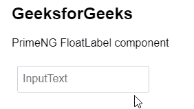
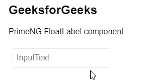

# 角向灌注浮动标签组件

> 原文:[https://www . geeksforgeeks . org/angular-priming-float label-component/](https://www.geeksforgeeks.org/angular-primeng-floatlabel-component/)

Angular PrimeNG 是一个开源框架，具有一组丰富的本机 Angular UI 组件，用于实现出色的风格，该框架用于非常轻松地制作响应性网站。在这篇文章中，我们将知道如何在角素数中使用浮点分量。

**浮动标签组件**是可以在输入组件上使用的浮动标签。

**创建角度应用和安装模块:**

*   **步骤 1:** 使用以下命令创建角度应用程序。

    ```
    ng new appname
    ```

*   **步骤 2:** 创建项目文件夹(即 appname)后，使用以下命令移动到该文件夹。

    ```
    cd appname
    ```

*   **步骤 3:** 在给定的目录中安装 PrimeNG。

    ```
    npm install primeng --save
    npm install primeicons --save
    ```

**项目结构**:如下图。


**示例 1:** 这是展示如何使用**浮动标签组件**的基本示例

## app.component.html

```
<h2>GeeksforGeeks</h2>

<p>PrimeNG FloatLabel component</p>

<div class="p-field p-col-12 p-md-4">
  <span class="p-float-label">
    <input type="text" pInputText />
    <label>InputText</label>
  </span>
</div>
```

## app.module.ts

```
import { NgModule } from "@angular/core";
import { BrowserModule } from "@angular/platform-browser";
import { FormsModule } from "@angular/forms";
import { BrowserAnimationsModule } from
    "@angular/platform-browser/animations";
import { HttpClientModule } from "@angular/common/http";

import { AppComponent } from "./app.component";

import { AutoCompleteModule } from "primeng/autocomplete";
import { InputTextModule } from "primeng/inputtext";

@NgModule({
  imports: [
    BrowserModule,
    BrowserAnimationsModule,
    AutoCompleteModule,
    FormsModule,
    HttpClientModule,
    InputTextModule,
  ],
  declarations: [AppComponent],
  bootstrap: [AppComponent],
})
export class AppModule {}
```

**输出:**



**示例 2:** 在本例中，我们将了解如何在 FloatLabel 组件中使用 disabled 属性。**T3】**

## app.component.html

```
<h2>GeeksforGeeks</h2>

<p>PrimeNG FloatLabel component</p>

<div class="p-field p-col-12 p-md-4">
  <span class="p-float-label">
    <input disabled="true" type="text" pInputText />
    <label>InputText</label>
  </span>
</div>
```

## app.module.ts

```
import { NgModule } from "@angular/core";
import { BrowserModule } from "@angular/platform-browser";
import { FormsModule } from "@angular/forms";
import { BrowserAnimationsModule } from 
    "@angular/platform-browser/animations";
import { HttpClientModule } from "@angular/common/http";

import { AppComponent } from "./app.component";

import { AutoCompleteModule } from "primeng/autocomplete";
import { InputTextModule } from "primeng/inputtext";

@NgModule({
  imports: [
    BrowserModule,
    BrowserAnimationsModule,
    AutoCompleteModule,
    FormsModule,
    HttpClientModule,
    InputTextModule,
  ],
  declarations: [AppComponent],
  bootstrap: [AppComponent],
})
export class AppModule {}
```

**输出:**



**参考:**T2】https://primefaces.org/primeng/showcase/#/floatlabel