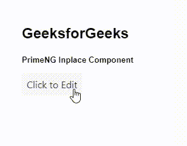
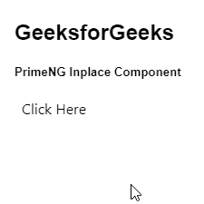

# 角向灌注就位组件

> 原文:[https://www . geesforgeks . org/angular-priming-in place-component/](https://www.geeksforgeeks.org/angular-primeng-inplace-component/)

Angular PrimeNG 是一个开源框架，具有一组丰富的本机 Angular UI 组件，用于实现出色的风格，该框架用于非常轻松地制作响应性网站。在本文中，我们将了解如何在 Angular PrimeNG 中使用 Inplace 组件。我们还将了解将在代码中使用的属性、事件、方法和样式以及它们的语法。

**原地组件**:用于编辑&显示他人原地内容的同时&渲染实际输出，同时点击按钮显示。

**属性:**

*   **激活**:用于指定是否显示内容。它是布尔数据类型&默认值为假。
*   **禁用**:指定应禁用该元素。它属于布尔数据类型，默认值为 false。
*   **可关闭**:显示一个按钮，切换回显示模式。它属于布尔数据类型，默认值为 false。
*   **preventClick** :指定组件是否可以通过 activate()和 deactivate()功能进行全编程控制。它属于布尔数据类型，默认值为 false。
*   **样式**:设置组件的内嵌样式。它是字符串数据类型，默认值为 null。
*   **styleClass** :是组件的样式类。它是字符串数据类型，默认值为 null。
*   **关闭图标**:是关闭图标，为字符串数据类型，默认值为ππ倍。

**事件:**

*   **onActivate:** 它是一个回调，当内容被激活时被触发。
*   **onDeactivate:** 这是一个回调，当内容被停用时会触发

**方法:**

*   **激活:**用于激活内容。
*   **去激活:**用于去激活内容。

**造型:**

*   **p-inplace:** 是容器元素
*   **p-in-place-display:**是 Display 容器
*   **p-in-place-Content:**它是内容容器

**创建角度应用&模块安装:**

**步骤 1:** 使用以下命令创建角度应用程序。

```
ng new appname
```

**步骤 2:** 创建项目文件夹即 appname 后，使用以下命令移动到该文件夹。

```
cd appname
```

**步骤 3:** 在给定的目录中安装 PrimeNG。

```
npm install primeng --save
npm install primeicons --save
```

**项目结构:**如下图:


**示例 1:** 这是说明如何在 Inplace 组件中实现*可关闭的*属性的基本示例。

## app.component.html

```
<h2>GeeksforGeeks</h2>
<h5>PrimeNG Inplace Component</h5>
<p-inplace closable="closable">
  <ng-template pTemplate="display"> Click to Edit </ng-template>
  <ng-template pTemplate="content">
    <input type="text" value="GeeksforGeeks" pInputText />
  </ng-template>
</p-inplace>
```

## app.component.ts

```
import { Component } from '@angular/core';

@Component({
  selector: 'my-app',
  templateUrl: './app.component.html',
  styleUrls: ['./app.component.scss']
})
export class AppComponent {}
```

## app.module.ts

```
import { NgModule } from "@angular/core";
import { BrowserModule } from "@angular/platform-browser";
import { HttpClientModule } from "@angular/common/http";
import { FormsModule } from "@angular/forms";
import { BrowserAnimationsModule } 
    from "@angular/platform-browser/animations";

import { AppComponent } from "./app.component";
import { InplaceModule } from "primeng/inplace";
import { TableModule } from "primeng/table";
import { InputTextModule } from "primeng/inputtext";

@NgModule({
  imports: [
    BrowserModule,
    BrowserAnimationsModule,
    InplaceModule,
    InputTextModule,
    TableModule,
    HttpClientModule,
  ],
  declarations: [AppComponent],
  bootstrap: [AppComponent],
})
export class AppModule {}
```

**输出:**



**示例 2:** 在本例中，我们在 Inplace 组件内部制作一个按钮。

## app.component.html

```
<h2>GeeksforGeeks</h2>
<h5>PrimeNG Inplace Component</h5>
<p-inplace>
  <ng-template pTemplate="display"> 
    Click Here 
  </ng-template>
  <ng-template pTemplate="content">
    <p-button>GfG</p-button>
  </ng-template>
</p-inplace>
```

## app.component.ts

```
import { Component } from '@angular/core';

@Component({
  selector: 'my-app',
  templateUrl: './app.component.html',
  styleUrls: ['./app.component.scss']
})
export class AppComponent {}
```

## app.module.ts

```
import { NgModule } from "@angular/core";
import { BrowserModule } from "@angular/platform-browser";
import { HttpClientModule } from "@angular/common/http";
import { FormsModule } from "@angular/forms";
import { BrowserAnimationsModule } 
    from "@angular/platform-browser/animations";

import { AppComponent } from "./app.component";
import { InplaceModule } from "primeng/inplace";
import { TableModule } from "primeng/table";
import { InputTextModule } from "primeng/inputtext";

@NgModule({
  imports: [
    BrowserModule,
    BrowserAnimationsModule,
    InplaceModule,
    InputTextModule,
    TableModule,
    HttpClientModule,
  ],
  declarations: [AppComponent],
  bootstrap: [AppComponent],
})
export class AppModule {}
```

**输出:**



**参考:**T2】https://primefaces.org/primeng/showcase/#/inplace