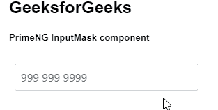
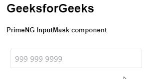

# 角度预处理输入任务组件

> 原文:[https://www . geesforgeks . org/angular-priming-input mask-component/](https://www.geeksforgeeks.org/angular-primeng-inputmask-component/)

Angular PrimeNG 是一个开源框架，具有一组丰富的本机 Angular UI 组件，用于实现出色的风格，该框架用于非常轻松地制作响应性网站。在本文中，我们将了解如何在角度预处理中使用输入任务组件。

**输入任务组件**允许用户以一定的格式输入数值，包括数字、日期、货币和电话。

**属性:**

*   **类型:**在 HTML5 中定义一个输入类型。
*   **遮罩:**定义遮罩的图案。
*   **slotChar** :这是一个掩码的占位符字符，&默认值是下划线。
*   **自动清除:**定义属性，帮助清除模糊时的不完整值。
*   **取消屏蔽:**仅当 ngModel 将原始未屏蔽值设置为绑定值或格式化屏蔽值时，才定义该属性。
*   **样式:**定义输入字段的内联样式。
*   **styleClass:** 定义输入字段的样式类。
*   **占位符:**用于在输入端显示咨询信息。
*   **大小:**定义输入字段的大小。
*   **最大长度:**输入字段允许最大字符数。
*   **tabindex:** 指定元素的制表符顺序。
*   **禁用**:当出现在元素标签中时，指定元素值不可更改。
*   **只读:**当出现在元素标签中时，它指定输入字段是只读的。
*   **名称:**指定输入字段的名称。
*   **输入项:**它是焦点输入的标识符，与为组件定义的标签相匹配。
*   **必选:**存在时，指定提交表单前必须填写输入字段。
*   **字符模式:**定义字母字符的 Regex 模式。
*   **自动对焦:**当出现在元素标签中时，输入会在加载时自动对焦。
*   **自动完成:**它定义了一个字符串，自动完成当前元素的一个属性。
*   **ariaLabel:** 它定义了一个标记输入元素的字符串。
*   **ariaRequired:** 用于表示在提交表单之前需要用户对某个元素进行输入。
*   **标题**:定义标题的输入文本。

**事件**

*   **onFocus** :当输入接收到焦点时要调用的回调。
*   **onbulr:**当输入失去焦点时调用的回调。
*   **完成时:**当用户完成屏蔽模式时调用的回调。
*   **onInput:** 当输入字段值改变时调用的回调。
*   **onKeydown:** 当输入接收到按键事件时调用的回调。

**创建角度应用&模块安装:**

*   **步骤 1:** 使用以下命令创建角度应用程序。

    ```
    ng new appname
    ```

*   **步骤 2:** 创建项目文件夹(即 appname)后，使用以下命令移动到该文件夹。

    ```
    cd appname
    ```

*   **步骤 3:** 在给定的目录中安装 PrimeNG。

    ```
    npm install primeng --save
    npm install primeicons --save
    ```

**项目结构**:如下图。


**示例 1:** 这是展示如何使用 InputMask 组件的基本示例

## app.component.html

```
<h2>GeeksforGeeks</h2>
<h5>PrimeNG InputMask component</h5>
<div class="p-fluid">
  <div class="p-lg-4">
    <p-inputMask mask="999 999 9999" placeholder="999 999 9999"></p-inputMask>
  </div>
</div>
```

## app.module.ts

```
import { NgModule } from "@angular/core";
import { BrowserModule } from "@angular/platform-browser";
import { FormsModule } from "@angular/forms";
import { BrowserAnimationsModule } from
    "@angular/platform-browser/animations";

import { AppComponent } from "./app.component";

import { InputMaskModule } from "primeng/inputmask";

@NgModule({
  imports: [
    BrowserModule,
    BrowserAnimationsModule,
    InputMaskModule,
    FormsModule,
  ],
  declarations: [AppComponent],
  bootstrap: [AppComponent],
})
export class AppModule {}
```

**输出:**



**示例 2:** 在本例中，我们将了解如何在 InputMask 组件中使用 disabled 属性

## app.component.html

```
<h2>GeeksforGeeks</h2>
<h5>PrimeNG InputMask component</h5>
<div class="p-fluid">
  <div class="p-lg-4">
    <p-inputMask
      [disabled]="true"
      mask="999 999 9999"
      placeholder="999 999 9999"
    ></p-inputMask>
  </div>
</div>
```

## app.module.ts

```
import { NgModule } from "@angular/core";
import { BrowserModule } from "@angular/platform-browser";
import { FormsModule } from "@angular/forms";
import { BrowserAnimationsModule } from 
    "@angular/platform-browser/animations";

import { AppComponent } from "./app.component";

import { InputMaskModule } from "primeng/inputmask";

@NgModule({
  imports: [
    BrowserModule,
    BrowserAnimationsModule,
    InputMaskModule,
    FormsModule,
  ],
  declarations: [AppComponent],
  bootstrap: [AppComponent],
})
export class AppModule {}
```

**输出:**



**参考:**T2】https://primefaces.org/primeng/showcase/#/inputmask