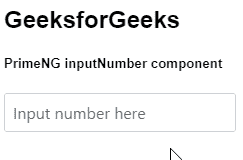
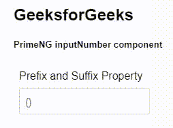

# 角度预输入数字组件

> 原文:[https://www . geesforgeks . org/angular-priming-input number-component/](https://www.geeksforgeeks.org/angular-primeng-inputnumber-component/)

Angular PrimeNG 是一个开源框架，具有一组丰富的本机 Angular UI 组件，用于实现出色的风格，该框架用于非常轻松地制作响应性网站。在本文中，我们将了解如何在角素数中使用 InputNumber 组件。我们还将了解将在代码中使用的属性、事件、方法和样式以及它们的语法。

**输入数字组件:**它允许用户以数值形式输入内容。

**属性:**

*   **值**:用于给出复选框的值。它是数字数据类型，默认值为空。
*   **格式**:用于设置是否格式化数值。它是布尔数据类型，默认值为真。
*   **显示按钮**:用于显示微调按钮。它是布尔数据类型，默认值为 false。
*   **按钮布局**:用于设置按钮的布局，有效值为“堆叠”(默认)、“水平”和“垂直”。它是字符串数据类型，默认值是堆叠的。
*   **增量按钮类**:用于设置增量按钮的样式类。它是字符串数据类型，默认值为 null。
*   **减量按钮类**:用于设置减量按钮的样式类。它是字符串数据类型，默认值为 null。
*   **增量按钮图标**:用于设置增量按钮的样式类别。它是字符串数据类型，默认值是 pi pi-chevron-up。
*   **减量按钮图标**:用于设置减量按钮的样式类别。它是字符串数据类型，默认值是 pi pi-chevron-down。
*   **区域设置**:用于设置格式化时使用的区域设置。它是字符串数据类型，默认值为 null。
*   **localeMatcher** :用于设置要使用的区域匹配算法。它是字符串数据类型，默认值是最合适的。
*   **模式**:用于定义组件的行为，有效值为“小数”和“货币”。它是字符串数据类型，默认值为十进制。
*   **前缀**:用于设置值前显示的文本。它是字符串数据类型，默认值为 null。
*   **后缀**:用于设置数值后显示的文本。它是字符串数据类型，默认值为十进制。
*   **货币**:用于设置货币格式中使用的货币。它是字符串数据类型，默认值为 null。
*   **货币显示**:用于指定货币格式中货币的显示方式。它是字符串数据类型，默认值是一个符号。
*   **使用分组**:用于设置是否使用分组分隔符，如千位分隔符或千位/十位/十位分隔符。它是布尔数据类型，默认值为真。
*   **最小分数位数**:用于设置要使用的最小分数位数。它是数字数据类型，默认值为空。
*   **maxfractionndigits**:用于设置要使用的最大分数位数。它是数字数据类型，默认值为空。
*   **min** :用于设置最小边界值。它是数字数据类型，默认值为空。
*   **最大**:用于设置最大边界值。它是数字数据类型，默认值为空。
*   **步长**:用于设置步长因子，使数值递增/递减。它是数字数据类型，默认值为 1。
*   **样式**:用于设置组件的内嵌样式。它是字符串数据类型，默认值为 null。
*   **样式类**:用于设置组件的样式类。它是字符串数据类型，默认值为 null。
*   **输入项**:是底层输入元素的标识，为字符串数据类型，默认值为空。
*   **输入样式**:用于设置输入字段的内联样式。它是字符串数据类型，默认值为 null。
*   **输入样式类**:用于设置输入字段的样式类。它是字符串数据类型，默认值为 null。
*   **占位符**:用于设置输入时显示的咨询信息。它是字符串数据类型，默认值为 null。
*   **大小**:用于设置输入字段的大小。它是数字数据类型，默认值为空。
*   **最大长度**:用于设置输入字段允许的最大字符数。它是数字数据类型，默认值为空。
*   **tabindex** :用于设置元素指定的 tab 顺序。它是数字数据类型，默认值为空。
*   **禁用**:指定应禁用该元素。它是布尔数据类型，默认值为 false。
*   **标题**:用于设置输入文本的标题文本。它是字符串数据类型，默认值为 null。
*   **ariaLabel** :用于定义标注输入元素的字符串。它是字符串数据类型，默认值为 null。
*   **ariaRequired** :表示在提交表单之前，需要用户对某个元素进行输入。它是布尔数据类型，默认值为 false。
*   **名称**:用于设置输入字段的名称。它是字符串数据类型，默认值为 null。
*   **自动完成**:用于定义一个字符串，该字符串自动完成当前元素的属性。它是字符串数据类型，默认值为 null。

**方法:**

*   **getFormatter:** 这个方法返回 Intl。NumberFormat 对象。

**事件:**

*   **onFocus:** 是输入接收焦点时触发的回调。
*   **onbull**:是输入失去焦点时触发的回调。
*   **onInput** :是输入输入值时触发的回调。
*   **event.value** :是输入值时触发的回调。

**造型:**

*   **p-inputnumber:** 是容器元素。
*   **p-inputnumber-stacked:** 是带有堆叠按钮的容器元素。
*   **p-input number-horizontal:**是带有水平按钮的容器元素。
*   **p-inputnumber-vertical:** 是带有垂直按钮的容器元素。
*   **p-inputnumber-input:** 是输入元素。
*   **p-inputnumber-button:** 是输入元素。
*   **p-input number-up 按钮:**是增量按钮。
*   **p-input number-button-down:**是减量按钮。
*   **p-input number-button-icon:**是按钮图标。

**创建角度应用&模块安装:**

*   **步骤 1:** 使用以下命令创建角度应用程序。

```ts
ng new appname
```

*   **步骤 2:** 创建项目文件夹即 appname 后，使用以下命令移动到该文件夹。

```ts
cd appname
```

*   **步骤 3:** 在给定的目录中安装 PrimeNG。

```ts
npm install primeng --save
npm install primeicons --save
```

**项目结构**:如下图:


**示例 1:** 这是说明如何使用 InputNumber 组件的基本示例。**T3】**

## app.component.html

```ts
<h2>GeeksforGeeks</h2>
<h5>PrimeNG inputNumber component</h5>
<div class="p-grid p-fluid">
  <div class="p-field p-col-12 p-md-3">
    <p-inputNumber placeholder="Input number here">
    </p-inputNumber>
  </div>
</div>
```

## app.module.ts

```ts
import { NgModule } from "@angular/core";
import { BrowserModule } from "@angular/platform-browser";
import { AppComponent } from "./app.component";

import { InputNumberModule } from "primeng/inputnumber";

@NgModule({
  imports: [BrowserModule, InputNumberModule],
  declarations: [AppComponent],
  bootstrap: [AppComponent],
})
export class AppModule {}
```

## app.component.ts

```ts
import { Component } from "@angular/core";

@Component({
  selector: "my-app",
  templateUrl: "./app.component.html",
})
export class AppComponent {}
```

**输出:**



**示例 2:** 在本例中，我们将了解如何在 InputNumber 组件中使用*前缀* & *后缀*属性。

## app.component.html

```ts
<h2>GeeksforGeeks</h2>
<h5>PrimeNG inputNumber component</h5>
<div class="p-field p-col-12 p-md-3">
  <label for="gfg">Prefix and Suffix Property</label>
  <p-inputNumber inputId="gfg" suffix=")" 
                 prefix="(" placeholder="()">
  </p-inputNumber>
</div>
```

## app.module.ts

```ts
import { NgModule } from "@angular/core";
import { BrowserModule } from "@angular/platform-browser";
import { AppComponent } from "./app.component";

import { InputNumberModule } from "primeng/inputnumber";

@NgModule({
  imports: [BrowserModule, InputNumberModule],
  declarations: [AppComponent],
  bootstrap: [AppComponent],
})
export class AppModule {}
```

## app.component.ts

```ts
import { Component } from "@angular/core";

@Component({
  selector: "my-app",
  templateUrl: "./app.component.html",
})
export class AppComponent {}
```

**输出:**



**参考:**T2】https://primefaces.org/primeng/showcase/#/inputnumber