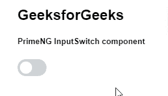

# 角度启动输入开关组件

> 原文:[https://www . geesforgeks . org/angular-priming-input switch-component/](https://www.geeksforgeeks.org/angular-primeng-inputswitch-component/)

Angular PrimeNG 是一个开源框架，具有一组丰富的本机 Angular UI 组件，用于实现出色的风格，该框架用于非常轻松地制作响应性网站。在本文中，我们将了解如何在 Angular PrimeNG 中使用 InputSwitch 组件。我们将了解将在代码中使用的属性、事件和样式以及它们的语法。

**输入开关组件:**它允许用户在两个值之间进行切换，即通过切换来选择其中一个值。

**属性:**

*   **样式**:用于设置元素的内联样式。它是字符串数据类型，默认值为 null。
*   **样式类**:用于设置元素的样式类。它是字符串数据类型，默认值为 null。
*   **tabindex** :用于按跳转顺序设置元素的索引。它是数字数据类型，默认值为空。
*   **输入项**:是底层输入元素的 Id 标识。它是字符串数据类型，默认值为 null。
*   **名称**:用于设置输入元素的名称。它是字符串数据类型，默认值为 null。
*   **ariaLabelledBy** :该属性建立组件和标签之间的关系，其值应该是一个或多个元素标识。它是字符串数据类型，默认值为 null。
*   **禁用**:指定应禁用该元素。它是布尔数据类型，默认值为 false。
*   **只读**:指定组件不可编辑。它是布尔数据类型，默认值为 false。

**事件:**

*   **onChange:** 是状态改变时触发的回调。

**造型:**

*   **p-inputswitch:** 是一个容器元素。
*   **p-inputswitch-checked:** 是处于活动状态的容器元素。
*   **p-inputswitch-slider:** 它是手柄后面的一个滑块元素。

**创建角度应用&模块安装:**

*   **步骤 1:** 使用以下命令创建角度应用程序。

    ```
    ng new appname
    ```

*   **步骤 2:** 创建项目文件夹即 appname 后，使用以下命令移动到该文件夹。

    ```
    cd appname
    ```

*   **步骤 3:** 在给定的目录中安装 PrimeNG。

    ```
    npm install primeng --save
    npm install primeicons --save
    ```

**项目结构**:如下图:


**示例 1:** 这是展示如何使用 InputSwitch 组件的基本示例。**T3】**

## app.component.html

```
<h2>GeeksforGeeks</h2>
<h5>PrimeNG InputSwitch component</h5>
<p-inputSwitch></p-inputSwitch>
```

## app.component.ts

```
import { Component } from "@angular/core";
import { MenuItem } from "primeng/api";

@Component({
  selector: "my-app",
  templateUrl: "./app.component.html",
})
export class AppComponent {}
```

## app.module.ts

```
import { NgModule } from "@angular/core";
import { BrowserModule } from "@angular/platform-browser";
import { FormsModule } from "@angular/forms";
import { BrowserAnimationsModule } 
    from "@angular/platform-browser/animations";

import { AppComponent } from "./app.component";
import { InputSwitchModule } from "primeng/inputswitch";

@NgModule({
  imports: [
    BrowserModule,
    BrowserAnimationsModule,
    InputSwitchModule,
    FormsModule,
  ],
  declarations: [AppComponent],
  bootstrap: [AppComponent],
})
export class AppModule {}
```

**输出:**



**示例 2:** 在本例中，我们使用禁用的&只读属性进行输入开关预选。

## app.component.html

```
<h2>GeeksforGeeks</h2>
<h5>PrimeNG InputSwitch Component</h5>
<p-inputSwitch [(ngModel)]="gfg"></p-inputSwitch>
<p-inputSwitch disabled="true"></p-inputSwitch>
<p-inputSwitch readonly="true"></p-inputSwitch>
```

## app.component.ts

```
import { Component } from '@angular/core';

@Component({
  selector: 'app-root',
  templateUrl: './app.component.html'
})
export class AppComponent {
  gfg: boolean = true;
}
```

## app.module.ts

```
import { NgModule } from "@angular/core";
import { BrowserModule } from "@angular/platform-browser";
import { FormsModule } from "@angular/forms";
import { BrowserAnimationsModule } from "@angular/platform-browser/animations";

import { AppComponent } from "./app.component";

import { InputSwitchModule } from "primeng/inputswitch";

@NgModule({
  imports: [
    BrowserModule,
    BrowserAnimationsModule,
    InputSwitchModule,
    FormsModule,
  ],
  declarations: [AppComponent],
  bootstrap: [AppComponent],
})
export class AppModule {}
```

**输出:**


**参考:**T2】https://primefaces.org/primeng/showcase/#/inputswitch