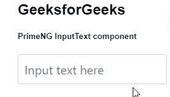
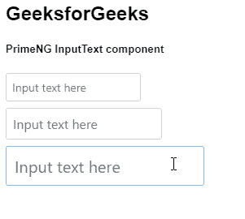

# 角度灌注输入文本组件

> 原文:[https://www . geesforgeks . org/angular-priming-input text-component/](https://www.geeksforgeeks.org/angular-primeng-inputtext-component/)

Angular PrimeNG 是一个开源框架，具有一组丰富的本机 Angular UI 组件，用于实现出色的风格，该框架用于非常轻松地制作响应性网站。在这篇文章中，我们将知道如何在 angular primeNG 中使用 InputText 组件。让我们了解一下将在代码中使用的属性、样式及其语法。

**InputTextArea 组件:**它是一个用来制作支持多行输入的文本字段的元素。

**属性:**

*   **禁用:**我们可以将输入组件设置为禁用。它是布尔数据类型&默认值为假。

**造型:**

*   **p-inputtext:** 是应用于文本输入字段的指令&。

```ts
<input type="text" pInputText />
```

**模型绑定:**n Model 指令用于绑定模型。

```ts
<input type="text" pInputText [(ngModel)]="property"/>
```

**尺寸:**除常规尺寸外，还有 2 种以上尺寸可选，小文本输入添加*p-input text-sm*&大文本输入添加 *p-inputtext-lg* 。这些类必须用于更改特定输入字段的大小。
**为较小的输入文本**

```ts
<input type="text" pInputText class="p-inputtext-sm">
```

**对于较大的输入文本**

```ts
<input type="text" pInputText class="p-inputtext-lg"> 
```

**创建角度应用&模块安装:**

*   **步骤 1:** 使用以下命令创建角度应用程序。

    ```ts
    ng new appname
    ```

*   **步骤 2:** 创建项目文件夹(即 appname)后，使用以下命令移动到该文件夹。

    ```ts
    cd appname
    ```

*   **步骤 3:** 在给定的目录中安装 PrimeNG。

    ```ts
    npm install primeng --save
    npm install primeicons --save
    ```

**项目结构**:如下图。


**示例 1:** 这是展示如何使用 InputText 组件的基本示例

## app.component.html

```ts
<h2>GeeksforGeeks</h2>
<h5>PrimeNG InputText component</h5>
<div class="sizes">
  <input
    type="text"
    class="p-inputtext-lg"
    placeholder="Input text here"
    pInputText/>
</div>
```

## app.module.ts

```ts
import { NgModule } from "@angular/core";
import { BrowserModule } from "@angular/platform-browser";
import { BrowserAnimationsModule } from "@angular/platform-browser/animations";

import { AppComponent } from "./app.component";

import { InputTextModule } from "primeng/inputtext";

@NgModule({
  imports: [BrowserModule, BrowserAnimationsModule, InputTextModule],
  declarations: [AppComponent],
  bootstrap: [AppComponent],
})
export class AppModule {}
```

**输出:**



**示例 2:** 在本例中，我们将了解如何设置 InputText 组件的大小。

## app.component.html

```ts
<h2>GeeksforGeeks</h2>
<h5>PrimeNG InputText component</h5>
<div class="sizes">
  <input
    type="text"
    class="p-inputtext-sm"
    placeholder="Input text here"
    pInputText/>
  <input type="text" placeholder="Input text here" pInputText />
  <input
    type="text"
    class="p-inputtext-lg"
    placeholder="Input text here"
    pInputText/>
</div>
```

## app.module.ts

```ts
import { NgModule } from '@angular/core';
import { BrowserModule } from '@angular/platform-browser';
import { BrowserAnimationsModule } 
    from '@angular/platform-browser/animations';

import { AppComponent } from './app.component';

import { InputTextModule } from 'primeng/inputtext';

@NgModule({
  imports: [BrowserModule, 
              BrowserAnimationsModule, 
            InputTextModule],
  declarations: [AppComponent],
  bootstrap: [AppComponent]
})
export class AppModule {}
```

**输出:**



**参考:**T2】https://primefaces.org/primeng/showcase/#/inputtext