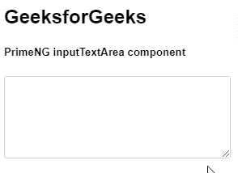
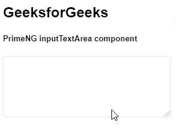

# 角度预处理输入区域组件

> 原文:[https://www . geesforgeks . org/angular-priming-input textarea-component/](https://www.geeksforgeeks.org/angular-primeng-inputtextarea-component/)

Angular PrimeNG 是一个开源框架，具有一组丰富的本机 Angular UI 组件，用于实现出色的风格，该框架用于非常轻松地制作响应性网站。在本文中，我们将了解如何在角度预处理中使用输入文本区域组件。

**InputTextArea 组件:**它是一个用来制作支持多行输入的文本字段的元素。

**属性:**

*   **自动调整大小:**我们可以设置文本区域的大小是否应该随着文本的增加而增加。随着 Textarea 大小的增加，textarea 将不显示滚动条。为此，我们可能需要定义行&列属性。
*   **禁用:**我们可以将 textarea 组件设置为禁用。

**事件:**

*   **onResize:** 当元素调整大小时，会调用回调。

**造型:**

*   **p-inputtextarea:** 是应用于文本输入字段的指令&。

**创建角度应用&模块安装:**

*   **步骤 1:** 使用以下命令创建角度应用程序。

    ```
    ng new appname
    ```

*   **步骤 2:** 创建项目文件夹(即 appname)后，使用以下命令移动到该文件夹。

    ```
    cd appname
    ```

*   **步骤 3:** 在给定的目录中安装 PrimeNG。

    ```
    npm install primeng --save
    npm install primeicons --save
    ```

**项目结构**:如下图。


**示例 1:** 这是展示如何使用 InputTextArea 组件的基本示例

## app.component.html

```
<h2>GeeksforGeeks</h2>
<h5>PrimeNG inputTextArea component</h5>
<textarea rows="4" cols="35" pInputTextarea></textarea>
```

## app.module.ts

```
import { NgModule } from "@angular/core";
import { BrowserModule } from "@angular/platform-browser";
import { FormsModule } from "@angular/forms";
import { AppComponent } from "./app.component";
import { InputTextareaModule } from "primeng/inputtextarea";

@NgModule({
  imports: [BrowserModule, InputTextareaModule, FormsModule],
  declarations: [AppComponent],
  bootstrap: [AppComponent],
})
export class AppModule {}
```

**输出:**



**示例 2:** 在本例中，我们将了解如何在 InputTextArea 组件中使用 disabled 属性

## app.component.html

```
<h2>GeeksforGeeks</h2>
<h5>PrimeNG inputTextArea component</h5>
<textarea rows="4" cols="35" pInputTextarea disabled></textarea>
```

## app.module.ts

```
import { NgModule } from "@angular/core";
import { BrowserModule } from "@angular/platform-browser";
import { FormsModule } from "@angular/forms";
import { AppComponent } from "./app.component";
import { InputTextareaModule } from "primeng/inputtextarea";

@NgModule({
  imports: [BrowserModule, InputTextareaModule, FormsModule],
  declarations: [AppComponent],
  bootstrap: [AppComponent],
})
export class AppModule {}
```

**输出:**



**参考:**T2】https://primefaces.org/primeng/showcase/#/inputtextarea