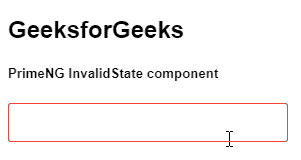
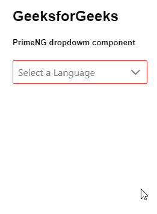

# 角度预旋无效状态组件

> 原文:[https://www . geeksforgeeks . org/angular-priming-invalid state-component/](https://www.geeksforgeeks.org/angular-primeng-invalidstate-component/)

Angular PrimeNG 是一个开源框架，具有一组丰富的本机 Angular UI 组件，用于实现出色的风格，该框架用于非常轻松地制作响应性网站。在本文中，我们将了解如何在角度素数中使用 InvalidState 组件。

**InvalidState 组件:**它用于在表单模块中显示一个无效的状态样式。当类设置为无效时，它将为输入元素提供无效的样式。

**创建角度应用&模块安装:**

*   **步骤 1:** 使用以下命令创建角度应用程序。

    ```ts
    ng new appname
    ```

*   **步骤 2:** 创建项目文件夹(即 appname)后，使用以下命令移动到该文件夹。

    ```ts
    cd appname
    ```

*   **步骤 3:** 在给定的目录中安装 PrimeNG。

    ```ts
    npm install primeng --save
    npm install primeicons --save
    ```

**项目结构**:安装过程成功后，如下图所示:


**示例 1:** 这是展示如何使用应用于输入元素的无效状态组件的基本示例。**T3】**

## app.component.html

```ts
<h2>GeeksforGeeks</h2>
<h5>PrimeNG InvalidState component</h5>
<div class="p-grid p-fluid">
  <div class="p-field p-col-12 p-md-3">
    <input type="text" class="ng-invalid ng-dirty" pInputText />
  </div>
</div>
```

## app.module.ts

```ts
import { NgModule } from "@angular/core";
import { BrowserModule } from "@angular/platform-browser";
import { BrowserAnimationsModule } from 
    "@angular/platform-browser/animations";

import { AppComponent } from "./app.component";

import { InputTextModule } from "primeng/inputtext";

@NgModule({
  imports: [BrowserModule, BrowserAnimationsModule, InputTextModule],
  declarations: [AppComponent],
  bootstrap: [AppComponent],
})
export class AppModule {}
```

**输出:**



**示例 2:** 在本例中，我们将知道如何在下拉列表中使用 invalidState。

## app.component.html

```ts
<h2>GeeksforGeeks</h2>
<h5>PrimeNG dropdowm component</h5>
<p-dropdown [options]="lang" placeholder="Select a Language"
 optionLabel="name" [showClear]="true" 
 class="ng-invalid ng-dirty">
</p-dropdown>
```

## app.module.ts

```ts
import { NgModule } from "@angular/core";
import { BrowserModule } from "@angular/platform-browser";
import { FormsModule } from "@angular/forms";
import { BrowserAnimationsModule } from 
    "@angular/platform-browser/animations";

import { AppComponent } from "./app.component";

import { DropdownModule } from "primeng/dropdown";

@NgModule({
  imports: [
    BrowserModule,
    BrowserAnimationsModule,
    DropdownModule,
    FormsModule,
  ],
  declarations: [AppComponent],
  bootstrap: [AppComponent],
})
export class AppModule {}
```

*   **app.component.ts**

## java 描述语言

```ts
import { Component } from "@angular/core";

@Component({
  selector: "app-root",
  templateUrl: "./app.component.html",
  styleUrls: ["./app.component.scss"],
})
export class AppComponent {
  lang = [
    { name: "HTML" },
    { name: "ReactJS" },
    { name: "Angular" },
    { name: "Bootstrap" },
    { name: "PrimeNG" },
  ];
}
```

**输出:**



**参考:**T2】https://primefaces.org/primeng/showcase/#/invalid