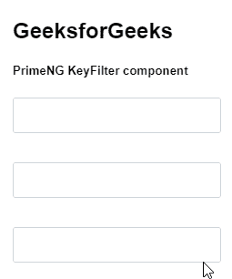
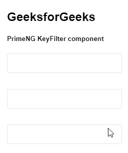

# 角度预调键控滤波器组件

> 原文:[https://www . geeksforgeeks . org/angular-priming-key filter-component/](https://www.geeksforgeeks.org/angular-primeng-keyfilter-component/)

Angular PrimeNG 是一个开源框架，具有一组丰富的本机 Angular UI 组件，用于实现出色的风格，该框架用于非常轻松地制作响应性网站。在本文中，我们将了解如何在角度预处理中使用关键过滤器组件。

**KeyFilter 组件:****用于设置输入字段要使用的数据类型。它还从输入的数据类型中过滤其他数据类型。**

****属性:****

*   ****仅验证:**根据给定的正则表达式检查输入字段中的值。**

****创建角度应用&模块安装:****

*   ****步骤 1:** 使用以下命令创建角度应用程序。

    ```ts
    ng new appname
    ```** 
*   ****步骤 2:** 创建项目文件夹(即 appname)后，使用以下命令移动到该文件夹。

    ```ts
    cd appname
    ```** 
*   ****步骤 3:** 在给定的目录中安装 PrimeNG。

    ```ts
    npm install primeng --save
    npm install primeicons --save
    ```** 

****项目结构:**如下图。**

****

****示例 1:** 这是展示如何使用**KeyFilter 组件的基本示例****

## ****app.component.html****

```ts
**<h2>GeeksforGeeks</h2>
<h5>PrimeNG KeyFilter component</h5>
<div class="p-grid p-fluid">
  <div class="p-field p-col-12 p-md-3">
    <input type="text" pKeyFilter="int" pInputText />
  </div>

  <div class="p-field p-col-12 p-md-3">
    <input type="text" pKeyFilter="alpha" pInputText />
  </div>

  <div class="p-field p-col-12 p-md-3">
    <input type="text" pKeyFilter="alphanumeric" pInputText />
  </div>
</div>**
```

## ****app.module.ts****

```ts
**import { NgModule } from "@angular/core";
import { BrowserModule } from "@angular/platform-browser";
import { BrowserAnimationsModule } from 
    "@angular/platform-browser/animations";

import { AppComponent } from "./app.component";

import { InputTextModule } from "primeng/inputtext";
import { KeyFilterModule } from "primeng/keyfilter";

@NgModule({
  imports: [
    BrowserModule,
    BrowserAnimationsModule,
    KeyFilterModule,
    InputTextModule,
  ],
  declarations: [AppComponent],
  bootstrap: [AppComponent],
})
export class AppModule {}**
```

******输出:******

********

******示例 2:** 在本例中，我们将了解如何在 keyfilter 组件中使用 disabled 属性****

## ****app.component.html****

```ts
**<h2>GeeksforGeeks</h2>
<h5>PrimeNG KeyFilter component</h5>
<div class="p-grid p-fluid">
  <div class="p-field p-col-12 p-md-3">
    <input type="text" pKeyFilter="int" pInputText disabled />
  </div>

  <div class="p-field p-col-12 p-md-3">
    <input type="text" pKeyFilter="alpha" pInputText disabled />
  </div>

  <div class="p-field p-col-12 p-md-3">
    <input type="text" pKeyFilter="alphanumeric" pInputText disabled />
  </div>
</div>**
```

## ****app.module.ts****

```ts
**import { NgModule } from "@angular/core";
import { BrowserModule } from "@angular/platform-browser";
import { BrowserAnimationsModule } from 
    "@angular/platform-browser/animations";

import { AppComponent } from "./app.component";

import { InputTextModule } from "primeng/inputtext";
import { KeyFilterModule } from "primeng/keyfilter";

@NgModule({
  imports: [
    BrowserModule,
    BrowserAnimationsModule,
    KeyFilterModule,
    InputTextModule,
  ],
  declarations: [AppComponent],
  bootstrap: [AppComponent],
})
export class AppModule {}**
```

******输出:******

********

******参考:**T2】https://primefaces.org/primeng/showcase/#/keyfilter****