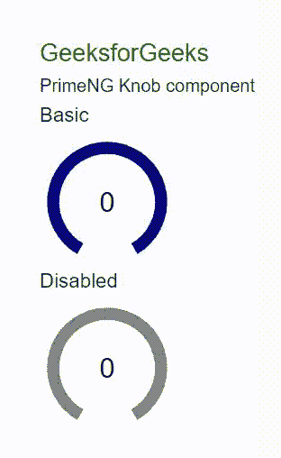
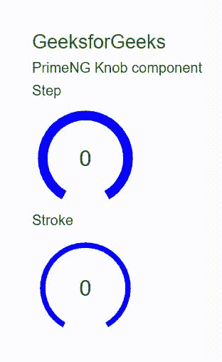

# 角度启动旋钮组件

> 原文:[https://www . geesforgeks . org/angular-priming-knob-component/](https://www.geeksforgeeks.org/angular-primeng-knob-component/)

Angular PrimeNG 是一个开源框架，拥有一套丰富的原生 Angular UI 组件，用于实现出色的造型，该框架用于非常轻松地制作响应性网站。在本文中，我们将了解如何在 Angular PrimeNG 中使用旋钮组件。

**旋钮组件:**它是一个表单组件，用于定义包含标签和一些数据值的拨号器类型旋钮。

**属性:**

*   **大小:**用于设置组件的大小，以像素为单位。它是数字数据类型，默认值为 100。
*   **禁用:**指定元素应禁用。它属于布尔数据类型，默认值为 false。
*   **只读:**用于指定组件不可编辑。它属于布尔数据类型，默认值为 false。
*   **min:** 用于设置最小边界值。它是数字数据类型，默认值为 0。
*   **max:** 用于设置最大边界值。它是数字数据类型，默认值为 100。
*   **步长:**用于设置步长因子，使数值递增/递减。它是数字数据类型，默认值为空。
*   **valueColor:** 用于设置数值的背景。它是字符串数据类型，默认值为 null。
*   **范围颜色:**用于设置范围的背景颜色。它是数字数据类型，默认值为空。
*   **文本颜色:**用于设置数值文本的颜色。它是数字数据类型，默认值为空。
*   **strokeWidth:** 用于设置旋钮行程的宽度。它是数字数据类型，默认值为 14。
*   **显示值:**用于指定是否显示旋钮内部的值。它是布尔数据类型，默认值为真。
*   **值模板:**用于设置值的模板字符串。它是字符串数据类型，默认值是 value。
*   **样式:**用于设置元素的 Inline 样式。它属于对象数据类型，默认值为空。
*   **styleClass:** 用于设置元素的 Style 类。它是字符串数据类型，默认值为 null。

**事件:**

*   **onChange:** 是值改变时触发的回调。

**造型:**

*   **p 旋钮:**是造型容器元素。
*   **p-旋钮-文本:**它是一个样式文本元素。
*   **p-旋钮值:**它是一个造型值元素。
*   **p-旋钮-文本:**它是一个样式文本元素。

**创建角度应用&模块安装:**

*   **步骤 1:** 使用以下命令创建角度应用程序。

    ```
    ng new appname
    ```

*   **步骤 2:** 创建项目文件夹(即 appname)后，使用以下命令移动到该文件夹。

    ```
    cd appname
    ```

*   **步骤 3:** 在给定的目录中安装 PrimeNG。

    ```
    npm install primeng --save
    npm install primeicons --save
    ```

**项目结构**:安装过程完成后，如下图。


**示例 1:** 在这一步中，我们将看到说明旋钮组件使用的基本示例。**T3】**

## app.component.html

```
<h2 style="color: green">GeeksforGeeks</h2>
<h5>PrimeNG Knob component</h5>
<div class="p-field p-col-12 p-md-4">

  <h4>Basic</h4>
  <p-knob
    [size]="150"
    [strokeWidth]="9"
    valueColor="green"
    rangeColor="navy">
  </p-knob>

  <h4>Disabled</h4>
  <p-knob
    [size]="150"
    [strokeWidth]="9"
    valueColor="Green"
    rangeColor="grey"
    [disabled]="true">
  </p-knob>
</div>
```

## app.module.ts

```
import { NgModule } from "@angular/core";
import { BrowserModule } from "@angular/platform-browser";
import { FormsModule } from "@angular/forms";
import { BrowserAnimationsModule } 
    from "@angular/platform-browser/animations";
import { AppComponent } from "./app.component";
import { KnobModule } from "primeng/knob";

@NgModule({
  imports: [BrowserModule, 
              BrowserAnimationsModule, 
            KnobModule, FormsModule],
  declarations: [AppComponent],
  bootstrap: [AppComponent],
})
export class AppModule {}
```

**输出:**



**示例 2:** 在本例中，我们将了解如何在旋钮组件中使用 steps &笔画属性。

## app.component.html

```
<h2 style="color: green">GeeksforGeeks</h2>
<h5>PrimeNG Knob component</h5>

<div class="p-field p-col-12 p-md-4">
  <h5>Step</h5>
  <p-knob
    [size]="150"
    [strokeWidth]="9"
    valueColor="Green"
    rangeColor="Blue"
    [step]="10">
  </p-knob>
</div>

<div class="p-field p-col-12 p-md-4">
  <h5>Stroke</h5>
  <p-knob
    [size]="150"
    [strokeWidth]="9"
    valueColor="Green"
    rangeColor="Blue"
    [step]="10"
    [strokeWidth]="5">
  </p-knob>
</div>
```

## app.module.ts

```
import { NgModule } from "@angular/core";
import { BrowserModule } from "@angular/platform-browser";
import { FormsModule } from "@angular/forms";
import { BrowserAnimationsModule }
    from "@angular/platform-browser/animations";
import { AppComponent } from "./app.component";
import { KnobModule } from "primeng/knob";

@NgModule({
  imports: [BrowserModule, 
              BrowserAnimationsModule, 
            KnobModule, FormsModule],
  declarations: [AppComponent],
  bootstrap: [AppComponent],
})
export class AppModule {}
```

**输出:**



**参考:**T2】https://primefaces.org/primeng/showcase/#/knob