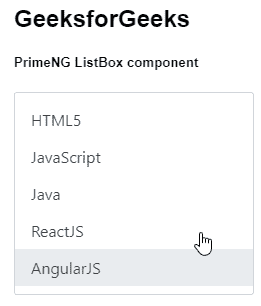
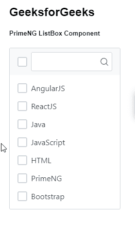

# 角形灌注列表框组件

> 原文:[https://www . geesforgeks . org/angular-priming-listbox-component/](https://www.geeksforgeeks.org/angular-primeng-listbox-component/)

Angular PrimeNG 是一个开源框架，具有一组丰富的本机 Angular UI 组件，用于实现出色的风格，该框架用于非常轻松地制作响应性网站。在本文中，我们将了解如何在 Angular PrimeNG 中使用 ListBox 组件。

**ListBox 组件:**它用来制作一个列表组件，我们可以从中选择一个或多个项目，如果列表中不需要取消选中该项目，也可以将其丢弃。

**属性:**

*   **ariaFilterLabel** :用于定义标注输入过滤元素的字符串。它是字符串数据类型，默认值为 null。
*   **复选框**:用于选择带有复选框的项目。它是布尔数据类型，默认值为 false。
*   **数据键**:用于识别选项的属性。它是字符串数据类型，默认值为 null。
*   **禁用**:指定应禁用该元素。它属于布尔数据类型，默认值为 false。
*   **过滤器**:用于显示表头的过滤器输入。它是布尔数据类型，默认值为 false。
*   **过滤匹配模式**:用于定义项目的过滤方式。它是字符串数据类型，包含默认值。
*   **过滤器值**:用于指定具有该值的过滤器显示。它是字符串数据类型，默认值为 null。
*   **过滤区域**:用于设置过滤时使用的区域。它是字符串数据类型，默认值未定义。
*   **过滤器占位符**:用于定义过滤器输入的占位符。它是字符串数据类型，默认值为 null。
*   **列表样式**:用于设置列表元素的内联样式，为字符串数据类型，默认值为空。
*   **列表样式类**:用于设置列表元素的样式类，为字符串数据类型，默认值为空。
*   **元键选择**:用于定义如何选择多个项目。它属于布尔数据类型，默认值为真。
*   **多个**:允许选择多个值。它属于布尔数据类型，默认值为 false。
*   **只读**:指定元素值不可更改。它属于布尔数据类型，默认值为 false。
*   **空消息**:用于设置没有数据时显示的文本。它是字符串数据类型，默认值是没有找到记录。
*   **emptyFilterMessage** :用于设置过滤不返回任何结果时显示的文本，为字符串数据类型，默认值为未找到记录。
*   **选项**:表示选择项目的数组，显示为可用选项，为数组数据类型，默认值为空。
*   **optionLabel** :用于给出一个选项的标签，为字符串数据类型，默认值为标签。
*   **选项值**:用于给出选项的值，未定义时默认为选项本身。它是字符串数据类型，默认值是 value。
*   **选项组标签**:用于给选项组一个标签。它是字符串数据类型，默认值是标签。
*   **options group children**:用于获取选项组的选项字段名称。它是字符串数据类型，默认值是项。
*   **分组**:用于设置在提供嵌套选项时，是否将选项分组显示。它属于布尔数据类型，默认值为 false。
*   **显示标题复选框**:用于设置标题复选框是否以多种模式显示。它属于布尔数据类型，默认值为真。
*   **样式**:用于设置元素的内联样式。它是字符串数据类型，默认值为 null。
*   **样式类**:用于设置元素的样式类。它是字符串数据类型，默认值为 null。

**事件:**

*   **onChange** :是列表框值发生变化时触发的回调。
*   **onDblClick** :是双击一个项目时触发的回调。
*   **onClick** :是 Listbox 选项点击时触发的回调。

**造型:**

*   **p-listbox:** 用于元素的容器。
*   **p-listbox-list** :用作列表的容器。
*   **p-listbox-item:** 用于将项目保留在列表中。
*   **p-listbox-表头**:用于显示元素的表头。
*   **p-listbox-filter-container**:是表头过滤输入的容器。

**创建角度应用&模块安装:**

*   **步骤 1:** 使用以下命令创建角度应用程序。

    ```ts
    ng new appname
    ```

*   **步骤 2:** 创建项目文件夹即 appname 后，使用以下命令移动到该文件夹。

    ```ts
    cd appname
    ```

*   **步骤 3:** 在给定的目录中安装 PrimeNG。

    ```ts
    npm install primeng --save
    npm install primeicons --save
    ```

**项目结构**:完成以上流程后，如下图。


**示例 1:** 这是展示如何使用 ListBox 组件的基本示例。**T3】**

## app.component.html

```ts
<h2>GeeksforGeeks</h2>
<h5>PrimeNG ListBox component</h5>
<p-listbox
  [options]="gfg"
  [(ngModel)]="selectedCourse"
  optionLabel="name"
  [style]="{'width':'15rem'}">
</p-listbox>
```

## app.module.ts

```ts
import { NgModule } from "@angular/core";
import { BrowserModule } 
    from "@angular/platform-browser";
import { FormsModule } from "@angular/forms";
import { BrowserAnimationsModule } 
    from "@angular/platform-browser/animations";
import { AppComponent } from "./app.component";
import { ListboxModule } from "primeng/listbox";

@NgModule({
  imports: [BrowserModule, 
              BrowserAnimationsModule, 
            ListboxModule, FormsModule],
  declarations: [AppComponent],
  bootstrap: [AppComponent],
})
export class AppModule {}
```

## app.component.ts

```ts
import { Component } from "@angular/core";
import { PrimeNGConfig, SelectItemGroup } from "primeng/api";

interface Course {
  name: string;
}

@Component({
  selector: "my-app",
  templateUrl: "./app.component.html",
  styles: [],
})
export class AppComponent {
  gfg: Course[];
  selectedCourse: Course;

  constructor(private primengConfig: PrimeNGConfig) {
    this.gfg = [
      { name: "HTML5" },
      { name: "JavaScript" },
      { name: "Java" },
      { name: "ReactJS" },
      { name: "AngularJS" },
    ];
  }
}
```

**输出:**



**示例 2:** 在本例中，我们将制作一个动态 listBox 组。

## app.component.html

```ts
<h2>GeeksforGeeks</h2>
<h5>PrimeNG ListBox Component</h5>
<p-listbox [options]="gfg" [checkbox]="true" 
           [filter]="true" [multiple]="true" 
           optionLabel="name">
</p-listbox>
```

## app.module.ts

```ts
import { NgModule } from '@angular/core';
import { BrowserModule } from '@angular/platform-browser';
import { FormsModule } from '@angular/forms';
import { HttpClientModule } from '@angular/common/http';
import { BrowserAnimationsModule } 
    from '@angular/platform-browser/animations';
import { AppComponent } from './app.component';
import { ListboxModule } from 'primeng/listbox';
import { ButtonModule } from 'primeng/button';

@NgModule({
  imports: [BrowserModule, 
              BrowserAnimationsModule, 
            ListboxModule, FormsModule],
  declarations: [AppComponent],
  bootstrap: [AppComponent]
})
export class AppModule {}
```

## app.component.ts

```ts
import { Component } from '@angular/core';
import { PrimeNGConfig } from 'primeng/api';
interface Course {
  name: string;
}

@Component({
  selector: 'my-app',
  templateUrl: './app.component.html'
})
export class AppComponent {
  gfg: any[];

  constructor(private primengConfig: PrimeNGConfig) {
    this.gfg = [
      { name: 'AngularJS' },
      { name: 'ReactJS' },
      { name: 'Java' },
      { name: 'JavaScript' },
      { name: 'HTML' },
      { name: 'PrimeNG' },
      { name: 'Bootstrap' }
    ];
  }

  ngOnInit() {
    this.primengConfig.ripple = true;
  }
}
```

**输出:**



**参考:**T2】https://primefaces.org/primeng/showcase/#/listbox