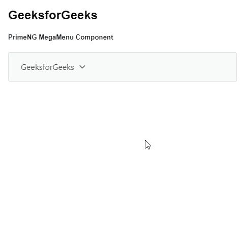
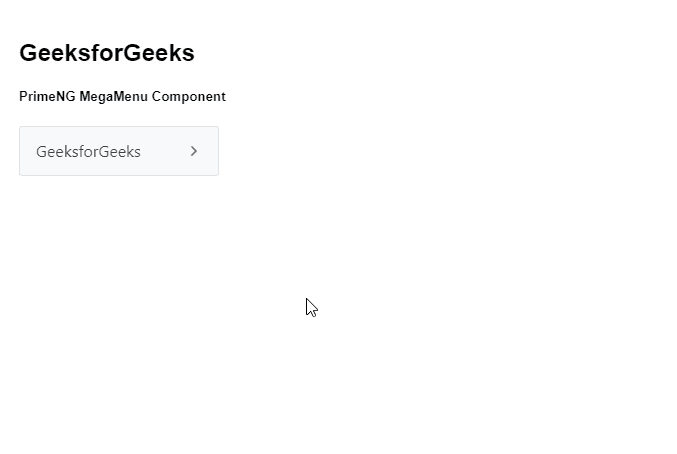

# 角度启动大菜单组件

> 原文:[https://www . geesforgeks . org/angular-priming-mega menu-component/](https://www.geeksforgeeks.org/angular-primeng-megamenu-component/)

Angular PrimeNG 是一个开源框架，具有一组丰富的本机 Angular UI 组件，用于实现出色的风格，该框架用于非常轻松地制作响应性网站。在本文中，我们将了解如何在 Angular PrimeNG 中使用 MegaMenu 组件。我们还将了解将在代码中使用的属性、样式及其语法。

**MegaMenu 组件:**是一个导航组件，用于制作菜单的多个编号的组件。

**属性:**

*   **模型:**是一组菜单。它接受数组数据类型作为输入&默认值为空。
*   **方位:**用于定义方位。它是字符串数据类型&默认值是水平。
*   **样式:**用于设置组件的内联样式。它是字符串数据类型&默认值为空。
*   **styleClass:** 用于设置组件的样式类。它是字符串数据类型&默认值为空。
*   **baseZIndex:** 用于设置分层时使用的 baseZIndex 值。它接受数字数据类型作为输入&默认值为 0。
*   **autoZIndex:** 用于指定是否自动管理分层。它是布尔数据类型&默认值为真。

**造型:**

*   **p-megamenu:** 是容器元素。
*   **p-menu-list:** 是列表元素。
*   **p-menuitem:** 是 menuitem 元素。
*   **p-menuitem-text:** 是 menuitem 的标签。
*   **p-menuitem-icon:** 是一个 menuitem 的图标。
*   **p-子菜单-图标:**是一个子菜单的箭头图标。

**创建角度应用&模块安装:**

*   **步骤 1:** 使用以下命令创建角度应用程序。

```ts
ng new appname
```

*   **步骤 2:** 创建项目文件夹即 appname 后，使用以下命令移动到该文件夹。

```ts
cd appname
```

*   **步骤 3:** 在给定的目录中安装 PrimeNG。

```ts
npm install primeng --save
npm install primeicons --save
```

**项目结构**:如下图:


**示例 1:** 这是说明如何使用 MegaMenu 组件的基本示例。

## app.component.html

```ts
<h2>GeeksforGeeks</h2>
<h5>PrimeNG MegaMenu Component</h5>
<p-megaMenu [model]="gfg"></p-megaMenu>
```

## app.module.ts

```ts
import { NgModule } from '@angular/core';
import { BrowserModule } from '@angular/platform-browser';
import { BrowserAnimationsModule } 
    from '@angular/platform-browser/animations';

import { AppComponent } from './app.component';
import { MegaMenuModule } from 'primeng/megamenu';

@NgModule({
  imports: [BrowserModule, 
              BrowserAnimationsModule, 
            MegaMenuModule],
  declarations: [AppComponent],
  bootstrap: [AppComponent]
})
export class AppModule {}
```

## app.component.ts

```ts
import { Component } from '@angular/core';
import { MegaMenuItem } from 'primeng/api';

@Component({
  selector: 'my-app',
  templateUrl: './app.component.html'
})
export class AppComponent {
  gfg: MegaMenuItem[];

  ngOnInit() {
    this.gfg = [
      {
        label: 'GeeksforGeeks',
        items: [
          [
            {
              label: 'AngularJS',
              items: [{ label: 'AngularJS 1' }, { label: 'AngularJS 2' }]
            },
            {
              label: 'ReactJS',
              items: [{ label: 'ReactJS 1' }, { label: 'ReactJS 2' }]
            }
          ],
          [
            {
              label: 'HTML',
              items: [{ label: 'HTML 1' }, { label: 'HTML 2' }]
            },
            {
              label: 'PrimeNG',
              items: [{ label: 'PriemNG 1' }, { label: 'PrimeNG 2' }]
            }
          ]
        ]
      }
    ];
  }
}
```

**输出:**



**示例 2:** 在本例中，我们将了解如何在 MegaMenu 组件中使用*方向*属性。

## app.component.html

```ts
<h2>GeeksforGeeks</h2>
<h5>PrimeNG MegaMenu Component</h5>
<p-megaMenu [model]="gfg" orientation='vertical'></p-megaMenu>
```

## app.module.ts

```ts
import { NgModule } from '@angular/core';
import { BrowserModule } from '@angular/platform-browser';
import { BrowserAnimationsModule } 
    from '@angular/platform-browser/animations';

import { AppComponent } from './app.component';
import { MegaMenuModule } from 'primeng/megamenu';

@NgModule({
  imports: [BrowserModule, 
              BrowserAnimationsModule, 
            MegaMenuModule],
  declarations: [AppComponent],
  bootstrap: [AppComponent]
})
export class AppModule {}
```

## app.component.ts

```ts
import { Component } from '@angular/core';
import { MegaMenuItem } from 'primeng/api';

@Component({
  selector: 'my-app',
  templateUrl: './app.component.html'
})
export class AppComponent {
  gfg: MegaMenuItem[];

  ngOnInit() {
    this.gfg = [
      {
        label: 'GeeksforGeeks',
        items: [
          [
            {
              label: 'AngularJS',
              items: [{ label: 'AngularJS 1' }, { label: 'AngularJS 2' }]
            },
            {
              label: 'ReactJS',
              items: [{ label: 'ReactJS 1' }, { label: 'ReactJS 2' }]
            }
          ],
          [
            {
              label: 'HTML',
              items: [{ label: 'HTML 1' }, { label: 'HTML 2' }]
            },
            {
              label: 'PrimeNG',
              items: [{ label: 'PriemNG 1' }, { label: 'PrimeNG 2' }]
            }
          ]
        ]
      }
    ];
  }
}
```

**输出:**



**参考:**T2】https://primefaces.org/primeng/showcase/#/megamenu