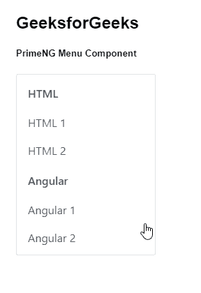
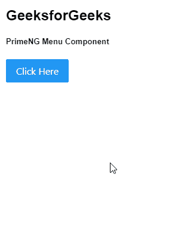

# 角度预调菜单组件

> 原文:[https://www . geesforgeks . org/angular-priming-menu-component/](https://www.geeksforgeeks.org/angular-primeng-menu-component/)

Angular PrimeNG 是一个开源框架，具有一组丰富的本机 Angular UI 组件，用于实现出色的风格，该框架用于非常轻松地制作响应性网站。在本文中，我们将了解如何在 Angular PrimeNG 中使用菜单组件。我们还将了解将在代码中使用的属性、事件、方法和样式以及它们的语法。

**菜单组件:**用于制作包含一些信息的组件&支持静态或动态定位。

**属性:**

*   **模型:**是一组菜单。它接受数组数据类型作为输入&默认值为空。
*   **弹出菜单:**用于定义菜单是否显示为弹出菜单。它是布尔数据类型&默认值为假。
*   **样式:**用于设置组件的内嵌样式。它是字符串数据类型&默认值为空。
*   **styleClass:** 用于设置组件的样式类。它是字符串数据类型&默认值为空。
*   **appendTo:** 是附着覆盖的目标元素。它接受任何数据类型&默认值为空。
*   **baseZIndex:** 用于设置分层时使用的 baseZIndex 值。它是数字数据类型&默认值为 0。
*   **autoZIndex:** 用于指定是否自动管理分层。它是布尔数据类型&默认值为真。
*   **显示过渡选项:**用于显示表演动画的过渡选项。它是字符串数据类型&默认值是. 12s 三次贝塞尔曲线(0，0，0.2，1)。
*   **隐藏过渡选项:**用于隐藏隐藏动画的过渡选项。它是字符串数据类型&默认值为. 1s 线性。

**事件:**

*   **onShow:** 这是一个回调，在显示覆盖菜单时触发。
*   **onHide:** 是覆盖菜单隐藏时触发的回调。

**方法:**

*   **切换:**用于切换弹出菜单的可见性。
*   **显示:**用于显示弹出菜单。
*   **隐藏:**用于隐藏弹出菜单。

**造型:**

*   **p-menu:** 是容器元素。
*   **p-menu-list:** 是列表元素。
*   **p-menuitem:** 是 menuitem 元素。
*   **p-menuitem-text:** 是 menuitem 的标签。
*   **p-menuitem-icon:** 是一个 menuitem 的图标。

**创建角度应用&模块安装:**

*   **步骤 1:** 使用以下命令创建角度应用程序。

```ts
ng new appname
```

*   **步骤 2:** 创建项目文件夹即 appname 后，使用以下命令移动到该文件夹。

```ts
cd appname
```

*   **步骤 3:** 在给定的目录中安装 PrimeNG。

```ts
npm install primeng --save
npm install primeicons --save
```

**项目结构**:如下图:


**示例 1:** 这是展示如何使用 Menu 组件的基本示例。

## app.component.html

```ts
<h2>GeeksforGeeks</h2>
<h5>PrimeNG Menu Component</h5>
<p-menu [model]="gfg"></p-menu>
```

## app.module.ts

```ts
import { NgModule } from '@angular/core';
import { BrowserModule } from '@angular/platform-browser';
import { BrowserAnimationsModule } 
    from '@angular/platform-browser/animations';

import { AppComponent } from './app.component';
import { MenuModule } from 'primeng/menu';
import { ButtonModule } from 'primeng/button';

@NgModule({
  imports: [BrowserModule, 
              BrowserAnimationsModule, 
            MenuModule, ButtonModule],
  declarations: [AppComponent],
  bootstrap: [AppComponent]
})
export class AppModule {}
```

## app.component.ts

```ts
import { Component } from '@angular/core';
import { MenuItem } from 'primeng/api';

@Component({
  selector: 'my-app',
  templateUrl: './app.component.html'
})
export class AppComponent {
  gfg: MenuItem[];

  ngOnInit() {
    this.gfg = [
      {
        label: 'HTML',
        items: [
          {
            label: 'HTML 1'
          },
          {
            label: 'HTML 2'
          }
        ]
      },
      {
        label: 'Angular',

        items: [
          {
            label: 'Angular 1'
          },
          {
            label: 'Angular 2'
          }
        ]
      }
    ];
  }
}
```

**输出:**



**示例 2:** 在本例中，我们使用按钮制作菜单列表。

## app.component.html

```ts
<h2>GeeksforGeeks</h2>
<h5>PrimeNG Menu Component</h5>
<button type="button" pButton pRipple label="Click Here"
        (click)="menu.toggle($event)"></button>
<p-menu #menu [popup]="true" [model]="gfg"></p-menu>
```

## app.module.ts

```ts
import { NgModule } from '@angular/core';
import { BrowserModule } from '@angular/platform-browser';
import { BrowserAnimationsModule } 
    from '@angular/platform-browser/animations';

import { AppComponent } from './app.component';
import { MenuModule } from 'primeng/menu';
import { ButtonModule } from 'primeng/button';
import { RippleModule } from 'primeng/ripple';

@NgModule({
  imports: [
    BrowserModule,
    BrowserAnimationsModule,
    MenuModule,
    RippleModule,
    ButtonModule
  ],
  declarations: [AppComponent],
  bootstrap: [AppComponent]
})
export class AppModule {}
```

## app.component.ts

```ts
import { Component } from '@angular/core';
import { MenuItem, MessageService, PrimeNGConfig } from 'primeng/api';

@Component({
  selector: 'my-app',
  templateUrl: './app.component.html',
  providers: [MessageService]
})
export class AppComponent {
  gfg: MenuItem[];

  constructor(
    private messageService: MessageService,
    private primengConfig: PrimeNGConfig
  ) {}

  ngOnInit() {
    this.primengConfig.ripple = true;

    this.gfg = [
      {
        label: 'HTML',
        items: [
          {
            label: 'HTML 1'
          },
          {
            label: 'HTML 2'
          }
        ]
      },
      {
        label: 'Angular',

        items: [
          {
            label: 'Angular 1'
          },
          {
            label: 'Angular 2'
          }
        ]
      }
    ];
  }
}
```

**输出:**



**参考:**T2】https://primefaces.org/primeng/showcase/#/menu