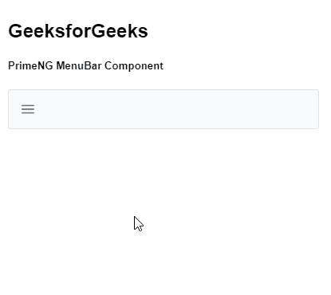

# 角形主菜单栏组件

> 原文:[https://www . geesforgeks . org/angular-priming-menubar-component/](https://www.geeksforgeeks.org/angular-primeng-menubar-component/)

Angular PrimeNG 是一个开源框架，具有一组丰富的本机 Angular UI 组件，用于实现出色的风格，该框架用于非常轻松地制作响应性网站。在本文中，我们将了解如何在 Angular PrimeNG 中使用菜单栏组件。我们还将了解将在代码中使用的属性、样式及其语法。

**菜单栏组件:**用于制作横条形式的菜单列表。

**属性:**

*   **模型:**是一个菜单项的数组。它接受数组数据类型作为输入&默认值为空。
*   **样式:**是组件的内嵌样式。它是字符串数据类型&默认值为空。
*   **styleClass:** 用于设置组件的样式类。它是字符串数据类型&默认值为空。
*   **baseZIndex:** 用于设置分层时使用的 baseZIndex 值。它接受数字数据类型作为输入&默认值为 0。
*   **autoZIndex:** 用于指定是否自动管理分层。它接受布尔数据类型作为输入&默认值为真。
*   **自动显示:**用于指定是否在鼠标悬停时显示根子菜单。它接受布尔数据类型作为输入&默认值为假。

**造型**T2:

*   **p-menubar:** 是容器元素。
*   **p-menu-list:** 是列表元素。
*   **p-menuitem:** 是 menuitem 元素。
*   **p-menuitem-text** :是 menuitem 的标签。
*   **p-menuitem-icon:** 是一个 menuitem 的图标。
*   **p-子菜单-图标:**是一个子菜单的箭头图标。

**创建角度应用&模块安装:**

*   **步骤 1:** 使用以下命令创建角度应用程序。

```ts
ng new appname
```

*   **步骤 2:** 创建项目文件夹即 appname 后，使用以下命令移动到该文件夹。

```ts
cd appname
```

*   **步骤 3:** 在给定的目录中安装 PrimeNG。

```ts
npm install primeng --save
npm install primeicons --save
```

**项目结构:**如下图:


**示例:**这是说明如何使用 Menubar 组件的基本示例。

## app.component.html

```ts
<h2>GeeksforGeeks</h2>
<h5>PrimeNG MenuBar Component</h5>
<p-menubar [model]="gfg"></p-menubar>
```

## app.module.ts

```ts
import { NgModule } from '@angular/core';
import { BrowserModule } from '@angular/platform-browser';
import { BrowserAnimationsModule } 
    from '@angular/platform-browser/animations';

import { AppComponent } from './app.component';
import { MenubarModule } from 'primeng/menubar';
@NgModule({
  imports: [BrowserModule, 
              BrowserAnimationsModule, 
            MenubarModule],
  declarations: [AppComponent],
  bootstrap: [AppComponent]
})
export class AppModule {}
```

## app.component.ts

```ts
import { Component } from '@angular/core';
import { MenuItem } from 'primeng/api';

@Component({
  selector: 'my-app',
  templateUrl: './app.component.html'
})
export class AppComponent {
  gfg: MenuItem[];

  ngOnInit() {
    this.gfg = [
      {
        label: 'HTML',
        items: [
          {
            label: 'HTML 1'
          },
          {
            label: 'HTML 2'
          }
        ]
      },
      {
        label: 'Angular',

        items: [
          {
            label: 'Angular 1'
          },
          {
            label: 'Angular 2'
          }
        ]
      }
    ];
  }
}
```

**输出:**



**参考:**T2】https://primefaces.org/primeng/showcase/#/menubar