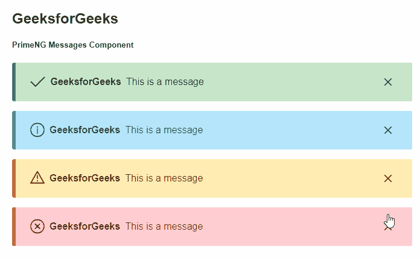
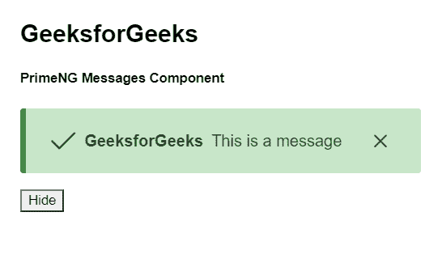

# 角度灌注信息组件

> 原文:[https://www . geesforgeks . org/angular-priming-messages-component/](https://www.geeksforgeeks.org/angular-primeng-messages-component/)

Angular PrimeNG 是一个开源框架，具有一组丰富的本机 Angular UI 组件，用于实现出色的风格，该框架用于非常轻松地制作响应性网站。在本文中，我们将了解如何在 Angular PrimeNG 中使用消息组件。我们还将了解将在代码中使用的属性、样式及其语法。

**消息组件:**用于显示具有特定严重性的消息。

**消息组件的属性:**

*   **值**:是要显示的消息数组。它属于数组数据类型，默认值为 null。
*   **可关闭**:定义消息框是否可以通过点击图标关闭。它属于布尔数据类型，默认值为真。
*   **样式**:设置组件的内嵌样式。它是字符串数据类型，默认值为 null。
*   **样式类**:设置组件的样式类。它是字符串数据类型，默认值为 null。
*   **启用服务**:指定是否启用显示服务消息。它属于布尔数据类型，默认值为真。
*   **转义**:指定显示消息是否会被转义。它是布尔数据类型，默认值为真。
*   **键**:它是与消息的键匹配的 Id，以便在基于服务的消息传递中启用范围。它是字符串数据类型，默认值为 null。
*   **显示过渡选项**:设置显示动画的过渡选项。它属于布尔数据类型，默认值为 300 毫秒。
*   **隐藏过渡选项**:设置隐藏动画的过渡选项。它属于布尔数据类型，默认值为 200 毫秒三次贝塞尔曲线(0.86，0，0.07，1)。

**消息组件的样式:**

*   **p-messages:** 它是一个容器元素。
*   **p-message:** 它是一个消息元素。
*   **p-message-info:** 显示信息消息时的消息元素。
*   **p-message-warn:** 显示警告消息时的消息元素。
*   **p-message-error:** 显示错误消息时的消息元素。
*   **p-message-success:** 显示成功消息时的消息元素。
*   **p-message-close:** 是关闭按钮。
*   **p-message-close-icon:** 是关闭图标。
*   **p-message-icon:** 是严重性图标。
*   **p-message-summary:** 是一条消息的摘要。
*   **p-message-detail:** 是一条消息的细节。

**消息组件的属性:**

*   **严重性**:用于指定消息的严重程度。它是字符串数据类型，默认值为 null。
*   **文本**:用于设置文本内容。它是字符串数据类型，默认值为 null。
*   **转义**:显示消息是否会被转义。布尔真
*   **样式**:用于设置组件的内嵌样式。它是字符串数据类型，默认值为 null。
*   **样式类**:用于设置组件的样式类。它是字符串数据类型，默认值为 null。

**消息组件的样式:**

*   **p-inline-message** :是一个消息元素。
*   **p-inline-message-info** :显示信息消息时的消息元素。
*   **p-inline-message-warn:** 显示警告消息时的消息元素。
*   **p-inline-message-error** :显示错误消息时的消息元素。
*   **p-inline-message-success** :显示成功消息时的消息元素。
*   **p-inline-message-icon** :用于指定严重性图标。
*   **p-inline-message-text:** 是一条短信。

**创建角度应用&模块安装:**

**步骤 1:** 使用以下命令创建角度应用程序。

```
ng new appname
```

**步骤 2:** 创建项目文件夹即 appname 后，使用以下命令移动到该文件夹。

```
cd appname
```

**步骤 3:** 在给定的目录中安装 PrimeNG。

```
npm install primeng --save
npm install primeicons --save
```

**项目结构:**如下图:


**示例 1:** 这是说明如何使用 Messages 组件的基本示例。

## app.component.html

```
<h2>GeeksforGeeks</h2>
<h5>PrimeNG Messages Component</h5>
<p-messages [(value)]="gfg" 
  [enableService]="false">
</p-messages>
```

## app.component.ts

```
import { Component } from "@angular/core";
import { Message } from "primeng/api";

@Component({
  selector: "my-app",
  templateUrl: "./app.component.html",
})
export class AppComponent {
  gfg: Message[];

  ngOnInit() {
    this.gfg = [
      { detail: "This is a message" },
      { detail: "This is a message" },
      { detail: "This is a message" },
      { detail: "This is a message" },
    ];
  }
}
```

## app.module.ts

```
import { NgModule } from "@angular/core";
import { BrowserModule } from "@angular/platform-browser";
import { BrowserAnimationsModule } 
    from "@angular/platform-browser/animations";

import { AppComponent } from "./app.component";
import { MessagesModule } from "primeng/messages";
import { MessageModule } from "primeng/message";

@NgModule({
  imports: [
    BrowserModule,
    BrowserAnimationsModule,
    MessagesModule,
    MessageModule,
  ],
  declarations: [AppComponent],
  bootstrap: [AppComponent],
})
export class AppModule {}
```

**输出:**



**示例 2:** 在本例中，我们已经使用按钮清除了消息。

## app.component.html

```
<h2>GeeksforGeeks</h2>
<h5>PrimeNG Messages Component</h5>
<p-messages [(value)]="msgs"></p-messages>
<button type="button" (click)="hide()">Hide</button>
```

## app.component.ts

```
import { Component } from "@angular/core";
import { Message } from "primeng/api";

@Component({
  selector: "my-app",
  templateUrl: "./app.component.html",
})
export class AppComponent {
  msgs = [
    {
      severity: "success",
      summary: "GeeksforGeeks",
      detail: "This is a message",
    },
  ];
  hide() {
    this.msgs = [];
  }
  ngOnInit() {}
}
```

## app.module.ts

```
import { NgModule } from "@angular/core";
import { BrowserModule } from "@angular/platform-browser";
import { BrowserAnimationsModule } 
    from "@angular/platform-browser/animations";

import { AppComponent } from "./app.component";
import { MessagesModule } from "primeng/messages";
import { MessageModule } from "primeng/message";

@NgModule({
  imports: [
    BrowserModule,
    BrowserAnimationsModule,
    MessagesModule,
    MessageModule,
  ],
  declarations: [AppComponent],
  bootstrap: [AppComponent],
})
export class AppModule {}
```

**输出:**



**参考:**T2】https://primefaces.org/primeng/showcase/#/messages