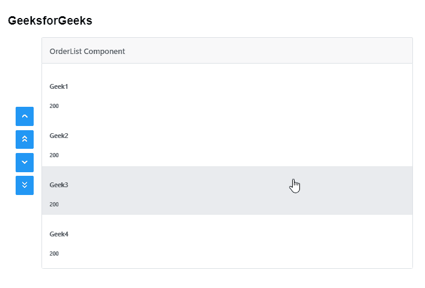
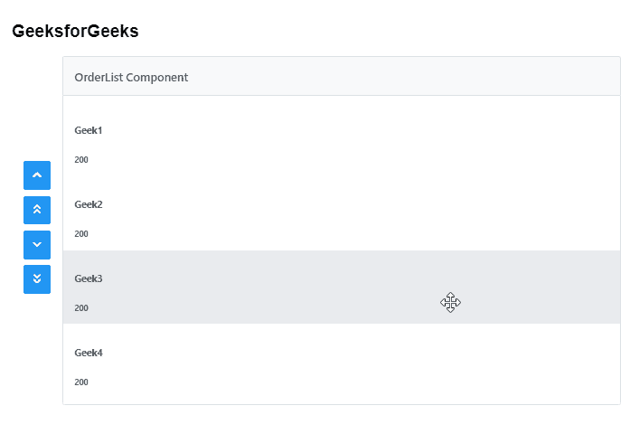

# 角度灌注订单列表组件

> 原文:[https://www . geesforgeks . org/angular-priming-order list-component/](https://www.geeksforgeeks.org/angular-primeng-orderlist-component/)

Angular PrimeNG 是一个开源框架，具有一组丰富的本机 Angular UI 组件，用于实现出色的风格，该框架用于非常轻松地制作响应性网站。在本文中，我们将了解如何在 Angular PrimeNG 中使用 OrderList 组件。我们还将了解将在代码示例中使用的属性、事件和样式以及它们的语法。

**订单列表组件:**用于维护物料和产品的列表。

**属性:**

*   **值**:是需要重新排序的对象数组。它接受数组数据类型&默认值为空。
*   **选择**:绑定选择的对象数组。它接受数组数据类型&默认值为空。
*   **标题**:是标题的文字。它是字符串数据类型&默认值为空。
*   **样式**:是组件的内嵌样式。它是字符串数据类型&默认值为空。
*   **styleClass** :是组件的样式类。它是字符串数据类型&默认值为空。
*   **列表样式**:是列表元素的内嵌样式。它是字符串数据类型&默认值为空。
*   **筛选依据**:用于指定是否显示输入字段来筛选键盘上的项目，并决定搜索哪些字段。它是字符串数据类型&默认值为空。
*   **过滤匹配模式**:用于定义项目的过滤方式。它是字符串数据类型&默认值是包含。
*   **过滤区域**:用于设置过滤时使用的区域。它是字符串数据类型&默认值未定义。
*   **元键选择**:用于指定是否需要按下元键来选择或丢弃项目。它接受布尔数据类型&默认值为真。
*   **拖放**:用于指定是否启用基于拖放的重新排序。它接受布尔数据类型&默认值为假。
*   **过滤器占位符**:是占位符文本。它是字符串数据类型&默认值为空。
*   **trackBy** :是通过委托给 ngForTrackBy 来优化 dom 操作的功能。它是函数类型&，默认值为空。
*   **控制位置**:用于定义按钮相对于列表的位置，有效值为“左”或“右”。它是字符串数据类型&默认值为左。
*   **ariaFilterLabel** :用于定义标注过滤器输入的字符串。它是字符串数据类型&默认值为空。

**事件:**

*   **on order**:是列表重新排序时触发的回调。
*   **onSelectionChange** :选择改变时调用的回调。
*   **onfilterrevent**:是过滤发生时触发的回调。

**造型:**

*   **p-orderlist:** 是容器元素。
*   **p-orderlist-list:** 是一个列表容器。
*   **p-orderlist-item:** 是列表项。

**创建角度应用&模块安装:**

**步骤 1:** 使用以下命令创建角度应用程序。

```ts
ng new appname
```

**步骤 2:** 创建项目文件夹即 appname 后，使用以下命令移动到该文件夹。

```ts
cd appname
```

**步骤 3:** 在给定的目录中安装 PrimeNG。

```ts
npm install primeng --save
npm install primeicons --save
```

**项目结构**:如下图:


**示例 1:** 这是说明如何使用 Orderlist 组件的基本示例。

## app.component.html

```ts
<h2>GeeksforGeeks</h2>
<p-orderList [value]="product" header="OrderList Component">
  <ng-template let-product pTemplate="item">
    <div class="product-item">
      <div class="product-list-detail">
        <h5 class="p-mb-2">{{product}}</h5>
        <h6 class="p-mb-2">{{gfg}}</h6>
      </div>
    </div>
  </ng-template>
</p-orderList>
```

## app.component.ts

```ts
import { Component } from '@angular/core';

@Component({
  selector: 'my-app',
  templateUrl: './app.component.html'
})
export class AppComponent {
  product: string[] = ['Geek1', 'Geek2', 'Geek3', 'Geek4'];

  gfg: string[] = ['200'];
}
```

## app.module.ts

```ts
import { NgModule } from '@angular/core';
import { BrowserModule } from '@angular/platform-browser';
import { BrowserAnimationsModule } 
    from '@angular/platform-browser/animations';

import { AppComponent } from './app.component';
import { OrderListModule } from 'primeng/orderlist';

@NgModule({
  imports: [BrowserModule, 
              BrowserAnimationsModule, 
            OrderListModule],
  declarations: [AppComponent],
  bootstrap: [AppComponent]
})
export class AppModule {}
```

**输出:**



**示例 2:** 在本例中，我们将在 OrderList 组件中使用 *dragdrop* 属性。

## app.component.html

```ts
<h2>GeeksforGeeks</h2>
<p-orderList [value]="product" 
    header="OrderList Component" 
    dragdrop="true">
  <ng-template let-product pTemplate="item">
    <div class="product-item">
      <div class="product-list-detail">
        <h5 class="p-mb-2">{{product}}</h5>
        <h6 class="p-mb-2">{{gfg}}</h6>
      </div>
    </div>
  </ng-template>
</p-orderList>
```

## app.component.ts

```ts
import { Component } from '@angular/core';

@Component({
  selector: 'my-app',
  templateUrl: './app.component.html'
})
export class AppComponent {
  product: string[] = ['Geek1', 'Geek2', 'Geek3', 'Geek4'];

  gfg: string[] = ['200'];
}
```

## app.module.ts

```ts
import { NgModule } from '@angular/core';
import { BrowserModule } from '@angular/platform-browser';
import { BrowserAnimationsModule } 
    from '@angular/platform-browser/animations';

import { AppComponent } from './app.component';
import { OrderListModule } from 'primeng/orderlist';

@NgModule({
  imports: [BrowserModule,
              BrowserAnimationsModule, 
            OrderListModule],
  declarations: [AppComponent],
  bootstrap: [AppComponent]
})
export class AppModule {}
```

**输出:**



**参考:**T2】https://primefaces.org/primeng/showcase/#/orderlist