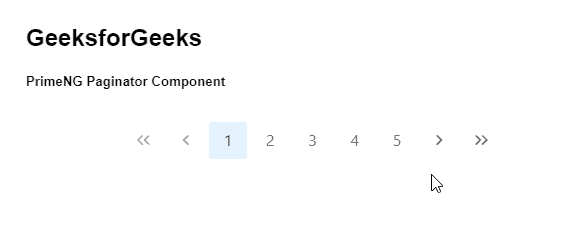
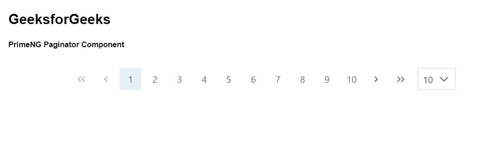

# 角度灌注分页器组件

> 原文:[https://www . geeksforgeeks . org/angular-priming-paginator-component/](https://www.geeksforgeeks.org/angular-primeng-paginator-component/)

Angular PrimeNG 是一个开源框架，具有一组丰富的本机 Angular UI 组件，用于实现出色的风格，该框架用于非常轻松地制作响应性网站。在本文中，我们将了解如何在 Angular PrimeNG 中使用分页器组件。我们还将了解将在代码中使用的属性、事件和样式以及它们的语法。

**分页器组件:**用于以分页格式显示内容。

**属性:**

*   **totalRecords** :是要显示的总记录页数的总和。它是数字数据类型，默认值为 0。
*   **行**:是每页显示的数据计数。它是数字数据类型，默认值为 0。
*   **第一个**:是要显示的第一行的相对零号。它是数字数据类型，默认值为 0。
*   **页面链接大小**:设置要显示的页面链接数量。它是数字数据类型，默认值为 5。
*   **rowsPerPageOptions** :显示在每页下拉列表行内的整数/对象值数组。它属于数组数据类型，默认值为 null。
*   **样式:**是组件的内嵌样式。它是字符串数据类型，默认值为 null。
*   **styleClass** :是组件的样式类。它是字符串数据类型，默认值为 null。
*   **alwaysShow** :指定即使只有一页是否显示。它是布尔数据类型，默认值为真。
*   **显示第一页**:显示分页器上显示的图标是第一页和最后一页。它是布尔数据类型，默认值为真。
*   **模板左侧**:是注入分页器左侧的模板实例。它属于 TemplateRef 数据类型，默认值为 null。
*   **templateRight** :是注入分页器右侧的模板实例。它属于 TemplateRef 数据类型，默认值为 null。
*   **dropdownItemTemplate** :是注入分页器内部下拉项的模板实例。它属于 TemplateRef 数据类型，默认值为 null。
*   **dropdownAppendTo** :是附着下拉叠加的目标元素。它可以接受任何类型的数据&默认值为空。
*   **dropdowsnrollheight**:是视口的下拉高度，以像素为单位，如果列表的高度超过这个值，就定义一个滚动条。它是字符串数据类型，默认值为 200px。
*   **currentPageReportTemplate**:是当前页面报表元素的模板。它是字符串数据类型，默认值为({currentPage} of {totalPages})。
*   **显示当前页面报告**:指定是否显示当前页面报告。它是布尔数据类型，默认值为 false。
*   **showJumpToPageDropdown** :指定是否显示下拉菜单导航到任意页面。它是布尔数据类型，默认值为 false。
*   **显示页面链接**:指定是否显示页面链接。它是布尔数据类型，默认值为真。

**事件:**

*   **onPageChange:** 是当元素中的页面发生变化时触发的回调。

**造型:**

*   **p-paginator:** 是 Container 元素。
*   **p-paginator-first:** 是第一页元素。
*   **p-paginator-prev:** 是上一页元素。
*   **p-paginator-pages:** 是页面链接的容器。
*   **p-paginator-page:** 是页面链接。
*   **p-paginator-next:** 是下一页元素。
*   **p-paginator-last:** 是最后一个页面元素。
*   **p-分页器-rpp-选项:**是每页的行数下拉列表。
*   **p-分页器-页面-选项:**是跳转到每页下拉列表。

**创建角度应用&模块安装:**

**步骤 1:** 使用以下命令创建角度应用程序。

```ts
ng new appname
```

**步骤 2:** 创建项目文件夹即 appname 后，使用以下命令移动到该文件夹。

```ts
cd appname
```

**步骤 3:** 在给定的目录中安装 PrimeNG。

```ts
npm install primeng --save
npm install primeicons --save
```

**项目结构:**如下图:


**示例 1:** 这是说明如何使用 Paginator 组件的基本示例。我们已经使用了*行* & *totalRecord* 属性，该属性将给出每页要呈现的数据计数信息&记录总数。

## app.component.html

```ts
<h2>GeeksforGeeks</h2>
<h5>PrimeNG Paginator Component</h5>
<p-paginator [rows]="1" [totalRecords]="15"></p-paginator>
```

## app.component.ts

```ts
import { Component } from "@angular/core";

@Component({
  selector: "my-app",
  templateUrl: "./app.component.html",
  styleUrls: ["./app.component.scss"],
})
export class AppComponent {}
```

## app.module.ts

```ts
import { NgModule } from "@angular/core";
import { BrowserModule } from "@angular/platform-browser";
import { FormsModule } from "@angular/forms";
import { BrowserAnimationsModule } 
    from "@angular/platform-browser/animations";

import { AppComponent } from "./app.component";
import { PaginatorModule } from "primeng/paginator";

@NgModule({
  imports: [
    BrowserModule,
    BrowserAnimationsModule,
    PaginatorModule,
    FormsModule,
  ],
  declarations: [AppComponent],
  bootstrap: [AppComponent],
})
export class AppModule {}
```

**输出:**



**示例 2:** 在本例中，我们将使用分页器组件中的*页面链接大小*属性和*行页面选项*下拉列表。

## app.component.html

```ts
<h2>GeeksforGeeks</h2>
<h5>PrimeNG Paginator Component</h5>
<p-paginator
  [pageLinkSize]="10"
  [rows]="1"
  [totalRecords]="25"
  [rowsPerPageOptions]="[10,20,30]">
</p-paginator>
```

## app.component.ts

```ts
import { Component } from "@angular/core";

@Component({
  selector: "my-app",
  templateUrl: "./app.component.html",
  styleUrls: ["./app.component.scss"],
})
export class AppComponent {}
```

## app.module.ts

```ts
import { NgModule } from "@angular/core";
import { BrowserModule } from "@angular/platform-browser";
import { FormsModule } from "@angular/forms";
import { BrowserAnimationsModule } 
    from "@angular/platform-browser/animations";

import { AppComponent } from "./app.component";
import { PaginatorModule } from "primeng/paginator";

@NgModule({
  imports: [
    BrowserModule,
    BrowserAnimationsModule,
    PaginatorModule,
    FormsModule,
  ],
  declarations: [AppComponent],
  bootstrap: [AppComponent],
})
export class AppModule {}
```

**输出:**



**参考:**T2】https://primefaces.org/primeng/showcase/#/paginator