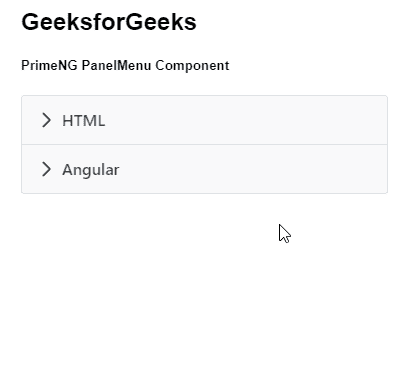
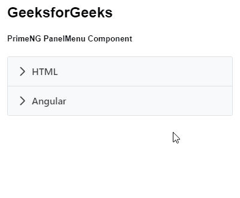

# 角度灌注面板菜单组件

> 原文:[https://www . geesforgeks . org/angular-priming-panel menu-component/](https://www.geeksforgeeks.org/angular-primeng-panelmenu-component/)

Angular PrimeNG 是一个开源框架，具有一组丰富的本机 Angular UI 组件，用于实现出色的风格，该框架用于非常轻松地制作响应性网站。在本文中，我们将了解如何在 Angular PrimeNG 中使用 PanelMenu 组件。我们还将了解将在代码中使用的属性、样式及其语法。

**PanelMenu 组件:**用于制作面板形式的菜单。它可以被认为是手风琴和树组件的组合

**属性:**

*   **模型:**是一个菜单项的数组。它接受数组数据类型作为输入&默认值为空。
*   **样式:**用于设置组件的内嵌样式。它属于字符串数据类型&，默认值为空。
*   **styleClass:** 用于设置组件的样式类。它属于字符串数据类型&，默认值为空。
*   **多个:**用于指定是否可以同时激活多个标签页。它属于布尔数据类型&默认值为真。
*   **过渡选项:**用于设置动画的过渡选项。它是字符串数据类型&默认值是 400 毫秒三次贝塞尔曲线(0.86，0，0.07，1)。

**造型:**

*   **p-panelmenu:** 是一个容器元素。
*   **p-panelmenu-header:** 是根子菜单的手风琴式标题。
*   **p-panelmenu-content:** 是根子菜单的手风琴式内容。
*   **p-菜单-列表:**是元素列表。
*   **p-menuitem:** 是元素 menuitem。
*   **p-menuitem-text:** 是 menuitem 的标签。
*   **p-menuitem-icon:** 是一个 menuitem 的图标。
*   **p-panelmenu-icon:** 是手风琴式标题的箭头图标。

**创建角度应用&模块安装:**

*   **步骤 1:** 使用以下命令创建角度应用程序。

```
ng new appname
```

*   **步骤 2:** 创建项目文件夹即 appname 后，使用以下命令移动到该文件夹。

```
cd appname
```

*   **步骤 3:** 在给定的目录中安装 PrimeNG。

```
npm install primeng --save
npm install primeicons --save
```

**项目结构**:安装完成后，如下图:


**示例 1:** 这是说明如何使用 PanelMenu 组件的基本示例。

## app.component.html

```
<h2>GeeksforGeeks</h2>
<h5>PrimeNG PanelMenu Component</h5>
<p-panelMenu [model]="gfg"></p-panelMenu>
```

## app.module.ts

```
import { NgModule } from '@angular/core';
import { BrowserModule } from '@angular/platform-browser';
import { BrowserAnimationsModule } 
    from '@angular/platform-browser/animations';

import { AppComponent } from './app.component';
import { PanelMenuModule } from 'primeng/panelmenu';

@NgModule({
  imports: [BrowserModule, 
              BrowserAnimationsModule, 
            PanelMenuModule],
  declarations: [AppComponent],
  bootstrap: [AppComponent]
})
export class AppModule {}
```

## app.component.ts

```
import { Component } from '@angular/core';
import { MenuItem } from 'primeng/api';

@Component({
  selector: 'my-app',
  templateUrl: './app.component.html'
})
export class AppComponent {
  gfg: MenuItem[];

  ngOnInit() {
    this.gfg = [
      {
        label: 'HTML',
        items: [
          {
            label: 'HTML 1'
          },
          {
            label: 'HTML 2'
          }
        ]
      },
      {
        label: 'Angular',

        items: [
          {
            label: 'Angular 1'
          },
          {
            label: 'Angular 2'
          }
        ]
      }
    ];
  }
}
```

**输出:**



**示例 2:** 在本例中，我们将了解如何在 panelmenu 组件中使用*多个*属性。

## app.component.html

```
<h2>GeeksforGeeks</h2>
<h5>PrimeNG PanelMenu Component</h5>
<p-panelMenu [multiple]='false' [model]="gfg"></p-panelMenu>
```

## app.module.ts

```
import { NgModule } from '@angular/core';
import { BrowserModule } from '@angular/platform-browser';
import { BrowserAnimationsModule } 
    from '@angular/platform-browser/animations';

import { AppComponent } from './app.component';
import { PanelMenuModule } from 'primeng/panelmenu';

@NgModule({
  imports: [BrowserModule, 
              BrowserAnimationsModule, 
            PanelMenuModule],
  declarations: [AppComponent],
  bootstrap: [AppComponent]
})
export class AppModule {}
```

## app.component.ts

```
import { Component } from '@angular/core';
import { MenuItem } from 'primeng/api';

@Component({
  selector: 'my-app',
  templateUrl: './app.component.html'
})
export class AppComponent {
  gfg: MenuItem[];

  ngOnInit() {
    this.gfg = [
      {
        label: 'HTML',
        items: [
          {
            label: 'HTML 1'
          },
          {
            label: 'HTML 2'
          }
        ]
      },
      {
        label: 'Angular',

        items: [
          {
            label: 'Angular 1'
          },
          {
            label: 'Angular 2'
          }
        ]
      }
    ];
  }
}
```

**输出:**



**参考:**T2】https://primefaces.org/primeng/showcase/#/panelmenu