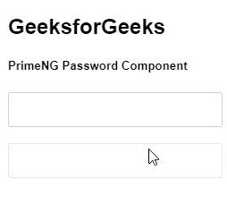
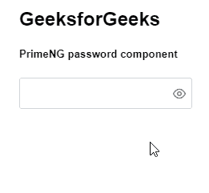

# 角度密码组件

> 原文:[https://www . geesforgeks . org/angular-priming-password-component/](https://www.geeksforgeeks.org/angular-primeng-password-component/)

Angular PrimeNG 是一个开源框架，具有一组丰富的本机 Angular UI 组件，用于实现出色的风格，该框架用于非常轻松地制作响应性网站。在本文中，我们将了解如何在 Angular PrimeNG 中使用密码组件。

**密码成分:**用于表示密码字段的强度指标。

**属性:**

*   **提示标签**:用于显示一些提示输入密码的文字。它是字符串数据类型，默认值为 null。
*   **mediumRegex** :是用于密码校验的中正则表达式。它是字符串数据类型，默认值是中级密码的正则表达式。
*   **strong 正则表达式**:用于密码检查的中等正则表达式。它是字符串数据类型，默认值是强级别密码的正则表达式。
*   **weakLabel** :用于显示弱密码输入的文本。它是字符串数据类型，默认值为 null。
*   **介质标签**:用于显示介质密码输入的文本。它是字符串数据类型，默认值为 null。
*   **strong 标签**:用于显示强密码输入的文本。它是字符串数据类型，默认值为 null。
*   **反馈**:用于显示强弱指标。它是布尔数据类型，默认值为真。
*   **toggleMask** :用于显示一个图标，以纯文本的形式显示密码。它是布尔数据类型，默认值为 false。
*   **追加到**:该属性获取叠加到其上的元素的标识。它是字符串数据类型，默认值为 null。
*   **输入样式**:用于设置输入字段的内联样式。它是字符串数据类型，默认值为 null。
*   **输入样式类**:用于设置输入字段的样式类。它是字符串数据类型，默认值为 null。
*   **输入项**:是底层输入元素的 Id 标识。它是字符串数据类型，默认值为 null。
*   **样式**:用于设置元素的内嵌样式。它是字符串数据类型，默认值为 null。
*   **样式类**:用于设置元素的样式类。它是字符串数据类型，默认值为 null。
*   **占位符**:用于设置输入的占位符文本。它是字符串数据类型，默认值为 null。

**模板:**

*   **表头:**是元素的表头部分。
*   **内容:**是元素的内容部分。
*   **页脚:**是元素的页脚部分。

**造型:**

*   **p-密码面板:**是密码面板的造型容器。
*   **p-密码米:**是密码强度的造型米元素。
*   **p-密码-信息:**是显示强度的文字。

**创建角度应用&模块安装:**

*   **步骤 1:** 使用以下命令创建角度应用程序。

    ```
    ng new appname
    ```

*   **步骤 2:** 创建项目文件夹即 appname 后，使用以下命令移动到该文件夹。

    ```
    cd appname
    ```

*   **步骤 3:** 在给定的目录中安装 PrimeNG。

    ```
    npm install primeng --save
    npm install primeicons --save
    ```

**项目结构**:如下图。


**示例 1:** 这是展示如何使用 Password 组件的基本示例。**T3】**

## app.component.html

```
<h2>GeeksforGeeks</h2>
<h5>PrimeNG Password Component</h5>
<p-password [feedback]="false"></p-password>
<p-password [disabled]="true" [feedback]="false"></p-password>
```

## app.module.ts

```
import { NgModule } from "@angular/core";
import { BrowserModule } from "@angular/platform-browser";
import { FormsModule } from "@angular/forms";
import { BrowserAnimationsModule }
    from "@angular/platform-browser/animations";

import { AppComponent } from "./app.component";
import { PasswordModule } from "primeng/password";

@NgModule({
  imports: [
    BrowserModule,
    BrowserAnimationsModule,
    PasswordModule,
    FormsModule,
  ],
  declarations: [AppComponent],
  bootstrap: [AppComponent],
})
export class AppModule {}
```

**输出:**



**示例 2:** 在本例中，我们将了解如何在密码组件中使用 toggleMask 属性。

## app.component.html

```
<h2>GeeksforGeeks</h2>
<h5>PrimeNG password component</h5>
<p-password [toggleMask] ="true"></p-password>
```

## app.module.ts

```
import { NgModule } from "@angular/core";
import { BrowserModule } from "@angular/platform-browser";
import { FormsModule } from "@angular/forms";
import { BrowserAnimationsModule } 
    from "@angular/platform-browser/animations";

import { AppComponent } from "./app.component";
import { PasswordModule } from "primeng/password";

@NgModule({
  imports: [
    BrowserModule,
    BrowserAnimationsModule,
    PasswordModule,
    FormsModule,
  ],
  declarations: [AppComponent],
  bootstrap: [AppComponent],
})
export class AppModule {}
```

**输出:**



**参考:**T2】https://primefaces.org/primeng/showcase/#/password