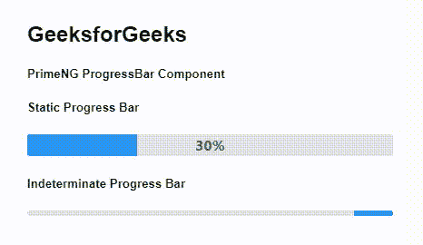
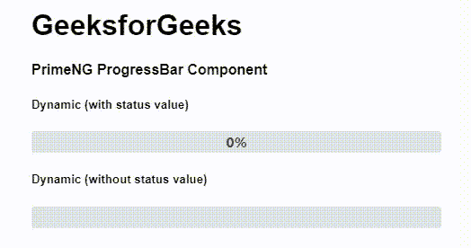

# 角度预旋进度条组件

> 原文:[https://www . geesforgeks . org/angular-priming-progress bar-component/](https://www.geeksforgeeks.org/angular-primeng-progressbar-component/)

Angular PrimeNG 是一个开源框架，具有一组丰富的本机 Angular UI 组件，用于实现出色的风格，该框架用于非常轻松地制作响应性网站。在本文中，我们将了解如何在 Angular PrimeNG 中使用 progressBar 组件。我们还将了解将在代码中使用的属性、样式及其语法。

**ProgressBar 组件:**用于制作显示过程状态的条。

**属性:**

*   **值:**指定进度的当前值。它接受数字数据类型，默认值为 null。
*   **显示值:**指定显示还是隐藏进度条值。它属于布尔数据类型，默认值为真。
*   **单位:**指定值后附加的单位符号。它是字符串数据类型，默认值为%。
*   **模式:**指定进度的模式，有效值为“确定”和“不确定”。它是字符串数据类型，默认值是确定的。

**造型:**

*   **p-progressbar:** 是容器元素。
*   **p-progressbar-确定:**它是确定的 progress bar 的容器元素。
*   **p-progressbar-不定:**它是不定 progress bar 的容器元素。
*   **p-progressbar-value:** 是宽度随值变化的元素。
*   **p-progressbar-label:** 是显示当前值的标签元素。

**创建角度应用&模块安装:**

**步骤 1:** 使用以下命令创建角度应用程序。

```
ng new appname
```

**步骤 2:** 创建项目文件夹即 appname 后，使用以下命令移动到该文件夹。

```
cd appname
```

**第三步**:在给定的目录下安装 PrimeNG。

```
npm install primeng --save
npm install primeicons --save
```

**项目结构**:安装完成后，如下图:


**示例 1:** 这是说明如何使用 ProgressBar 组件的基本示例。

## app.component.html

```
<h2>GeeksforGeeks</h2>
<h5>PrimeNG ProgressBar Component</h5>
<h5>Static Progress Bar</h5>
<p-progressBar [value]="30"></p-progressBar>
<h5>Indeterminate Progress Bar</h5>
<p-progressBar mode="indeterminate" 
               [style]="{'height': '6px'}">
</p-progressBar>
```

## app.component.ts

```
import { Component } from '@angular/core';

@Component({
  selector: 'my-app',
  templateUrl: './app.component.html'
})
export class AppComponent {}
```

## app.module.ts

```
import { NgModule } from '@angular/core';
import { BrowserModule } from '@angular/platform-browser';
import { FormsModule } from '@angular/forms';
import { BrowserAnimationsModule } 
    from '@angular/platform-browser/animations';

import { AppComponent } from './app.component';
import { ProgressBarModule } from 'primeng/progressbar';

@NgModule({
  imports: [
    BrowserModule,
    BrowserAnimationsModule,
    ProgressBarModule,
    FormsModule
  ],
  declarations: [AppComponent],
  bootstrap: [AppComponent]
})
export class AppModule {}
```

**输出:**



**例 2:** 在本例中，我们将使动态进度条组件随机更新，并显示&而不显示进度状态值。

## app.component.html

```
<h1>GeeksforGeeks</h1>
<h4>PrimeNG ProgressBar Component</h4>
<div class="card">
  <h5>Dynamic (with status value)</h5>
  <p-progressBar [value]="gfg1"></p-progressBar>
  <h5>Dynamic (without status value)</h5>
  <p-progressBar [showValue]='false' [value]="gfg2"></p-progressBar>
</div>
```

## app.component.ts

```
import { Component } from '@angular/core';

@Component({
  selector: 'my-app',
  templateUrl: './app.component.html'
})
export class AppComponent {
  gfg1: number = 0;
  gfg2: number = 0;

  ngOnInit() {
    setInterval(() => {
      this.gfg1 = this.gfg1 + Math.floor(Math.random() * 10) + 1;
      if (this.gfg1 >= 100) {
        this.gfg1 = 100;
      }
    }, 1500),
      setInterval(() => {
        this.gfg2 = this.gfg2 + Math.floor(Math.random() * 10) + 3;
        if (this.gfg2 >= 100) {
          this.gfg2 = 100;
        }
      }, 1500);
  }
}
```

## app.module.ts

```
import { NgModule } from '@angular/core';
import { BrowserModule } from '@angular/platform-browser';
import { FormsModule } from '@angular/forms';
import { BrowserAnimationsModule } 
    from '@angular/platform-browser/animations';

import { AppComponent } from './app.component';
import { ProgressBarModule } from 'primeng/progressbar';

@NgModule({
  imports: [
    BrowserModule,
    BrowserAnimationsModule,
    ProgressBarModule,
    FormsModule
  ],
  declarations: [AppComponent],
  bootstrap: [AppComponent]
})
export class AppModule {}
```

**输出:**



**参考:**T2】https://primefaces.org/primeng/showcase/#/progressbar