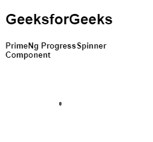
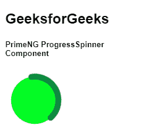

# 角度预旋程序旋转组件

> 原文:[https://www . geesforgeks . org/angular-priming-progress spinner-component/](https://www.geeksforgeeks.org/angular-primeng-progressspinner-component/)

Angular PrimeNG 是一个开源框架，具有一组丰富的本机 Angular UI 组件，用于实现出色的风格，该框架用于非常轻松地制作响应性网站。在本文中，我们将了解如何在 Angular PrimeNG 中使用 ProgressSpinner 组件。我们还将了解将在代码中使用的属性、样式及其语法。

**ProgressSpinner:** 该组件用于制作一个微调器，说明过程状态。

**属性:**

*   **描边宽度:**指定圆描边的宽度。它接受字符串数据类型作为输入&默认值为 2。
*   **填充:**指定圆圈背景的颜色。它是字符串数据类型，默认值为 null。
*   **动画持续时间:**指定旋转动画的持续时间。它是字符串数据类型，默认值为 2s。

**造型:**

*   **p-progress-spinner:** 是容器元素。
*   **p-progress-circle:** 是 SVG 造型元素。
*   **p-progress-path:** 是圆形造型元素。

**创建角度应用&模块安装:**

**步骤 1:** 使用以下命令创建角度应用程序。

```ts
ng new appname
```

**步骤 2:** 创建项目文件夹即应用程序名称后，使用以下命令移动到该文件夹。

```ts
cd appname
```

**步骤 3:** 在给定的目录中安装 PrimeNG。

```ts
npm install primeng --save
npm install primeicons --save
```

**项目结构:**安装完成后，如下图:


**示例 1:** 这是展示如何使用 ProgressSpinner 组件的基本示例。

## app.component.html

```ts
<h2>GeeksforGeeks</h2>
<h5>PrimeNg ProgressSpinner Component</h5>
<p-progressSpinner></p-progressSpinner>
```

## app.module.ts

```ts
import { NgModule } from '@angular/core';
import { BrowserModule } from '@angular/platform-browser';
import { FormsModule } from '@angular/forms';
import { BrowserAnimationsModule } 
    from '@angular/platform-browser/animations';

import { AppComponent } from './app.component';
import { ProgressSpinnerModule } 
    from 'primeng/progressspinner';

@NgModule({
  imports: [
    BrowserModule,
    BrowserAnimationsModule,
    ProgressSpinnerModule,
    FormsModule
  ],
  declarations: [AppComponent],
  bootstrap: [AppComponent]
})
export class AppModule {}
```

## app.component.ts

```ts
import { Component } from '@angular/core';

@Component({
  selector: 'my-app',
  templateUrl: './app.component.html'
})
export class AppComponent {}
```

**输出:**



**示例 2:** 在本例中，我们将在 progressSpinner 组件中使用 strokeWidth、fill 和 animationduration 属性。

## app.component.html

```ts
<h2>GeeksforGeeks</h2>
<h5>PrimeNG ProgressSpinner Component</h5>
<p-progressSpinner strokeWidth="5" fill="#03fc24" 
                   animationDuration="1s"></p-progressSpinner>
```

## app.module.ts

```ts
import { NgModule } from '@angular/core';
import { BrowserModule } from '@angular/platform-browser';
import { FormsModule } from '@angular/forms';
import { BrowserAnimationsModule } 
    from '@angular/platform-browser/animations';

import { AppComponent } from './app.component';
import { ProgressSpinnerModule } from 'primeng/progressspinner';

@NgModule({
  imports: [
    BrowserModule,
    BrowserAnimationsModule,
    ProgressSpinnerModule,
    FormsModule
  ],
  declarations: [AppComponent],
  bootstrap: [AppComponent]
})
export class AppModule {}
```

## app.component.ts

```ts
import { Component } from '@angular/core';

@Component({
  selector: 'my-app',
  templateUrl: './app.component.html'
})
export class AppComponent {}
```

**输出:**



**参考:**[**https://primefaces.org/primeng/showcase/#/progressspinner**](https://primefaces.org/primeng/showcase/#/progressspinner)