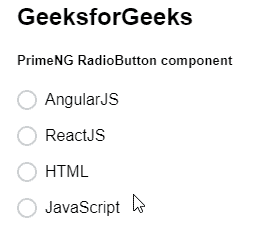
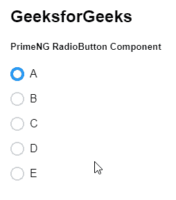

# 角度启动单选按钮组件

> 原文:[https://www . geesforgeks . org/angular-priming-radio button-component/](https://www.geeksforgeeks.org/angular-primeng-radiobutton-component/)

Angular PrimeNG 是一个开源框架，具有一组丰富的本机 Angular UI 组件，用于实现出色的风格，该框架用于非常轻松地制作响应性网站。在本文中，我们将了解如何在 Angular PrimeNG 中使用 RadioButton 组件。

**单选按钮组件:**它允许用户从一组选项中一次选择一个选项。

**属性:**

*   **名称:**用于设置单选按钮组的名称。它是字符串数据类型，默认值为 null。
*   **值:**用于设置单选按钮的值。它是字符串数据类型，默认值为 null。
*   **标签:**用于设置单选按钮的标签。它是字符串数据类型，默认值为 null。
*   **disabled:** 指定元素应该被禁用，它是布尔数据类型，默认值为 false。
*   **tabindex:** 用于按 tab binding 顺序设置元素的索引。它是数字数据类型，默认值为空。
*   **inputId:** 是底层输入元素的 Id 标识。它是字符串数据类型，默认值为 null。
*   **Arialabelledby:**Arialabelledby 属性建立组件和标签之间的关系，其值应该是一个或多个元素标识。它是字符串数据类型，默认值为 null。
*   **样式:**用于设置元素的内联样式。它属于对象数据类型，默认值为空。
*   **styleClass:** 用于设置元素的样式类。它是字符串数据类型，默认值为 null。
*   **ariaLabel:** 用于定义标注输入元素**的字符串。**为字符串数据类型，默认值为空。
*   **标签样式类:**用于设置标签的样式类。它是字符串数据类型，默认值为 null。

**事件:**

*   **onClick:** 是单选按钮点击时触发的回调。
*   **onFocus:** 是单选按钮收到焦点时触发的回调。
*   **onbulr:**是单选按钮失去焦点时触发的回调。

**方法:**

*   **焦点:**此方法用于对元素应用焦点。

**造型:**

*   **p-radiobutton:** 它为容器元素设置样式。
*   **p-radiobutton-box:** 它为图标容器设置样式。
*   **p-radiobutton-icon:** 它设置图标元素的样式。
*   **p-chkbox-label:** 它为标签元素设置样式。
*   **p-label-active:** 它为选中状态的标签元素设置样式。
*   **p-label-focus:** 它为聚焦状态的标签元素设置样式。
*   **p-label-disabled:** 它为禁用状态的标签元素设置样式。**T3】**

**创建角度应用&模块安装:**

*   **步骤 1:** 使用以下命令创建角度应用程序。

    ```ts
    ng new appname
    ```

*   **步骤 2:** 创建项目文件夹即 appname 后，使用以下命令移动到该文件夹。

    ```ts
    cd appname
    ```

*   **步骤 3:** 在给定的目录中安装 PrimeNG。

    ```ts
    npm install primeng --save
    npm install primeicons --save
    ```

**项目结构**:如下图。


**示例 1:** 这个基本示例说明了不带预选值的单选按钮组件的使用。

## app.component.html

```ts
<h2>GeeksforGeeks</h2>
<h5>PrimeNG RadioButton component</h5>
<div class="p-field-radiobutton">
  <p-radioButton value="AngularJS" 
                   [(ngModel)]=" gfg" 
                 inputId=" gfg1">
  </p-radioButton>
  <label for=" gfg1">AngularJS</label>
</div>
<div class="p-field-radiobutton">
  <p-radioButton value="ReactJS" 
                 [(ngModel)]=" gfg" 
                 inputId=" gfg2">
  </p-radioButton>
  <label for=" gfg2">ReactJS</label>
</div>
<div class="p-field-radiobutton">
  <p-radioButton value="HTML" 
                 [(ngModel)]=" gfg" 
                 inputId="gfg3">
  </p-radioButton>
  <label for="gfg3">HTML</label>
</div>
<div class="p-field-radiobutton">
  <p-radioButton value="JavaScript" 
                 [(ngModel)]=" gfg" 
                 inputId=" gfg4">
  </p-radioButton>
  <label for=" gfg4">JavaScript</label>
</div>
```

## app.component.ts

```ts
import { Component } from '@angular/core';

@Component({
  selector: 'my-app',
  templateUrl: './app.component.html'
})
export class AppComponent {
  gfg: string;
}
```

## app.module.ts

```ts
import { NgModule } from '@angular/core';
import { BrowserModule } 
    from '@angular/platform-browser';
import { FormsModule } from '@angular/forms';
import { BrowserAnimationsModule } 
    from '@angular/platform-browser/animations';
import { AppComponent } from './app.component';
import { RadioButtonModule } from 'primeng/radiobutton';

@NgModule({
  imports: [
    BrowserModule,
    BrowserAnimationsModule,
    RadioButtonModule,
    FormsModule
  ],
  declarations: [AppComponent],
  bootstrap: [AppComponent]
})
export class AppModule {}
```

**输出:**



**示例 2:** 在本例中，我们使用预先选择的值动态构建单选按钮组。

## app.component.html

```ts
<h2>GeeksforGeeks</h2>
<h5>PrimeNG RadioButton Component</h5>
<div *ngFor="let a of gfg" class="p-field-checkbox">
  <p-radioButton [value]="a" [(ngModel)]="selected">
  </p-radioButton>
  <label [for]="a.key">{{a.name}}</label>
</div>
```

## app.component.ts

```ts
import { Component } from '@angular/core';

@Component({
  selector: 'my-app',
  templateUrl: './app.component.html'
})
export class AppComponent {
  selected: any = null;

  gfg: any[] = [
    { name: 'A' },
    { name: 'B' },
    { name: 'C' },
    { name: 'D' },
    { name: 'E' }
  ];

  ngOnInit() {
    this.selected = this.gfg[0];
  }
}
```

## app.module.ts

```ts
import { NgModule } from '@angular/core';
import { BrowserModule } 
    from '@angular/platform-browser';
import { FormsModule } from '@angular/forms';
import { BrowserAnimationsModule } 
    from '@angular/platform-browser/animations';
import { AppComponent } from './app.component';
import { RadioButtonModule } from 'primeng/radiobutton';

@NgModule({
  imports: [
    BrowserModule,
    BrowserAnimationsModule,
    RadioButtonModule,
    FormsModule
  ],
  declarations: [AppComponent],
  bootstrap: [AppComponent]
})
export class AppModule {}
```

**输出:**



**参考:**T2】https://primefaces.org/primeng/showcase/#/radiobutton