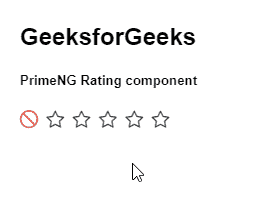
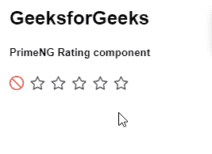

# 角度灌注评级组件

> 原文:[https://www . geesforgeks . org/angular-priming-rating-component/](https://www.geeksforgeeks.org/angular-primeng-rating-component/)

Angular PrimeNG 是一个开源框架，具有一组丰富的本机 Angular UI 组件，用于实现出色的风格，该框架用于非常轻松地制作响应性网站。在本文中，我们将了解如何在 Angular PrimeNG 中使用 Rating 组件。让我们了解将在代码中使用的属性、事件和样式以及它们的语法。

**评级组件:**用于表示用户给出的评级。

**属性:**

*   **星星:**表示要显示的星星数量。它是数字数据类型，默认值为 5。
*   **取消:**显示一个取消图标，重置所有星星值。它属于布尔数据类型，默认值为真。
*   **禁用:**设置为真时，评级应禁用。它属于布尔数据类型，默认值为 false。
*   **只读:**我们无法更改组件的值。它属于布尔数据类型，默认值为 false。
*   **图标类别:**用于设置“开”图标的类别。它是字符串数据类型，默认值是 pi pi-star。
*   **图标关闭类别:**用于设置“关闭”图标的类别。它是字符串数据类型，默认值是 pi pi-star。
*   **图标取消类:**用于设置“取消”图标的类。它是字符串数据类型，默认值是 pi pi-ban。
*   **图标样式:**用于设置‘on’图标的内嵌样式。它属于对象数据类型，默认值为空。
*   **图标关闭样式:**用于设置“关闭”图标的内嵌样式。它属于对象数据类型，默认值为空。
*   **图标取消样式:**用于设置‘取消’图标的内嵌样式。它属于对象数据类型，默认值为空。

**事件:**

*   **onRate:** 这是一个在利率变化时触发的回调。
*   **onCancel:** 它是一个回调，在值被移除时被触发。

**造型:**

*   **p 级:**是容器元素。
*   **p 级星:**是星元素。
*   **p-rating-star-on:** 显示选中的星元素。
*   **p 级-取消:**显示取消图标。

**创建角度应用&模块安装:**

*   **步骤 1:** 使用以下命令创建角度应用程序。

```
ng new appname
```

*   **步骤 2:** 创建项目文件夹即 appname 后，使用以下命令移动到该文件夹。

```
cd appname
```

*   **步骤 3:** 在给定的目录中安装 PrimeNG。

```
npm install primeng --save
npm install primeicons --save
```

**项目结构**:如下图:


**示例 1:** 这是展示如何使用 Rating 组件的基本示例。**T3】**

## app.component.html

```
<h2>GeeksforGeeks</h2>
<h5>PrimeNG Rating component</h5>
<p-rating [cancel]="false"></p-rating>
```

## app.component.ts

```
import { Component } from '@angular/core';

@Component({
  selector: 'my-app',
  templateUrl: './app.component.html'
})
export class AppComponent {}
```

## app.module.ts

```
import { NgModule } from "@angular/core";
import { BrowserModule } from "@angular/platform-browser";
import { FormsModule } from "@angular/forms";
import { BrowserAnimationsModule } 
    from "@angular/platform-browser/animations";

import { AppComponent } from "./app.component";
import { RatingModule } from "primeng/rating";

@NgModule({
  imports: [BrowserModule, 
              BrowserAnimationsModule, 
            RatingModule, FormsModule],
  declarations: [AppComponent],
  bootstrap: [AppComponent],
})
export class AppModule {}
```

**输出:**


**示例 2:** 在本例中，我们将了解如何在 Rating 组件中使用 cancel 属性。

## app.component.html

```
<h2>GeeksforGeeks</h2>
<h5>PrimeNG Rating component</h5> 
<p-rating cancel='true'></p-rating>
```

## app.component.ts

```
import { Component } from '@angular/core';

@Component({
  selector: 'my-app',
  templateUrl: './app.component.html'
})
export class AppComponent {}
```

## app.module.ts

```
import { NgModule } from "@angular/core";
import { BrowserModule } from "@angular/platform-browser";
import { FormsModule } from "@angular/forms";
import { BrowserAnimationsModule } 
    from "@angular/platform-browser/animations";

import { AppComponent } from "./app.component";
import { RatingModule } from "primeng/rating";

@NgModule({
  imports: [BrowserModule, 
              BrowserAnimationsModule, 
            RatingModule, FormsModule],
  declarations: [AppComponent],
  bootstrap: [AppComponent],
})
export class AppModule {}
```

**输出:**



**示例 3:** 在本例中，我们将了解如何在 Rating 组件中使用 readOnly 属性。

## app.component.html

```
<h2>GeeksforGeeks</h2>
<h5>PrimeNG Rating component</h5>
<p-rating readonly="true" cancel="true"></p-rating>
```

## app.component.ts

```
import { Component } from '@angular/core';

@Component({
  selector: 'my-app',
  templateUrl: './app.component.html'
})
export class AppComponent {}
```

## app.module.ts

```
import { NgModule } from "@angular/core";
import { BrowserModule } from "@angular/platform-browser";
import { FormsModule } from "@angular/forms";
import { BrowserAnimationsModule } 
    from "@angular/platform-browser/animations";

import { AppComponent } from "./app.component";
import { RatingModule } from "primeng/rating";

@NgModule({
  imports: [BrowserModule, 
              BrowserAnimationsModule, 
            RatingModule, FormsModule],
  declarations: [AppComponent],
  bootstrap: [AppComponent],
})
export class AppModule {}
```

**输出:**



**参考:**T2】https://primefaces.org/primeng/showcase/#/rating