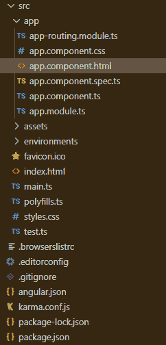
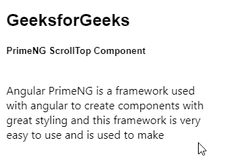
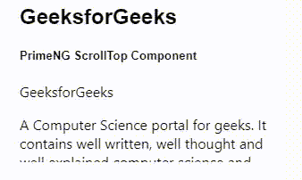

# 角形底漆滚动顶部件

> 原文:[https://www . geeksforgeeks . org/angular-priming-scroll top-component/](https://www.geeksforgeeks.org/angular-primeng-scrolltop-component/)

Angular PrimeNG 是一个开源框架，具有一组丰富的本机 Angular UI 组件，用于实现出色的风格，该框架用于非常轻松地制作响应性网站。在本文中，我们将了解如何在 Angular PrimeNG 中使用 ScrollTop 组件。

**ScrollTop 组件:**用于使某个滚动位置后显示的组件导航到页面顶部。

**属性:**

*   **目标**:指定 scrollTop 的目标，有效值为“窗口”和“父级”。它是字符串数据类型&默认值是一个窗口。
*   **阈值**:是元素可见后的阈值。它接受数字数据类型作为输入&默认值为 400。
*   **图标**:是要显示的图标。它是字符串数据类型&默认值是 pi pi-chevron-up。
*   **行为**:是滚动行为，“平滑”添加动画，“自动”跳转滚动。它是字符串数据类型&默认值是平滑。
*   **样式**:设置组件的内嵌样式。它属于对象数据类型，默认值为空。
*   **样式类**:设置组件的样式类。它是字符串数据类型，默认值为 null。

**造型:**

*   **p-scrolltop:** 是容器元素。
*   **p-scrolltop-sticky:** 它是附加到其父元素时的容器元素。

**创建角度应用&模块安装:**

**步骤 1:** 使用以下命令创建角度应用程序。

```ts
ng new appname
```

**步骤 2:** 创建项目文件夹即 appname 后，使用以下命令移动到该文件夹。

```ts
cd appname
```

**第三步**:在给定的目录下安装 PrimeNG。

```ts
npm install primeng --save
npm install primeicons --save
```

**项目结构**:安装完成后，如下图:



**示例 1:** 这是说明如何使用 scrollTop 组件的基本示例。*阈值*的值设置为 150，因此滚动 150 像素后将显示滚动顶部图标。

## app.component.html

```ts
<h2>GeeksforGeeks</h2>
<h5>PrimeNG ScrollTop Component</h5>
<p-scrollPanel [style]=
    "{width: '25p0x', height: '100px'}">

    <p>
        Angular PrimeNG is a framework used 
        with angular to create components
        with great styling and this framework 
        is very easy to use and is used to 
        make responsive websites. Angular 
        PrimeNG is a framework used with
        angular to create components with 
        great styling and this framework is
        very easy to use and is used to make 
        responsive websites. Angular PrimeNG 
        is a framework used with angular to 
        create components with great styling 
        and this framework is very easy to 
        use and is used to make responsive 
        websites.
    </p>

    <p-scrollTop target="parent" 
        [threshold]="150" 
        icon="pi pi-arrow-up">
    </p-scrollTop>
</p-scrollPanel>
```

## app.module.ts

```ts
import { NgModule } from '@angular/core';
import { BrowserModule } from '@angular/platform-browser';
import { BrowserAnimationsModule } 
    from '@angular/platform-browser/animations';
import { AppComponent } from './app.component';
import { ScrollTopModule } from 'primeng/scrolltop';
import { ScrollPanelModule } from 'primeng/scrollpanel';

@NgModule({
  imports: [
    BrowserModule,
    BrowserAnimationsModule,
    ScrollTopModule,
    ScrollPanelModule
  ],
  declarations: [AppComponent],
  bootstrap: [AppComponent]
})
export class AppModule {}
```

## app.component.ts

```ts
import { Component } from '@angular/core';

@Component({
  selector: 'my-app',
  templateUrl: './app.component.html'
})
export class AppComponent {}
```

**输出:**



**示例 2:** 在本例中，我们将*行为*属性设置为自动，因此，滚动到元素顶部时动画不可见，*阈值*设置为 0，因此滚动时会立即显示 scrollTop 图标。

## app.component.html

```ts
<h2>GeeksforGeeks</h2>
<h5>PrimeNG ScrollTop Component</h5>
<p-scrollPanel [style]=
    "{width: '300px', height: '90px'}">

    <div>
        <span>GeeksforGeeks</span>

        <p>
            A Computer Science portal for 
            geeks. It contains well written, 
            well thought and well explained 
            computer science and programming 
            articles. We provide a variety 
            of services for you to learn, 
            thrive and also have fun! Free 
            Tutorials, Millions of Articles, 
            Live, Online and Classroom Courses,
            Frequent Coding Competitions, 
            Webinars by Industry Experts,
            Internship opportunities and Job 
            Opportunities.
        </p>
    </div>

    <p-scrollTop target="parent" [threshold]="0" 
        [behavior]='auto' icon="pi pi-arrow-up">
    </p-scrollTop>
</p-scrollPanel>
```

## app.module.ts

```ts
import { NgModule } from '@angular/core';
import { BrowserModule } from '@angular/platform-browser';
import { BrowserAnimationsModule } 
    from '@angular/platform-browser/animations';
import { AppComponent } from './app.component';
import { ScrollTopModule } from 'primeng/scrolltop';
import { ScrollPanelModule } from 'primeng/scrollpanel';

@NgModule({
  imports: [
    BrowserModule,
    BrowserAnimationsModule,
    ScrollTopModule,
    ScrollPanelModule
  ],
  declarations: [AppComponent],
  bootstrap: [AppComponent]
})
export class AppModule {}
```

## app.component.ts

```ts
import { Component } from '@angular/core';

@Component({
  selector: 'app-root',
  templateUrl: './app.component.html'
})
export class AppComponent {}
```

**输出:**



**参考:**T2】https://primefaces.org/primeng/showcase/#/scrolltop