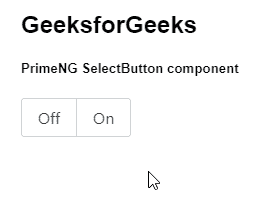
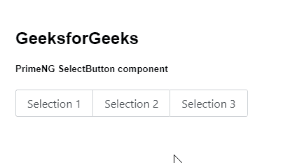

# 角度启动选择按钮组件

> 原文:[https://www . geesforgeks . org/angular-priming-select button-component/](https://www.geeksforgeeks.org/angular-primeng-selectbutton-component/)

Angular PrimeNG 是一个开源框架，具有一组丰富的本机 Angular UI 组件，用于实现出色的风格，该框架用于非常轻松地制作响应性网站。在本文中，我们将了解如何在角度灌注中使用选择按钮组件。

**选择按钮组件:**它用于制作一组按钮，用户可以从中选择一个值。

**属性:**

*   **选项**:是一个数组，表示选择项目作为可用选项显示。它属于数组数据类型，默认值为 null。
*   **选项标签**:用于给出选项的标签。它是字符串数据类型，默认值是标签。
*   **选项值**:用于给出选项的值，未定义时默认为选项本身。它是字符串数据类型，默认值是 value。
*   **多个**:用于设置指定时，允许选择多个值。它属于布尔数据类型，默认值为 false。
*   **tabindex** :用于设置元素指定的 tab 顺序。它是数字数据类型，默认值为 0。
*   **样式**:用于设置元素的内嵌样式。它是字符串数据类型，默认值为 null。
*   **样式类**:用于设置元素的样式类。它是字符串数据类型，默认值为 null。
*   **ariaLabelledBy:** 用于建立组件和标签之间的关系，其值应为一个或多个元素标识。它是字符串数据类型，默认值为 null。
*   **禁用**:指定元素禁用，为布尔数据类型，默认值为假。
*   **数据键**:用于标识选项的属性，为字符串数据类型，默认值为空。

**事件:**

*   **onChange:** 是值改变时触发的回调。
*   **onOptionClick:** 是一个回拨，点击按钮时会触发。

**创建角度应用&模块安装:**

*   **步骤 1:** 使用以下命令创建角度应用程序。

    ```ts
    ng new appname
    ```

*   **步骤 2:** 创建项目文件夹即 appname 后，使用以下命令移动到该文件夹。

    ```ts
    cd appname
    ```

*   **步骤 3:** 在给定的目录中安装 PrimeNG。

    ```ts
    npm install primeng --save
    npm install primeicons --save
    ```

**项目结构**:如下图:


**示例 1:** 这是展示如何使用 SelectButton 组件的基本示例。

## app.component.html

```ts
<h2>GeeksforGeeks</h2>
<h5>PrimeNG SelectButton component</h5>
<p-selectButton [options]="gfg"></p-selectButton>
```

## app.component.ts

```ts
import { Component } from "@angular/core";
import { PrimeNGConfig } from "primeng/api";

@Component({
  selector: "my-app",
  templateUrl: "./app.component.html"
})
export class AppComponent {
  gfg: any[];

  constructor(private primeNGConfig: PrimeNGConfig) {
    this.gfg = [
      { label: "Off", value: "off" },
      { label: "On", value: "on" }
    ];
  }

  ngOnInit() {
    this.primeNGConfig.ripple = true;
  }
}
```

## app.module.ts

```ts
import { NgModule } from "@angular/core";
import { BrowserModule } from "@angular/platform-browser";
import { FormsModule } from "@angular/forms";
import { BrowserAnimationsModule } 
    from "@angular/platform-browser/animations";

import { AppComponent } from "./app.component";
import { SelectButtonModule } from "primeng/selectbutton";
import { ButtonModule } from "primeng/button";

@NgModule({
  imports: [
    BrowserModule,
    BrowserAnimationsModule,
    SelectButtonModule,
    ButtonModule,
    FormsModule,
  ],
  declarations: [AppComponent],
  bootstrap: [AppComponent],
})
export class AppModule {}
```

**输出:**



**示例 2:** 在本例中，我们将了解如何在 selectButton 组件中使用多个属性。

## app.component.html

```ts
<h2>GeeksforGeeks</h2>
<h5>PrimeNG SelectButton component</h5>
<p-selectButton [options]="gfg" multiple="true"></p-selectButton>
```

## app.component.ts

```ts
import { Component } from "@angular/core";
import { PrimeNGConfig } from "primeng/api";

@Component({
  selector: "my-app",
  templateUrl: "./app.component.html",
})
export class AppComponent {
  gfg: any[];

  constructor(private primeNGConfig: PrimeNGConfig) {
    this.gfg = [
      { label: "Selection 1", value: 1 },
      { label: "Selection 2", value: 2 },
      { label: "Selection 3", value: 3 },
    ];
  }

  ngOnInit() {
    this.primeNGConfig.ripple = true;
  }
}
```

## pp.module.ts

```ts
import { NgModule } from "@angular/core";
import { BrowserModule } from "@angular/platform-browser";
import { FormsModule } from "@angular/forms";
import { BrowserAnimationsModule } 
    from "@angular/platform-browser/animations";

import { AppComponent } from "./app.component";
import { SelectButtonModule } from "primeng/selectbutton";
import { ButtonModule } from "primeng/button";

@NgModule({
  imports: [
    BrowserModule,
    BrowserAnimationsModule,
    SelectButtonModule,
    ButtonModule,
    FormsModule,
  ],
  declarations: [AppComponent],
  bootstrap: [AppComponent],
})
export class AppModule {}
```

**输出:**



**参考:**T2】https://primefaces.org/primeng/showcase/#/selectbutton