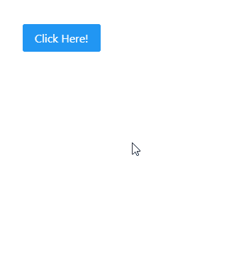

# 角度灌注侧边栏组件

> 原文:[https://www . geesforgeks . org/angular-priming-sidebar-component/](https://www.geeksforgeeks.org/angular-primeng-sidebar-component/)

Angular PrimeNG 是一个开源框架，具有一组丰富的本机 Angular UI 组件，用于实现出色的风格，该框架用于非常轻松地制作响应性网站。在本文中，我们将了解如何在 Angular PrimeNG 中使用侧边栏组件。我们还将了解将在代码中使用的属性、事件和样式以及它们的语法。

**侧边栏组件:**它用于制作覆盖在屏幕边缘的元素。

**属性:**

*   **可见:**指定对话框的可见性。它属于布尔数据类型，默认值为 false。
*   **位置:**指定侧边栏的位置，有效值为“左”、“右”、“底”、“顶”。它是字符串数据类型&默认值为左。
*   **全屏:**用于在表头增加关闭图标，隐藏对话框。它是布尔数据类型&默认值为假。
*   **appendTo:** 是附加对话框的目标元素，有效值为“body”或另一个元素的局部 ng-template 变量。它接受任何类型的数据&默认值为空。
*   **样式:**用于设置组件的内嵌样式。它是字符串数据类型&默认值为空。
*   **styleClass:** 用于设置组件的样式类。它是字符串数据类型&默认值为空。
*   **阻止滚动:**用于指定侧边栏活动时是否阻止文档滚动。它是布尔数据类型&默认值为假。
*   **baseZIndex:** 用于设置分层时使用的 baseZIndex 值。它是数字数据类型&默认值为 0。
*   **autoZIndex:** 用于指定是否自动管理分层。它属于布尔数据类型，默认值为真。
*   **模态:**用于指定侧边栏后面是否显示覆盖遮罩。它属于布尔数据类型，默认值为真。
*   **解除:**用于指定点击蒙版是否解除侧边栏。它属于布尔数据类型，默认值为真。
*   **显示关闭图标:**用于指定是否显示关闭图标。它是布尔数据类型，默认值为真。
*   **过渡选项:**用于设置动画的过渡选项。它是字符串数据类型&默认值是 150 毫秒三次贝塞尔曲线(0，0，0.2，1)。
*   **ariacoselabel:**用于设置关闭图标的 aria-label。它是字符串数据类型&默认值是关闭。
*   **closenEscape:**用于指定按下 escape 键是否应该隐藏侧边栏。它属于布尔数据类型，默认值为真。

**事件:**

*   **onShow:** 这是一个回调，在显示对话框时触发。
*   **onHide:** 这是一个在对话框隐藏时触发的回调。

**造型:**

*   **p 侧边栏:**它是容器元素
*   **p-侧边栏-左侧:**是左侧边栏的容器元素。
*   **p-侧边栏-右侧:**是右侧侧边栏的容器元素。
*   **p-侧边栏-顶部:**是顶部侧边栏的容器元素。
*   **p-侧边栏-底部:**是底部侧边栏的容器元素。
*   **p-侧边栏-full:** 它是全屏侧边栏的容器元素。
*   **p-侧边栏-活动:**侧边栏可见时是容器元素。
*   **p-侧边栏-关闭**:是关闭锚点元素。
*   **p-侧边栏-sm** :是一个小尺寸的侧边栏。
*   **p-侧边栏-md** :是中型侧边栏。
*   **p-侧边栏-lg** :是大尺寸侧边栏。
*   **p-侧边栏-遮罩**:是侧边栏的模态层。

**创建角度应用&模块安装:**

*   **步骤 1:** 使用以下命令创建角度应用程序。

```
ng new appname
```

*   **步骤 2:** 创建项目文件夹即 appname 后，使用以下命令移动到该文件夹。

```
cd appname
```

*   **步骤 3:** 在给定的目录中安装 PrimeNG。

```
npm install primeng --save
npm install primeicons --save
```

**项目结构:**如下图:


**示例 1:** 这是说明如何使用侧边栏组件的基本示例。**T3】**

## app.component.html

```
<p-sidebar [(visible)]="gfg" [baseZIndex]="10000">
  <h1 style="font-weight: normal">GeeksforGeeks</h1>

<p>Angular PrimeNG Sidebar Component</p>

  <p-button
    type="button"
    (click)="gfg = false"
    label="OK"
    styleClass="p-button-info">
  </p-button>
  <p-button
    type="button"
    (click)="gfg = false"
    label="Cancel"
    styleClass="p-button-danger">
  </p-button>
</p-sidebar>
<p-button (click)="gfg = true"
          label="Click Here!">
</p-button>
```

## app.component.ts

```
import { Component } from '@angular/core';

@Component({
  selector: 'my-app',
  templateUrl: './app.component.html',
  styleUrls: ['./app.component.scss']
})
export class AppComponent {}
```

## app.module.ts

```
import { NgModule } from "@angular/core";
import { BrowserModule } from "@angular/platform-browser";
import { BrowserAnimationsModule } 
    from "@angular/platform-browser/animations";

import { AppComponent } from "./app.component";
import { ButtonModule } from "primeng/button";
import { SidebarModule } from "primeng/sidebar";

@NgModule({
  imports: [
    BrowserModule,
    BrowserAnimationsModule,
    SidebarModule,
    ButtonModule,
  ],
  declarations: [AppComponent],
  bootstrap: [AppComponent],
})
export class AppModule {}
```

**输出:**



**示例 2:** 在本例中，我们将了解如何在侧边栏组件中使用*位置*属性。

## app.component.html

```
<p-sidebar [(visible)]="gfg" 
          [baseZIndex]="10000" position="right">
  <h1 style="font-weight: normal">GeeksforGeeks</h1>

  <p>Angular PrimeNG Sidebar Component</p>

  <p-button
    type="button"
    (click)="gfg = false"
    label="OK"
    styleClass="p-button-info">
  </p-button>
  <p-button
    type="button"
    (click)="gfg = false"
    label="Cancel"
    styleClass="p-button-danger">
  </p-button>
</p-sidebar>
<p-button (click)="gfg = true" 
          label="Click Here!">
</p-button>
```

## app.component.ts

```
import { Component } from '@angular/core';

@Component({
  selector: 'my-app',
  templateUrl: './app.component.html',
  styleUrls: ['./app.component.scss']
})
export class AppComponent {}
```

## app.module.ts

```
import { NgModule } from "@angular/core";
import { BrowserModule } from "@angular/platform-browser";
import { BrowserAnimationsModule } 
    from "@angular/platform-browser/animations";

import { AppComponent } from "./app.component";
import { ButtonModule } from "primeng/button";
import { SidebarModule } from "primeng/sidebar";

@NgModule({
  imports: [
    BrowserModule,
    BrowserAnimationsModule,
    SidebarModule,
    ButtonModule,
  ],
  declarations: [AppComponent],
  bootstrap: [AppComponent],
})
export class AppModule {}
```

**输出:**


**参考:**T2】https://primefaces.org/primeng/showcase/#/sidebar