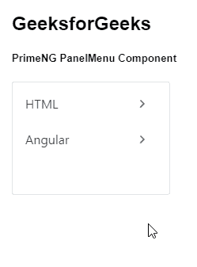
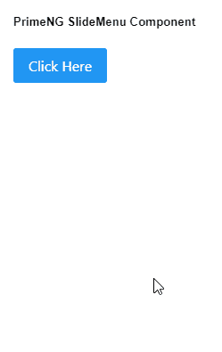

# 角度预置滑动菜单组件

> 原文:[https://www . geesforgeks . org/angular-priming-slide menu-component/](https://www.geeksforgeeks.org/angular-primeng-slidemenu-component/)

Angular PrimeNG 是一个开源框架，具有一组丰富的本机 Angular UI 组件，用于实现出色的风格，该框架用于非常轻松地制作响应性网站。在本文中，我们将看到如何在 Angular PrimeNG 中使用 SlideMenu 组件。我们还将了解将在代码中使用的属性、方法、样式以及它们的语法。

**滑动菜单组件:**用于以滑动动画的形式显示菜单列表，有助于逐步查看菜单项。

**属性:**

*   **模型**:是一个菜单项的数组。它接受数组数据类型&默认值为空。
*   **弹出菜单**:定义菜单是否显示为弹出菜单。它属于布尔数据类型&默认值为假。
*   **样式**:是组件的内嵌样式。它接受字符串数据类型&默认值为空。
*   **styleClass** :是组件的样式类。它接受字符串数据类型&默认值为空。
*   **放松**:是用来滑动的动画。它接受字符串数据类型&默认值是缓和。
*   **效果持续时间**:是滑动动画的持续时间，单位为毫秒。它接受任何数据类型作为输入&默认值为 250。
*   **后退标签**:是一个元素要后退导航的标签。它接受字符串数据类型&默认值回来了。
*   **menuWidth** :是子菜单的宽度。它接受数字数据类型作为输入&默认值为 180。
*   **viewportHeight** :是可滚动区的高度，如果菜单高度超过这个值，会出现滚动条。它接受数字数据类型作为输入&默认值为 175。
*   **appendTo** :是附着叠加的目标元素，有效值为“body”或另一个元素的局部 ng-template 变量。它接受任何数据类型作为输入&默认值为空。
*   **baseZIndex** :是分层时使用的基 ZIndex 值。它接受数字数据类型作为输入&默认值为 0。
*   **autoZIndex** :指定是否自动管理分层。它属于布尔数据类型&默认值为真。
*   **显示过渡选项**:这些是显示动画的过渡选项。它接受字符串数据类型&默认值为. 12s 三次贝塞尔曲线(0，0，0.2，1)。
*   **隐藏过渡选项**:这些是隐藏动画的过渡选项。它接受字符串数据类型&默认值为. 1s 线性。

**方法:**

*   **切换:**用于切换弹出菜单的可见性。
*   **显示:**用于显示弹出菜单。
*   **隐藏:**用于隐藏弹出菜单。

**造型:**

*   **p-slidemenu** :是一个容器元素。
*   **p-slidemenu-wrapper** :是一个内容的包装器。
*   **p-slidemenu-content** :是一个内容元素。
*   **p-slidemenu-backward** :点击导航到上一个菜单是一个元素。
*   **p-menu-list:** 是列表元素。
*   **p-menuitem:** 是菜单项元素。
*   **p-menuitem-text:** 是菜单项的标签。
*   **p-menuitem-icon** :是一个菜单项的图标。
*   **p-子菜单-图标**:是一个子菜单的箭头图标。

**创建角度应用&模块安装:**

**步骤 1:** 使用以下命令创建角度应用程序。

```ts
ng new appname
```

**步骤 2:** 创建项目文件夹即 appname 后，使用以下命令移动到该文件夹。

```ts
cd appname
```

**步骤 3:** 在给定的目录中安装 PrimeNG。

```ts
npm install primeng --save
npm install primeicons --save
```

**项目结构:**安装完成后，如下图:


**示例 1:** 这是展示如何使用 SlideMenu 组件的基本示例。

## app.component.html

```ts
<h2>GeeksforGeeks</h2>
<h5>PrimeNG PanelMenu Component</h5>
<p-slideMenu [model]="gfg" ></p-slideMenu>
```

## app.component.ts

```ts
import { Component } from '@angular/core';
import { MenuItem } from 'primeng/api';

@Component({
  selector: 'my-app',
  templateUrl: './app.component.html'
})
export class AppComponent {
  gfg: MenuItem[];

  ngOnInit() {
    this.gfg = [
      {
        label: 'HTML',
        items: [
          {
            label: 'HTML 1'
          },
          {
            label: 'HTML 2'
          }
        ]
      },
      {
        label: 'Angular',

        items: [
          {
            label: 'Angular 1'
          },
          {
            label: 'Angular 2'
          }
        ]
      }
    ];
  }
}
```

## app.module.ts

```ts
import { NgModule } from '@angular/core';
import { BrowserModule } from '@angular/platform-browser';
import { BrowserAnimationsModule } 
    from '@angular/platform-browser/animations';

import { AppComponent } from './app.component';
import { SlideMenuModule } from 'primeng/slidemenu';

@NgModule({
  imports: [BrowserModule, 
              BrowserAnimationsModule, 
            SlideMenuModule],
  declarations: [AppComponent],
  bootstrap: [AppComponent]
})
export class AppModule {}
```

**输出:**



**示例 2:** 在本例中，我们将使用弹出菜单制作一个 slidemenu 组件。

## app.component.html

```ts
<h5>PrimeNG SlideMenu Component</h5>
<button #btn type="button" pButton label="Click Here"
        (click)="menu.toggle($event)">
</button>

<p-slideMenu #menu [model]="gfg" 
    [popup]="true" [viewportHeight]="250">
</p-slideMenu>
```

## app.component.ts

```ts
import { Component } from '@angular/core';
import { MenuItem } from 'primeng/api';

@Component({
  selector: 'my-app',
  templateUrl: './app.component.html'
})
export class AppComponent {
  gfg: MenuItem[];

  ngOnInit() {
    this.gfg = [
      {
        label: 'HTML',
        items: [
          {
            label: 'HTML 1'
          },
          {
            label: 'HTML 2'
          }
        ]
      },
      {
        label: 'Angular',

        items: [
          {
            label: 'Angular 1'
          },
          {
            label: 'Angular 2'
          }
        ]
      }
    ];
  }
}
```

## app.module.ts

```ts
import { NgModule } from '@angular/core';
import { BrowserModule } from '@angular/platform-browser';
import { BrowserAnimationsModule } 
    from '@angular/platform-browser/animations';

import { AppComponent } from './app.component';
import { SlideMenuModule } from 'primeng/slidemenu';
import { ButtonModule } from 'primeng/button';

@NgModule({
  imports: [
    BrowserModule,
    BrowserAnimationsModule,
    SlideMenuModule,
    ButtonModule
  ],
  declarations: [AppComponent],
  bootstrap: [AppComponent]
})
export class AppModule {}
```

**输出:**



**参考:**T2】https://primefaces.org/primeng/showcase/#/slidemenu