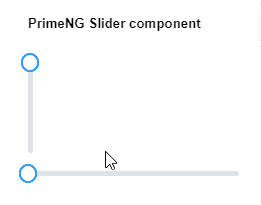
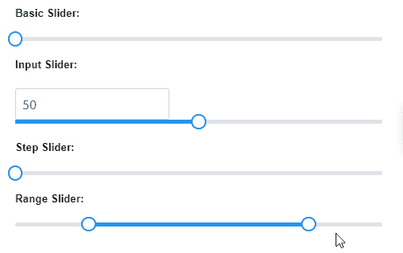

# 角度预旋滑块组件

> 原文:[https://www . geesforgeks . org/angular-priming-slider-component/](https://www.geeksforgeeks.org/angular-primeng-slider-component/)

Angular PrimeNG 是一个开源框架，具有一组丰富的本机 Angular UI 组件，用于实现出色的风格，该框架用于非常轻松地制作响应性网站。在本文中，我们将了解如何在 Angular PrimeNG 中使用滑块组件。

**属性:**

*   **动画:**用于点击滑动条显示动画，为布尔数据类型，默认值为假。
*   **disabled:** 指定元素应该被禁用，它是布尔数据类型，默认值为 false。
*   **min:** 用于设置最小边界值，为数字数据类型，默认值为 0。
*   **max:** 用于设置最大边界值，为数字数据类型，默认值为 100。
*   **方向:**用于设置滑块的方向，有效值为水平和垂直，为字符串数据类型，默认值为水平。
*   **步骤:**用于设置递增/递减数值的因子，为数字数据类型，默认值为 1。
*   **范围:**用于指定要拾取的两个边界值，为布尔数据类型，默认值为假。
*   **样式:**用于设置元素的 Inline 样式，为字符串数据类型，默认值为空。
*   **styleClass:** 用于设置元素的 Style 类，为字符串数据类型，默认值为空。
*   **Arialabelledby:**Arialabelledby 属性建立组件和标签之间的关系，其值应该是一个或多个元素标识，它是字符串数据类型，默认值为空。
*   **tabindex:** 用于设置跳转顺序中元素的 index，为数字数据类型，默认值为 0。

**事件:**

*   **onChange:** 是一个回调，通过幻灯片在值更改时触发。
*   **onsliteend:**这是一个回调，在幻灯片停止时触发。

**造型:**

*   **p 滑块:**它是一个造型容器元素
*   **p 滑块手柄:**这是一个造型手柄元素

**创建角度应用&模块安装:**

*   **步骤 1:** 使用以下命令创建角度应用程序。

```
ng new appname
```

*   **步骤 2:** 创建项目文件夹即 appname 后，使用以下命令移动到该文件夹。

```
cd appname
```

*   **步骤 3:** 在给定的目录中安装 PrimeNG。

```
npm install primeng --save
npm install primeicons --save
```

**项目结构**:如下图。


**示例 1:** 这是展示如何使用 Slider 组件的基本示例。**T3】**

## app.component.html

```
<h5>PrimeNG Slider component</h5>
<p-slider [(ngModel)]="val1"></p-slider>
<p-slider [(ngModel)]="val2" orientation="vertical"></p-slider>
```

## app.module.ts

```
import { NgModule } from '@angular/core';
import { BrowserModule } from '@angular/platform-browser';
import { FormsModule } from '@angular/forms';
import { HttpClientModule } from '@angular/common/http';
import { BrowserAnimationsModule } 
    from '@angular/platform-browser/animations';
import { AppComponent } from './app.component';
import { SliderModule } from 'primeng/slider';
import { InputTextModule } from 'primeng/inputtext';

@NgModule({
  imports: [
    BrowserModule,
    BrowserAnimationsModule,
    SliderModule,
    InputTextModule,
    FormsModule
  ],
  declarations: [AppComponent],
  bootstrap: [AppComponent]
})
export class AppModule {}
```

## app.component.ts

```
import { Component } from '@angular/core';

@Component({
  selector: 'my-app',
  templateUrl: './app.component.html'
})
export class AppComponent {
  val1: number;
  val2: number;
  rangeValues: number[] = [20, 80];
}
```

**输出:**



**示例 2:** 在本例中，我们将了解如何在滑块组件中使用 max 属性。

## app.component.html

```
<h5>Basic Slider: </h5>
<p-slider [(ngModel)]="basic"></p-slider>

<h5>Input Slider:</h5>
<input type="text" pInputText [(ngModel)]="inp" />
<p-slider [(ngModel)]="inp"></p-slider>

<h5>Step Slider:</h5>
<p-slider [(ngModel)]="step" [step]="15"></p-slider>

<h5>Range Slider:</h5>
<p-slider [(ngModel)]="range" [range]="true"></p-slider>
```

## app.component.ts

```
import { Component } from '@angular/core';

@Component({
  selector: 'my-app',
  templateUrl: './app.component.html'
})
export class AppComponent {
  basic: number;

  inp: number = 50;

  step: number;

  range: number[] = [20, 80];
}
```

## app.module.ts

```
import { NgModule } from '@angular/core';
import { BrowserModule } from '@angular/platform-browser';
import { FormsModule } from '@angular/forms';
import { BrowserAnimationsModule } 
    from '@angular/platform-browser/animations';
import { AppComponent } from './app.component';
import { SliderModule } from 'primeng/slider';

@NgModule({
  imports: [BrowserModule, 
              BrowserAnimationsModule, 
            SliderModule, FormsModule],
  declarations: [AppComponent],
  bootstrap: [AppComponent]
})
export class AppModule {}
```

**输出:**



**参考:**T2】https://primefaces.org/primeng/showcase/#/slider