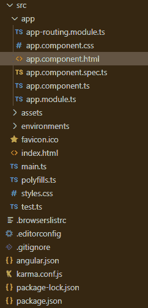

# 角向启动分离按钮组件

> 原文:[https://www . geesforgeks . org/angular-priming-split button-component/](https://www.geeksforgeeks.org/angular-primeng-splitbutton-component/)

Angular PrimeNG 是一个与 Angular 一起使用的框架，用来创建具有很好样式的组件，这个框架非常易于使用，用于制作响应性网站。

在本文中，我们将看到如何在 angular primeNG 中使用 SplitButton 组件。**拆分按钮组件**用于制作下拉按钮。

**属性:**

*   **标签:**是按钮的文字。为字符串数据类型，默认值为空。
*   **图标:** 是图标的 n 名称。为字符串数据类型，默认值为空。
*   **图标:** 是图标的 p 位置。为字符串数据类型，默认值为空。
*   **风格:** 是组件的直列风格。为字符串数据类型，默认值为空。
*   **styleClass:** 它是组件的 Style class。为字符串数据类型，默认值为空。
*   **菜单风格:** 这是叠加菜单的内联风格。为字符串数据类型，默认值为空。
*   **菜单风格类:** 是叠加菜单的风格类。为字符串数据类型，默认值为空。
*   **appendTo:** 附着叠加的是目标元素。为字符串数据类型，默认值为空。
*   **禁用:**指定组件应禁用。为布尔数据类型，默认值为假。
*   **tabindex:** 它是元素在 tabbing 顺序中的索引。为数字数据类型，默认值为空。
*   **dir:** 表示元素的方向。为字符串数据类型，默认值为空。
*   **显示过渡选项:**这些是显示动画的过渡选项。为字符串数据类型，默认值为空。
*   **隐藏过渡选项:**这些是隐藏动画的过渡选项。为字符串数据类型，默认值为空。

**事件:**

*   **onClick:** 是点击默认命令按钮时调用的回调。
*   **ondropdownlick:**是点击下拉按钮时调用的回调。

**造型:**

*   **p-splitbutton:** 是容器元素。
*   **p-split button-menu button:**是下拉按钮。
*   **p 菜单:**是叠加菜单

**创建角度应用和安装模块:**

*   **步骤 1:** 使用以下命令创建角度应用程序。

```
ng new appname
```

*   **步骤 2:** 创建项目文件夹即 appname 后，使用以下命令移动到该文件夹。

```
cd appname
```

*   **步骤 3:** 在给定的目录中安装 PrimeNG。

```
npm install primeng --save
npm install primeicons --save
```

**项目结构**:如下图。



**示例:**这是展示如何使用 SplitButton 组件的基本示例。

## app.component.html

```
<h2>GeeksforGeeks</h2>
<h5>PrimeNG SplitButton Component</h5>
<p-splitButton label="GeeksforGeeks" [model]="gfg"></p-splitButton>
```

## app.module.ts

```
import { NgModule }      from '@angular/core';
import { BrowserModule } from '@angular/platform-browser';
import {RouterModule} from '@angular/router';
import {BrowserAnimationsModule} 
        from '@angular/platform-browser/animations';

import { AppComponent }   from './app.component';

import { SplitButtonModule } from 'primeng/splitbutton';

@NgModule({
  imports: [
    BrowserModule,
    BrowserAnimationsModule,
    SplitButtonModule,
    RouterModule.forRoot([
      {path:'',component: AppComponent}
        ])
  ],
  declarations: [ AppComponent ],
  bootstrap:    [ AppComponent ]
})

export class AppModule { }
```

## app.component.ts

```
import { Component, OnInit, ViewEncapsulation} 
    from '@angular/core';
import {MenuItem} from 'primeng/api';
import {MessageService} from 'primeng/api';

@Component({
  selector: 'app-root',
  providers: [MessageService],
  templateUrl: './app.component.html',
  styles: [`
      :host ::ng-deep .ui-splitbutton {
          margin-right: .25em;
      }
  `]
})
export class AppComponent { 
    gfg: MenuItem[];

    constructor(private messageService: MessageService) {}

    ngOnInit() {
        this.gfg = [
            {label: 'Angular'},
            {label: 'PrimeNG'},
            {label: 'SplitButton'}
        ];
    }
}
```

**输出:**


**参考:**[](https://primefaces.org/primeng/showcase/#/button)**[https://primefaces.org/primeng/showcase/#/splitbutton](https://primefaces.org/primeng/showcase/#/splitbutton)**