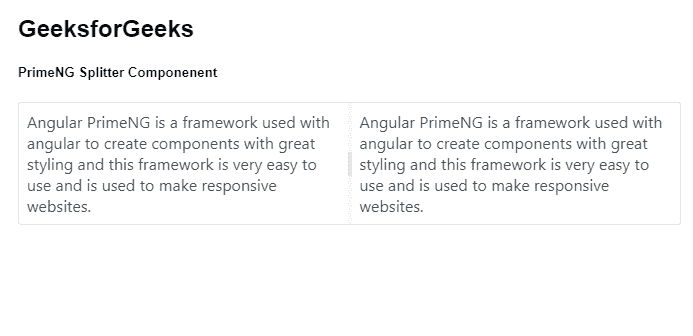
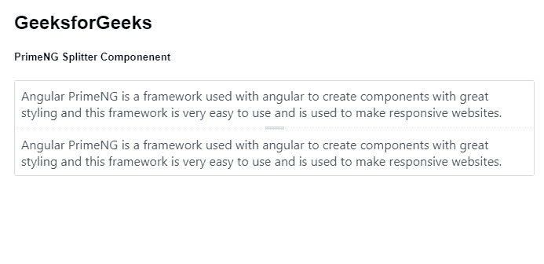

# 角度预旋分离器组件

> 原文:[https://www . geesforgeks . org/angular-priming-splitter-component/](https://www.geeksforgeeks.org/angular-primeng-splitter-component/)

Angular PrimeNG 是一个开源框架，具有一组丰富的本机 Angular UI 组件，用于实现出色的风格，该框架用于非常轻松地制作响应性网站。在本文中，我们将了解如何在 Angular PrimeNG 中使用拆分器组件。我们还将了解将在代码中使用的属性、事件和样式以及它们的语法。

**拆分器组件:**它允许用户使用单独使用的拆分器&拆分两个元素，并调整面板大小。

**属性:**

*   **面板尺寸:**用于指定的尺寸。它是数字数据类型&默认值为空。
*   **最小化:**用于指定元素的最小大小。它是数字数据类型&默认值为空。
*   **布局:**用于设置面板的方向。它是字符串数据类型&默认值是水平。
*   **gutterSize:** 用于以像素为单位指定分割线的大小。它是数字数据类型&默认值为 4。
*   **状态键:**用于指定有状态拆分器的存储标识符。它是字符串数据类型&默认值为空。
*   **状态存储:**用于定义有状态拆分器保持其状态的位置。它是字符串数据类型&默认值是会话。
*   **样式:**用于指定组件的内嵌样式。它属于对象数据类型&，默认值为空。
*   **styleClass:** 用于指定组件的样式类。它是字符串数据类型&默认值为空。
*   **panelStyleClass:** 用于指定面板的样式类。它是字符串数据类型&默认值为空。
*   **panelStyle:** 用于指定面板的内嵌样式。它属于对象数据类型&，默认值为空。

**事件:**

*   **onresize art:**这是一个回调，在开始调整大小时触发。
*   **onResizeEnd:** 是调整大小结束时触发的回调。

**造型:**

*   **p-splitter:** 是容器元素。
*   **p-splitter** :是调整大小时的容器元素。
*   **p-splitter-水平**:是水平布局的容器元素。
*   **p-splitter-垂直:**是垂直布局的容器元素。
*   **p-分路器面板**:是分路器面板元件。
*   **p-拆分器-檐槽:**这是调整面板大小时要使用的檐槽元素。
*   **p-分割器-天沟-手柄:**是天沟的手柄元件。

**创建角度应用&模块安装:**

*   **步骤 1:** 使用以下命令创建角度应用程序。

```ts
ng new appname
```

*   **步骤 2:** 创建项目文件夹即 appname 后，使用以下命令移动到该文件夹。

```ts
cd appname
```

*   **步骤 3:** 在给定的目录中安装 PrimeNG。

```ts
npm install primeng --save
npm install primeicons --save
```

**项目结构**:如下图:


**示例 1:** 这是说明如何使用拆分器组件的基本示例。

## app.component.html

```ts
<h2>GeeksforGeeks</h2>
<h5>PrimeNG Splitter Componenent</h5>
<p-splitter>
  <ng-template pTemplate>
    <div class="p-col p-ai-center p-jc-center">
      Angular PrimeNG is a framework used with angular 
      to create components with great styling and this 
      framework is very easy to use and is used to make
      responsive websites.
    </div>
  </ng-template>
  <ng-template pTemplate>
    <div class="p-col p-ai-center p-jc-center">
      Angular PrimeNG is a framework used with angular 
      to create components with great styling and this 
      framework is very easy to use and is used to make
      responsive websites.
    </div>
  </ng-template>
</p-splitter>
```

## app.component.ts

```ts
import { Component } from '@angular/core';

@Component({
  selector: 'my-app',
  templateUrl: './app.component.html',
  styleUrls: ['./app.component.scss']
})
export class AppComponent {}
```

## app.module.ts

```ts
import { NgModule } from "@angular/core";
import { BrowserModule } from "@angular/platform-browser";
import { BrowserAnimationsModule } from "@angular/platform-browser/animations";
import { AppComponent } from "./app.component";
import { SplitterModule } from "primeng/splitter";

@NgModule({
  imports: [
    BrowserModule,
    BrowserAnimationsModule,
    SplitterModule
  ],
  declarations: [AppComponent],
  bootstrap: [AppComponent]
})
export class AppModule {}
```

**输出:**



**示例 2:** 在本例中，我们将了解如何在拆分器组件中使用*布局*属性。

## app.component.html

```ts
<h2>GeeksforGeeks</h2>
<h5>PrimeNG Splitter Componenent</h5>
<p-splitter layout="vertical">
  <ng-template pTemplate>
    <div class="p-col p-ai-center p-jc-center">
      Angular PrimeNG is a framework used with angular 
      to create components with great styling and this 
      framework is very easy to use and is used to make
      responsive websites.
    </div>
  </ng-template>
  <ng-template pTemplate>
    <div class="p-col p-ai-center p-jc-center">
      Angular PrimeNG is a framework used with angular 
      to create components with great styling and this 
      framework is very easy to use and is used to make
      responsive websites.
    </div>
  </ng-template>
</p-splitter>
```

## app.component.ts

```ts
import { Component } from '@angular/core';

@Component({
  selector: 'my-app',
  templateUrl: './app.component.html',
  styleUrls: ['./app.component.scss']
})
export class AppComponent {}
```

## app.module.ts

```ts
import { NgModule } from "@angular/core";
import { BrowserModule } from "@angular/platform-browser";
import { BrowserAnimationsModule } 
    from "@angular/platform-browser/animations";
import { AppComponent } from "./app.component";
import { SplitterModule } from "primeng/splitter";

@NgModule({
  imports: [BrowserModule, 
              BrowserAnimationsModule, 
            SplitterModule],
  declarations: [AppComponent],
  bootstrap: [AppComponent],
})
export class AppModule {}
```

**输出:**



**参考:**T2】https://primefaces.org/primeng/showcase/#/splitter