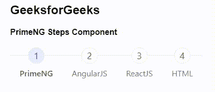
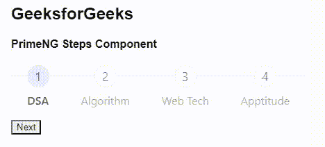

# 角焊步骤组件

> 原文:[https://www . geesforgeks . org/angular-priming-steps-component/](https://www.geeksforgeeks.org/angular-primeng-steps-component/)

Angular PrimeNG 是一个开源框架，具有一组丰富的本机 Angular UI 组件，用于实现出色的风格，该框架用于非常轻松地制作响应性网站。在本文中，我们将了解如何在 Angular PrimeNG 中使用 Steps 组件。我们还将了解将在代码中使用的属性、事件和样式以及它们的语法。

**步骤组件**:用于指示或跟踪一系列过程的完成。

**属性:**

*   **模型**:是一个菜单项的数组。它是数据的数组类型&默认值为空。
*   **活动索引**:是活动项的索引。它接受数字作为输入数据类型&默认值为 0。
*   **只读**:指定项目是否可点击。它属于布尔数据类型&默认值为真。
*   **样式**:设置组件的内嵌样式。它属于字符串数据类型&，默认值为空。
*   **styleClass** :是组件的样式类。它属于字符串数据类型&，默认值为空。

**事件:**

*   **activeIndexChange:** 是选择新步骤时触发的回调。

**造型:**

*   **p 步:**是容器元素。
*   **p-steps-item:** 是 menuitem 元素。
*   **p 步数:**是 menuitem 的个数。
*   **p-steps-title:** 是 menuitem 的标签。

**创建角度应用&模块安装:**

**步骤 1:** 使用以下命令创建角度应用程序。

```
ng new appname
```

**步骤 2:** 创建项目文件夹即 appname 后，使用以下命令移动到该文件夹。

```
cd appname
```

**第三步**:在给定的目录下安装 PrimeNG。

```
npm install primeng --save
npm install primeicons --save
```

**项目结构:**如下图:


**示例 1:** 这是说明如何使用 Steps 组件的基本示例。

## app.component.html

```
<h2>GeeksforGeeks</h2>
<h4>PrimeNG Steps Component</h4>
<p-steps [model]="geeks" 
    [(activeIndex)]="gfg" [readonly]="false">
</p-steps>
```

## app.component.ts

```
import { Component } from "@angular/core";
import { MenuItem } from "primeng/api";

@Component({
  selector: "my-app",
  templateUrl: "./app.component.html",
})
export class AppComponent {
  geeks: MenuItem[];
  gfg: number = 1;

  ngOnInit() {
    this.geeks = [
      { label: "PrimeNG" },
      { label: "AngularJS" },
      { label: "ReactJS" },
      { label: "HTML" },
    ];
  }
}
```

## app.module.ts

```
import { NgModule } from "@angular/core";
import { BrowserModule } from "@angular/platform-browser";
import { RouterModule } from "@angular/router";
import { BrowserAnimationsModule } 
    from "@angular/platform-browser/animations";

import { AppComponent } from "./app.component";
import { StepsModule } from "primeng/steps";
import { ToastModule } from "primeng/toast";

@NgModule({
  imports: [
    BrowserModule,
    BrowserAnimationsModule,
    StepsModule,
    ToastModule,
    RouterModule.forRoot([{ path: "", 
        component: AppComponent }]),
  ],
  declarations: [AppComponent],
  bootstrap: [AppComponent],
})
export class AppModule {}
```

**输出:**



**示例 2:** 在本例中，我们将使用下一个按钮来导航步骤组件中的元素。

## app.component.html

```
<h2>GeeksforGeeks</h2>
<h4>PrimeNG Steps Component</h4>
<p-steps
  [model]="[
    { label: 'DSA' },
    { label: 'Algorithm' },
    { label: 'Web Tech' },
    { label: 'Aptitude' }
  ]"
  [(activeIndex)]="gfg"
  [readonly]="true">
</p-steps><br />
<button (click)="chan()">Next</button>
```

## app.component.ts

```
import { Component } from "@angular/core";
import { MenuItem } from "primeng/api";

@Component({
  selector: "my-app",
  templateUrl: "./app.component.html",
})
export class AppComponent {
  geeks: MenuItem[];
  gfg: number = 0;

  chan() {
    this.gfg += 1;
  }
  ngOnInit() {}
}
```

## app.module.ts

```
import { NgModule } from "@angular/core";
import { BrowserModule } from "@angular/platform-browser";
import { RouterModule } from "@angular/router";
import { BrowserAnimationsModule } 
    from "@angular/platform-browser/animations";

import { AppComponent } from "./app.component";
import { StepsModule } from "primeng/steps";
import { ToastModule } from "primeng/toast";

@NgModule({
  imports: [
    BrowserModule,
    BrowserAnimationsModule,
    StepsModule,
    ToastModule,
    RouterModule.forRoot([{ path: "", 
        component: AppComponent }]),
  ],
  declarations: [AppComponent],
  bootstrap: [AppComponent],
})
export class AppModule {}
```

**输出:**



**参考:**[https://primefaces . org/primeng/showcase/#/steps/confirmation](https://primefaces.org/primeng/showcase/#/steps/confirmation)